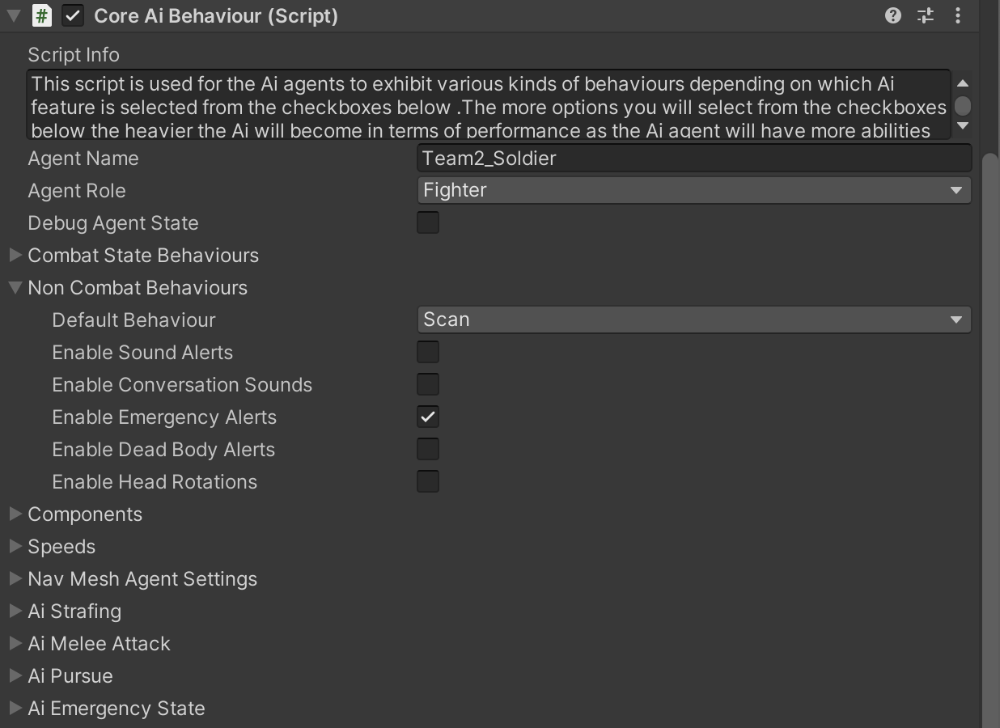
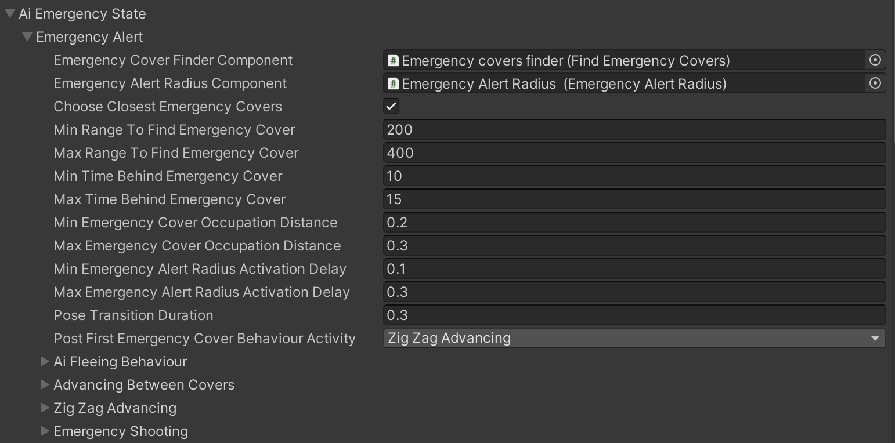

# Emergency State(Zig Zag Advancing) Part-1

    <iframe width="700" height="405" src="https://www.youtube.com/embed/hVD0wtHb4UM?si=PUNwfF04UUhETk_2" title="YouTube video player" frameborder="0" allow="accelerometer; autoplay; clipboard-write; encrypted-media; gyroscope; picture-in-picture; web-share" referrerpolicy="strict-origin-when-cross-origin" allowfullscreen></iframe>

## Introduction
This is the Part-1 of AI Emergency State and in this part you will learn about how the AI react in emergency state and perform 'Zig Zag Advancing' towards the enemy supposed postion.

### Enable Emergency Alert

To enable emergency alert behaviour on AI agent you need to check the checkbox 'Enable Emergency Alerts' and enabling this checkbox will show the paragraph below called 'AI Emergency State'.

#### AI Emergency State

This paragraph is responsible for Ai agent behaviour in life threatening situations where he cannot detect the source of the threat and takes several measures to save his life and locate the threat. Most common emergency state triggering situations are when Ai agent will hear bullet impacts near him or will hear dying sound of friendly Ai agent or when he will see another friendly Ai agent in emergency state.All those conditions will result in Emergency behaviour that Ai agent will execute in a various forms depending on two major conditions.When Ai agent gets into Emergency state he will be provided with the coordinate of the supposed enemy position. After that Navmesh path is calculated towards this coordinate.If navmesh path is complete then Ai agent will hide behind available emergency covers for specified time and when this hiding time is expired then Ai agent will advance between emergency covers towards supposed enemy position.If there are no more available emergency covers left for Ai agent on his way to supposed enemy position then Ai agent will start run in a zigzag pattern towards those coordinates to increase survival chances.If navmesh path is incomplete towards supposed enemy position(i.e if supposed enemy coordinate is on the roof of a different building or on the other side of the river etc.) then Ai agent will perform Emergency hiding and shooting in a general direction of the supposed enemy position.This behaviour can be set up that way so that Ai agent could switch emergency covers or stay at the first occupied emergency cover without ever leaving it.

<table class="custom-table">
    <tr>
        <th>Fields</th>
        <th>Info</th>
    </tr>
    <tr>
        <td>Emergency Cover Finder Component</td>
        <td>Drag and drop Emergency covers finder game object with 'Find Emergency Covers' script attached to it from this Ai agent's hierarchy.</td>
    </tr>
    <tr>
        <td>Emergency Alert Radius Component</td>
        <td>Drag and drop Emergency covers finder game object with 'Emergency Alert Radius' script attached to it from this Ai agent's hierarchy.</td>
    </tr>
    <tr>
        <td>Choose Closest Emergency Covers</td>
        <td>In case this checkbox is active then Ai agent will find closest emergency covers during emergency state.</td>
    </tr>
    <tr>
        <td>Min Range To Find Emergency Cover</td>
        <td>Specifies the minimum emergency covers detection radius.</td>
    </tr>
    <tr>
        <td>Max Range To Find Emergency Cover</td>
        <td>Specifies the maximum emergency covers detection radius.</td>
    </tr>
    <tr>
        <td>Min Time Behind Emergency Cover</td>
        <td>Minimum time to hide behind emergency cover before beginning but not during advancing towards supposed enemy position.</td>
    </tr>
    <tr>
        <td>Max Time Behind Emergency Cover</td>
        <td>Maximum time to hide behind emergency cover before beginning but not during advancing towards supposed enemy position.</td>
    </tr>
    <tr>
        <td>Min Emergency Cover Occupation Distance</td>
        <td>Minimal Emergency Cover occupation distance reaching which Ai agent will stop moving towards it and start hiding behaviour.</td>
    </tr>
    <tr>
        <td>Max Emergency Cover Occupation Distance</td>
        <td>Maximum Emergency Cover occupation distance reaching which Ai agent will stop moving towards it and start hiding behaviour.</td>
    </tr>
    <tr>
        <td>Min Emergency Alert Radius Activation Delay</td>
        <td>Minimum amount in seconds of Ai agent's Emergency Alert Radius Trigger Activation delay.</td>
    </tr>
    <tr>
        <td>Max Emergency Alert Radius Activation Delay</td>
        <td>Maximum amount in seconds of Ai agent's Emergency Alert Radius Trigger Activation delay.</td>
    </tr>
    <tr>
        <td>Pose Transition Duration</td>
        <td>The duration, in seconds, it takes for the AI agent to rotate and focus on emergency cover or shooting points during emergency state. A lower value indicates a faster rotation, while a higher value results in a slower rotation.</td>
    </tr>
    <tr>
        <td>Post First Emergency Cover Behaviour Activity</td>
        <td>Select any of the options from this drop down list that contains various behaviours for Ai agent to perform after expiration of the initial Emergency cover occupation timer.</td>
    </tr>
    <tr>
        <td>Ai Fleeing Behaviour</td>
        <td>This Subsection regulates the parameters of fleeing behaviour when Ai agent sprints away from danger zone when find himself in the emergency situation.</td>
    </tr>
    <tr>
        <td>Advancing Between Covers</td>
        <td>Fields of this subsection are regulating various aspects of Ai agent's advancing between covers towards enemy supposed coordinates.</td>
    </tr>
    <tr>
        <td>ZigZag Advancing</td>
        <td>This subsection sets the coordinate for the final destination of zigzag sprinting and regulates the amplitude of the zigzag sprinting pattern.</td>
    </tr>
    <tr>
        <td>Emergency Shooting</td>
        <td>This subsection regulates various aspects of Emergency Shooting behaviour which if activated will make Ai agent to fire his weapon in general direction of the enemy situated outside of enemy detection parameters of this Ai agent.</td>
    </tr>
</table>

#### Zig Zag Advancing Paragraph

This subsection sets the coordinate for the final destination of zigzag sprinting and regulates the amplitude of the zigzag sprinting pattern.

<table class="custom-table">
    <tr>
        <th>Fields</th>
        <th>Info</th>
    </tr>
    <tr>
        <td>Coordinate Creator</td>
        <td>Drag and Drop an empty gameobject which will rotate and look at the enemy to generate a coordinate towards the path where the enemy is located. This will make sure that the coordinate always created towards the enemy path to make it look natural. This field will also make sure that the coordinate generated is in the forward direction and towards the enemy path.</td>
    </tr>
    <tr>
        <td>Min Enemy Supposed Position Offset</td>
        <td>Minimum radius to create a coordinate from the enemy position.</td>
    </tr>
    <tr>
        <td>Max Enemy Supposed Position Offset</td>
        <td>Maximum radius to create a coordinate from the enemy position.</td>
    </tr>
    <tr>
        <td>Zigzag Turns Amount</td>
        <td>Specify how many coordinates to generate when moving towards the enemy. The coordinates generated will be in a V-Direction and the Ai agent has to reach these generated coordinates one by one, which will result in a zig zag movement. Once all the coordinates are reached then the Ai agent will move directly towards the coordinate created around the enemy.</td>
    </tr>
</table>

#### Create Emergency Covers

First you need to select the 'Covers' that we created in the previous part of 'AI Covers' and than duplicate all 'Cover Points - 1,2,3,4' and rename it to 'Emergency Cover Point - 1,2,3,4'.After this select all the 4 Emergency Cover Point and remove the component 'Cover Node' and Add the component 'Emergency Cover Node'. Choose the Emegency Cover Type based on the cover for example - If it is a Crouch cover than choose 'Crouch Emergency Cover' and in case Stand cover than choose 'Stand Emergency Cover'.

##### Emergency Cover Node

Emergency Cover is designed for the non combat cover behaviour. For example  when Ai agents are under the threat but can not detect and locate the attackers which is required for them to enter the combat state.In this case they will sprint towards emergency cover and will hide there for some specified amount of time before moving out towards supposed enemy position by performing movement between emergency covers and sprinting in a zigzag pattern to increase their survival chances. 
