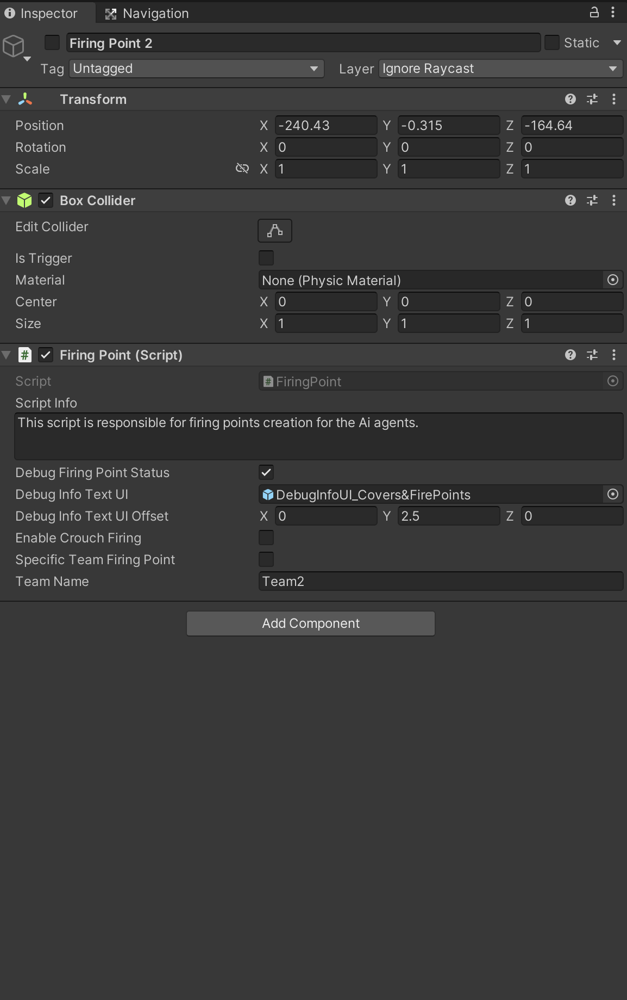

# AI Firing Point Part-1

    <iframe width="700" height="405" src="https://www.youtube.com/embed/hVD0wtHb4UM?si=PUNwfF04UUhETk_2" title="YouTube video player" frameborder="0" allow="accelerometer; autoplay; clipboard-write; encrypted-media; gyroscope; picture-in-picture; web-share" referrerpolicy="strict-origin-when-cross-origin" allowfullscreen></iframe>

## Introduction
This is the Part-1 of Humanoid AI Firing Point Behaviour and in this part we have covered the topic called how to create a firing point and use it. You will also
going to learn how to use the Stop and shoot behaviour when moving to firing point.

### Create a Firing Point

To create the firing point you just need to create an empty gameObject and add a box collider to it.After that you need to change the layer of the gameObject to be 'IgnoreRaycast' and just add the script called 'Firing Point' to it.

 

<table class="custom-table">
    <tr>
        <th>Fields</th>
        <th>Info</th>
    </tr>
    <tr>
        <td>Debug Firing Point Status</td>
        <td>If checked than Ai agent will debug firing point status if it is occupied or vacant.</td>
    </tr>
    <tr>
        <td>Debug Info Text UI</td>
        <td>This field is responsible for debugging firing point state in a form of text whether it is vacant or occupied.</td>
    </tr>
    <tr>
        <td>Debug Info Text UI Offset</td>
        <td>Adjust text UI horizontally or vertically by tweaking values in this field.</td>
    </tr>
    <tr>
        <td>Enable Crouch Firing</td>
        <td>If checked than Ai agent will crouch and shoot on this firing point position.</td>
    </tr>
    <tr>
        <td>Specific Team Firing Point</td>
        <td>If checked than this firing point can only be available to one Team.</td>
    </tr>
    <tr>
        <td>Team Name</td>
        <td>If the above field name 'SpecificTeamCover' is checked than it is required to enter the TeamName for which this firing point can be available too.</td>
    </tr>
</table>

### Use The Firing Point

To use the created firing point you need to enable the checkbox called 'Use Firing Points' in 'Combat state behaviours' of the Core AI behaviour script. This will allow the humanoid AI agent to use the Firing point in the game.

  

### Understand The Firing Point

When you enable the 'Use Firing Points' in 'Combat state behaviours' this will show you a paragraph below called 'Ai Firing Points'. 
more info about each field can be found below. 

  

<table class="custom-table">
    <tr>
        <th>Fields</th>
        <th>Info</th>
    </tr>
    <tr>
        <td>Firing Point Detection Behaviour</td>
        <td>Fields in this subsection will allow tweaking for AI agent to move towards the firing point.</td>
    </tr>
    <tr>
        <td>Sprinting Behaviour</td>
        <td>Fields in this subsection will allow Ai agent to sprint towards the firing point in case structured that way.</td>
    </tr>
    <tr>
        <td>Open Fire Behaviour</td>
        <td>Fields in this subsection are setting Ai agent's weapon firing behaviour while he is moving towards or between covers. This subsection is reused in 3 different combat related paragraphs. Those are - Ai Charging, Ai Covers and Ai firing points. And in each of those cases this subsection is defining Open Fire Behaviour in relation to parent paragraphs subject. In 'Ai Charging' paragraph fields will define shooting behaviour in relation to enemies. In case of 'AI Covers' paragraph those fields are used in relation to covers. And in 'Ai Firing Points' paragraph in relation to Firing points.</td>
    </tr>
    <tr>
        <td>Firing Points Finder</td>
        <td>Drag and drop the child gameObject of this Ai agent which have a script named attached called 'FindFiringPoints' from the hierarchy into this field.</td>
    </tr>
    <tr>
        <td>Find Closest Firing Point</td>
        <td>If enabled than the Ai agent will find the closest firing point from his current position. In case if this checkbox is disabled than Ai agent will take random firing point within the Range specified in the field name 'RangeToFindAFiringPoint'</td>
    </tr>
    <tr>
        <td>Switching Firing Points Probability</td>
        <td>The slider value below indicate what would be the probability of the Ai agent to switch new firing point. In case the value in the slider is 100 than the Ai agent will switch between different firing point around him. In case this value is 0 than the Ai agent will not switch between any new firing point after taking his first firing point and will make sure to stay in his first firing point only for the duration of combat. Depending on the probability Ai agent will decide whether to pick a new firing point or stay at the currently picked one.</td>
    </tr>
    <tr>
        <td>Range To Find A Firing Point</td>
        <td>A Radius within which Ai agent can find random firing point from its current position to be able to move around.</td>
    </tr>
    <tr>
        <td>Min Time Between Firing Points</td>
        <td>Minimum time needed to find a random firing point from the current position within the range defined in 'Range to Find Firing a Point' field.</td>
    </tr>
    <tr>
        <td>Max Time Between Firing Points</td>
        <td>Maximum time needed to find a random firing point from the current position within the range defined in 'Range to Find Firing a Point' field.</td>
    </tr>
    <tr>
        <td>Distance To Stop Before Firing Point</td>
        <td>Distance to stop before occupying a valid firing point.</td>
    </tr>
    <tr>
        <td>Min Stop And Shoot Cancel Distance To Firing Point</td>
        <td>Minimum distance To cancel Stop and shoot behaviour if the distance with the cover is less than or equal to the value specified in this field.</td>
    </tr>
    <tr>
        <td>Max Stop And Shoot Cancel Distance To Firing Point</td>
        <td>Maximum distance To cancel Stop and shoot behaviour if the distance with the cover is less than or equal to the value specified in this field.</td>
    </tr>
    <tr>
        <td>Enable Sprinting</td>
        <td>If enabled Ai agent will be allowed to sprint towards the destination.</td>
    </tr>
    <tr>
        <td>Min Remaining Distance To Firing Point To Stop Sprinting</td>
        <td>Minimum distance to stop sprinting towards the firing point.</td>
    </tr>
    <tr>
        <td>Max Remaining Distance To Firing Point To Stop Sprinting</td>
        <td>Maximum distance to stop sprinting towards the firing point.</td>
    </tr>
    <tr>
        <td>Stop And Shoot Probability</td>
        <td>This slider sets the probability of 'Stop And Shoot' behaviour while Ai agent is moving towards or between covers.</td>
    </tr>
    <tr>
        <td>Strafing Probability</td>
        <td>This slider sets the probability of 'Strafing' behaviour while Ai agent is moving towards or between covers.</td>
    </tr>
    <tr>
        <td>Min Stop And Shoot Distance To Enemy Or To Cover</td>
        <td>Minimal distance towards the cover to activate Stop&Shoot behaviour.</td>
    </tr>
    <tr>
        <td>Max Stop And Shoot Distance To Enemy Or To Cover</td>
        <td>Maximum distance towards the cover to activate Stop&Shoot behaviour.</td>
    </tr>
    <tr>
        <td>Min Time Till Stop And Shoot Behaviour</td>
        <td>Minimum time since Ai agent decided to go towards or between covers till he starts Stop&Shoot behaviour.</td>
    </tr>
    <tr>
        <td>Max Time Till Stop And Shoot Behaviour</td>
        <td>Maximum time since Ai agent decided to go towards or between covers till he starts Stop&Shoot behaviour.</td>
    </tr>
    <tr>
        <td>Min Stop And Shoot Duration</td>
        <td>Minimum duration in seconds of the Stop&Shoot behaviour.</td>
    </tr>
    <tr>
        <td>Max Stop And Shoot Duration</td>
        <td>Maximum duration in seconds of the Stop&Shoot behaviour.</td>
    </tr>
</table>
