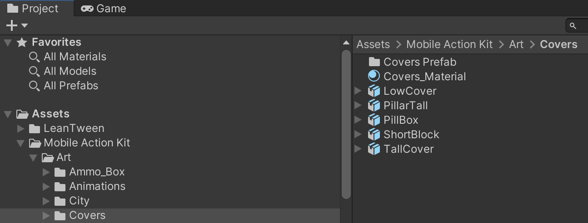

# AI Firing Point Part-2

    <iframe width="700" height="405" src="https://www.youtube.com/embed/hVD0wtHb4UM?si=PUNwfF04UUhETk_2" title="YouTube video player" frameborder="0" allow="accelerometer; autoplay; clipboard-write; encrypted-media; gyroscope; picture-in-picture; web-share" referrerpolicy="strict-origin-when-cross-origin" allowfullscreen></iframe>

## Introduction
This is the Part-2 of Humanoid AI Firing Point Behaviour and in this part we have talked about how AI agent behaves when there are multiple firing points.We have also talked
about how multiple Humanoid AI agent select firing point for them,How to create the firing point for a specific team and enable pillbox on firing
point to make it visually appear like a cover.

### Add The Pillbox 

You can add a pillbox to the firing point just by going to project< Mobile Action Kit < Art < Covers < PillBox. Drag and drop the pillbox to the firing point as a child and
check the checkbox 'Static'.
After this you just need to bake the navmesh for the Humanoid AI agent and this will create a path to the firing point inside the pillbox and when the agent will use it.
It will visually appear like a cover.

 

### Important Things To Note

1.When firing points are placed from top of the navmesh (and not on the navmesh) than this will considered as a invalid firing point for the Humanoid AI agent which will
result in the agent not able to reach them and will be only performing his default behaviour for example: Strafing or stationed shooting.

2.When the firing points are placed on the navmesh but the path to the firing point is incomplete or not available for example: On Top of a building [See the image below].
In this case this will also  result in the agent not able to reach them and will be only performing his default behaviour for example: Strafing or stationed shooting.

3.If there is only one firing point but two Humanoid AI agents than if one of them have taken the firing point than this will also result in the agent to be only performing his default behaviour for example: Strafing or stationed shooting.

4.When the distance to the firing point is further than the distance to the enemy this will also result in the agent to be only performing his default behaviour for example: Strafing or stationed shooting. But as while strafing the distance to the firng point gets closer than the distance to the enemy this will allow agent to use the firing points.

