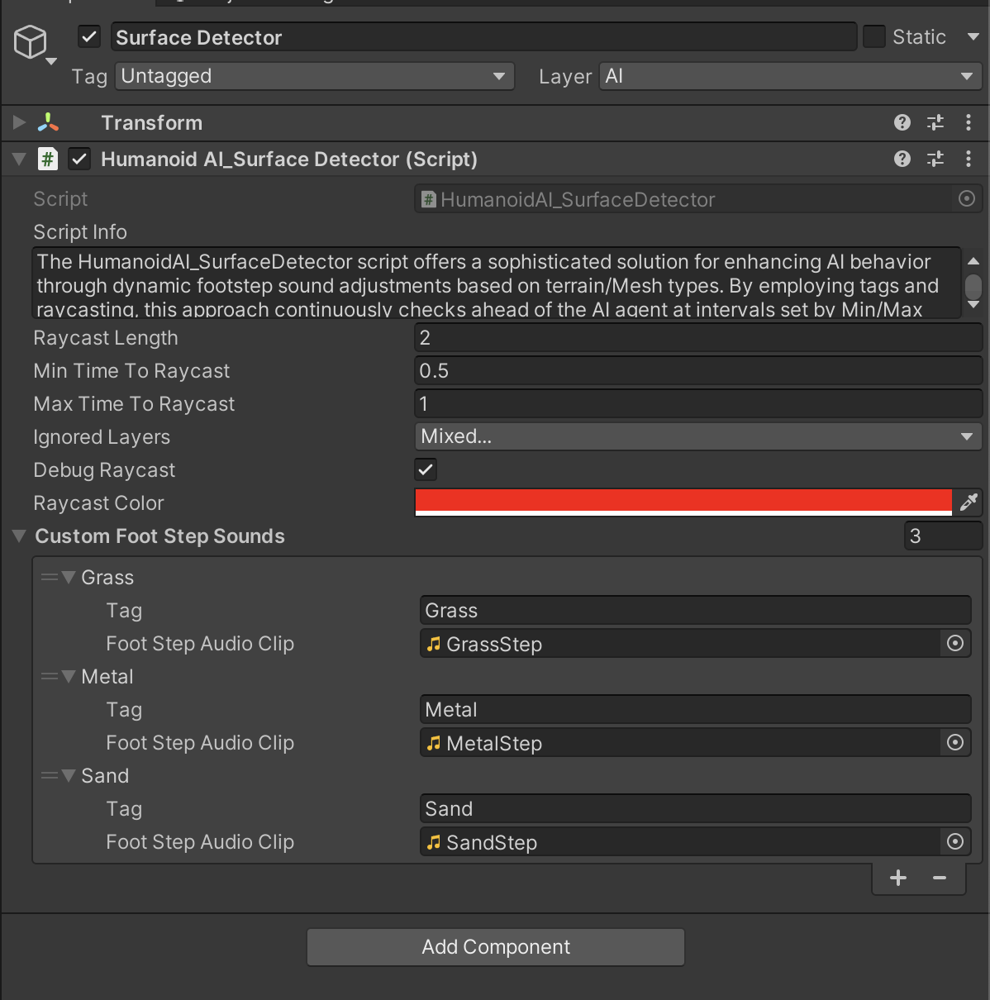

# FootStep Sounds Part-1

    <iframe width="700" height="405" src="https://www.youtube.com/embed/hVD0wtHb4UM?si=PUNwfF04UUhETk_2" title="YouTube video player" frameborder="0" allow="accelerometer; autoplay; clipboard-write; encrypted-media; gyroscope; picture-in-picture; web-share" referrerpolicy="strict-origin-when-cross-origin" allowfullscreen></iframe>

## Introduction
In this tutorial you will how to setup footstep sounds for the AI agent.

### Humanoid Ai Audio Player

The script is responsible for playback of different sounds and phrases in various situations. When Ai agent is wounded or dying or reloading weapons or engaging his enemy etc.

Drag and drop the 'FootStep' AudioSource Component from the hierarchy into this field located in the hierarchy of this AI agent.[See the image below] 

#### Setup FootStep event in the Animation Window

To play the footstep audio each time the AI agent foot touches the ground. First Open the Animation window by going to 'Window < Animation < Animation'.
After this Check each frame where the Ai agent foot is touching the ground.[See the image below]

At each frame where the foot is touching the ground you need to add the event and choose the function 'FootStep Sound'. Do the same for all the other animation clips where the agent is moving for example: Sprinting ,Running, Walking etc..

#### Setup FootStep Sounds Based On Surfaces

There are two ways you can setup the footstep sounds based on the surface using the trigger collider or using the Raycast.

###### Humanoid AI Surfaces (Trigger Collider)

To Setup this up create an empty gameObject and add a primitive collider to it like: Box,Sphere collider etc.. and adjust it in the scene where you want the AI agent footstep sound to get changed like in sand or grass area. Make sure to check 'Is Trigger' Checkbox. After this add a script to it called 'Humanoid AI Surfaces'.[See the image below]

###### Humanoid AI Surfaces Script

This Script replaces Humanoid AI foot step Sounds within the trigger that should be placed in a certain Surface Area. When Ai agent will enter such trigger then its default footstep sounds will be replaced by the particular sound in the field named 'Foot Step Audio' of this script. For Example : Metal Surface , Grass Surface etc... 

<table class="custom-table">
    <tr>
        <th>Fields</th>
        <th>Info</th>
    </tr>
    <tr>
        <td>FootStep Audio</td>
        <td>Drag and drop the desired audio clip from the project into this field to playback this distinct footstep audio clip for the duration of HumanoidAI agents inside this trigger (e.g., for grass, metal, wood surfaces etc).</td>
    </tr>
</table>

###### Humanoid_AI Surface Detector Script

First create an empty gameObject to be the child of the AI agent and rename it to be 'Surface Detector' and in this gameObject Add component called 'Humanoid_AI Surface Detector'. Select any 3D Mesh gameObject like grass or sand and change its tag to 'Grass' or 'Sand'.After this in the script you need to write the name of the tag and provide an audio clip to it. 

The HumanoidAI_SurfaceDetector script offers a sophisticated solution for enhancing AI behavior through dynamic footstep sound adjustments based on terrain/Mesh types. By employing tags and raycasting, this approach continuously checks ahead of the AI agent at intervals set by Min/Max timers. It provides detailed environmental responsiveness, allowing AI characters to interact realistically with various surfaces like grass, concrete, or wood. However, due to its continuous raycasting nature, developers should consider performance implications, particularly on mobile platforms where it may slightly impact FPS. For smaller environments, alternative script like 'HumanoidAISurfaces' which do collider-based detection may be more performance-efficient, ensuring optimal gameplay experience across different device capabilities.

<table class="custom-table">
    <tr>
        <th>Fields</th>
        <th>Info</th>
    </tr>
    <tr>
        <td>Raycast Length</td>
        <td>Length of the raycast that detects surfaces in front of the AI character. Adjust this value based on how far ahead you want the AI to detect surfaces.</td>
    </tr>
    <tr>
        <td>Min Time To Raycast</td>
        <td>Minimum time interval between consecutive raycasts. Controls how often the script performs raycast checks.</td>
    </tr>
    <tr>
        <td>Max Time To Raycast</td>
        <td>Maximum time interval between consecutive raycasts. Controls how often the script performs raycast checks.</td>
    </tr>
    <tr>
        <td>Ignored Layers</td>
        <td>Layers to ignore during raycasting. Objects on these layers will not trigger surface detections. Useful for ignoring irrelevant objects like UI elements or other AI agents.</td>
    </tr>
    <tr>
        <td>Debug Raycast</td>
        <td>Toggle to enable or disable visual debugging of raycasts in the Scene view. When enabled (true), the raycast is visualized with raycastColor, during development and testing.</td>
    </tr>
    <tr>
        <td>Raycast Color</td>
        <td>Color used to visualize the raycast in the Scene view. Helps developers see where the raycast is directed during debugging.</td>
    </tr>
    <tr>
        <td>Custom FootStep Sounds Class</td>
        <td>Class for custom footstep sounds.</td>
    </tr>
    <tr>
        <td>Tag</td>
        <td>The tag representing a specific surface type (e.g., 'Grass', 'Concrete'). Assign tags to game objects in Unity to differentiate surfaces.</td>
    </tr>
    <tr>
        <td>FootStep Audio Clip</td>
        <td>Audio clip to play when the AI walks on surfaces with the corresponding tag. For example, assign a rustling sound for 'Grass' or a hard impact sound for 'Concrete'.</td>
    </tr>
    <tr>
        <td>Custom FootStep Sounds</td>
        <td>List of custom footstep sounds for different surface tags. Populate this list with tags and corresponding audio clips to simulate realistic footstep behavior based on terrain type.</td>
    </tr>
</table>

You can choose any one of the option provided above based on your requirements.