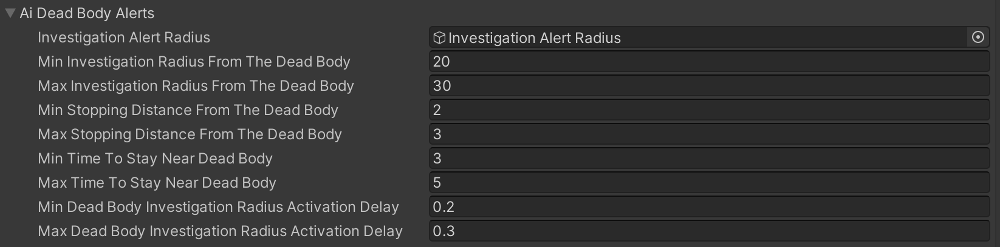

# AI Investigation Near DeadBody

    <iframe width="700" height="405" src="https://www.youtube.com/embed/hVD0wtHb4UM?si=PUNwfF04UUhETk_2" title="YouTube video player" frameborder="0" allow="accelerometer; autoplay; clipboard-write; encrypted-media; gyroscope; picture-in-picture; web-share" referrerpolicy="strict-origin-when-cross-origin" allowfullscreen></iframe>

## Introduction
In this tutorial you will going to learn how the AI agent investigate near the friendly deadbody.

### Enable DeadBody Alert

To enable DeadBody alert behaviour on AI agent you need to check the checkbox 'Enable DeadBody Alerts' and enabling this checkbox will show the paragraph below called 'AI DeadBody Alerts'.

#### AI DeadBody Alerts

This subsection is for the case when AI agent finds dead body of a friendly AI agent, that was already there for some time(if it only has active 'Dead Body Radius' collider).

<table class="custom-table">
    <tr>
        <th>Fields</th>
        <th>Info</th>
    </tr>
    <tr>
        <td>Investigation Alert Radius</td>
        <td>Drag and drop an empty gameobject named 'Dead Body Radius' with a sphere collider attached to it into this field. Enable 'Is Trigger' on that sphere collider and tweak its 'Radius' field value to specify how large this trigger should be. If any friendly Ai agent collides with this trigger, it will immediately enter into Dead Body Investigation state, which in turn will activate its own Dead Body Investigation state to notify nearby friendlies of current Investigation.</td>
    </tr>
    <tr>
        <td>Min Investigation Radius From The Dead Body</td>
        <td>A value within which Ai agent will investigate from the point where the dead body is found (for example: if the value is 10, then the Ai agent will investigate within 10 meters radius from the point where the dead body was located).</td>
    </tr>
    <tr>
        <td>Max Investigation Radius From The Dead Body</td>
        <td>A value within which Ai agent will investigate from the point where the dead body is found (for example: if the value is 10, then the Ai agent will investigate within 10 meters radius from the point where the dead body was located).</td>
    </tr>
    <tr>
        <td>Min Stopping Distance From The Dead Body</td>
        <td>Minimum stopping distance from the dead body.</td>
    </tr>
    <tr>
        <td>Max Stopping Distance From The Dead Body</td>
        <td>Maximum stopping distance from the dead body.</td>
    </tr>
    <tr>
        <td>Min Time To Stay Near Dead Body</td>
        <td>This field determines how long Ai agent will stay near the dead body.</td>
    </tr>
    <tr>
        <td>Max Time To Stay Near Dead Body</td>
        <td>This field determines how long Ai agent will stay near the dead body.</td>
    </tr>
    <tr>
        <td>Min Dead Body Investigation Radius Activation Delay</td>
        <td>This field determines how long it will take Ai agent to activate the investigation radius on top of him.</td>
    </tr>
    <tr>
        <td>Max Dead Body Investigation Radius Activation Delay</td>
        <td>This field determines how long it will take Ai agent to activate the investigation radius on top of him.</td>
    </tr>
</table>

#### Investigation Radius Component

This script activates investigation radius on  the Ai agent at the first time when it detects a dead body so that other Ai agents who are within this trigger would get into investigation state as well. Investigating Agents will move within proximity of dead body to get within distance specified in  the 'Core AI Behaviour script' that has paragraph called 'AI Investigation Alerts' where field called 'Investigation Radius From The Dead Body' is located.Activation of investigation trigger on some AI agents will cause similar activation for other Ai agents who will happen to be within resulted investigation triggers which will create chain reaction or domino effect for all affected agents.If same dead body is encoutered for the second time then by same agents thaen they will not react to it and will not get into investigation state. 

First create an empty gameObject to be the child of the Alert Radius gameobject Mesh and rename it to be 'Investigation Alert Radius' and within the gameObject add a sphere Collider and a script to it called 'Investigation Radius'.[See the Image Below]

<table class="custom-table">
    <tr>
        <th>Fields</th>
        <th>Info</th>
    </tr>
    <tr>
        <td>Display Ai Agents</td>
        <td>Display friendlies AI agents who are within emergency state.</td>
    </tr>
</table>

Adding this script will allow the DeadBody of Friendly AI agent to notify his other friendly AI agent to get into the investigation state.

Lastly,Make sure to drag and drop the gameObject in the field called 'Investigation Alert Radius' exist in the 'AI DeadBody Alerts'.[See the image below]

