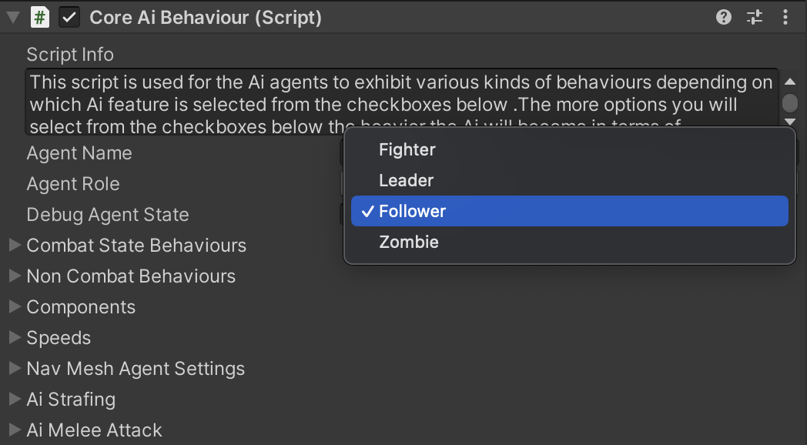
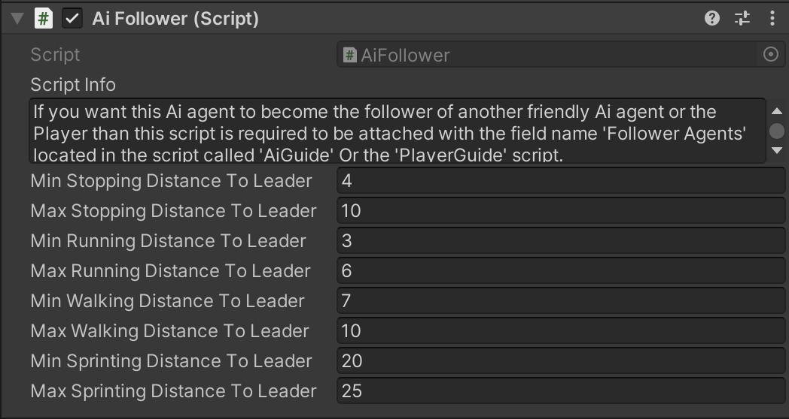

# AI Leader and Followers Part-1

    <iframe width="700" height="405" src="https://www.youtube.com/embed/hVD0wtHb4UM?si=PUNwfF04UUhETk_2" title="YouTube video player" frameborder="0" allow="accelerometer; autoplay; clipboard-write; encrypted-media; gyroscope; picture-in-picture; web-share" referrerpolicy="strict-origin-when-cross-origin" allowfullscreen></iframe>

## Introduction
This is the Part-1 of AI Leader and follower and in this part you will learn about how the AI agent moves between destination points with his followers.

### Enable AI As Leader

First make sure to enable the AI agent as leader by selecting the AI agent and than expand the 'Core AI Behaviour' script and change the Agent Role to be 'Leader'. This will
enable/add the script to the AI agent root object called 'AI Guide' using this script we can control the AI agent behaviour as 'Leader'.

#### AI Guide

This script turns Ai agent to a leader of Player and/or other AI agents, that guides player and/or other AI agents to certain destination point.

<table class="custom-table">
    <tr>
        <th>Fields</th>
        <th>Info</th>
    </tr>
    <tr>
        <td>Destination Points</td>
        <td>Ai Leader will go through destination points in the order they are listed below. Starting from the point in 'Element 0' field. If Ai Leader encounters any resistance on his way, he will switch to other behaviors depending on the state those situations might put him into. As soon as all interrupting factors are eliminated and Ai Leader is no longer distracted, he will resume his destination-following behavior. After reaching the last destination point, Leader will switch to its default behavior (wandering, patrolling, etc.).</td>
    </tr>
    <tr>
        <td>Player Follower Script</td>
        <td>Drag and drop 'PlayerFollower' component attached to Player from the hierarchy into this field. Adding 'PlayerFollower' component will allow this Ai agent to become the leader of the Player and not get too far from the player while moving towards the destination.</td>
    </tr>
    <tr>
        <td>Follower Agents</td>
        <td>Drag and drop into this field one or multiple Ai agents from the hierarchy window (with their role set as the 'Follower' inside the 'core Ai behavior' script). This functionality is designed to work with AI agents that are pre-placed in the level by the mission designer. It is not intended to work with spawned AI agents.</td>
    </tr>
    <tr>
        <td>NavMesh Agent Component</td>
        <td>Drag and drop this agent's root gameobject with 'NavMeshAgent' component attached to it into this field.</td>
    </tr>
    <tr>
        <td>Sprint to Destination</td>
        <td>Decide whether the Ai agent will sprint towards the destination points or only run between destination points.</td>
    </tr>
    <tr>
        <td>Min Run Distance</td>
        <td>Specifies remaining distance to the destination point to switch from walking or sprinting to running towards it.</td>
    </tr>
    <tr>
        <td>Max Run Distance</td>
        <td>Specifies remaining distance to the destination point to switch from walking or sprinting to running towards it.</td>
    </tr>
    <tr>
        <td>Min Walk Distance</td>
        <td>Specifies remaining distance to the destination point to switch from running or sprinting to walking towards it.</td>
    </tr>
    <tr>
        <td>Max Walk Distance</td>
        <td>Specifies remaining distance to the destination point to switch from running or sprinting to walking towards it.</td>
    </tr>
    <tr>
        <td>Stopping Distance to Destination Point</td>
        <td>Specifies the value at which distance the Ai agent will register the destination point as reached and look for the new one (if there are more of them) - Recommended Range (1,3).</td>
    </tr>
    <tr>
        <td>Min Time to Check on Followers</td>
        <td>Minimum time interval to check distance with followers in case the followers are getting far behind from this Ai agent leader.</td>
    </tr>
    <tr>
        <td>Max Time to Check on Followers</td>
        <td>Maximum time to check distance with followers in case the followers are getting far behind from this Ai agent leader.</td>
    </tr>
    <tr>
        <td>Stop and Wait Distance</td>
        <td>If Ai Leader exceeds the specified distance, Ai agent will stop and wait until all the followers catch up again.</td>
    </tr>
</table>

### Enable AI As Follower

First make sure to enable the AI agent as follower by selecting the AI agent and than expand the 'Core AI Behaviour' script and change the Agent Role to be 'Follower'. This will
enable/add the script to the AI agent root object called 'AI Follower' using this script we can control the AI agent behaviour as 'Follower'.

### AI Follower

If you want this Ai agent to become the follower of another friendly Ai agent or the Player than this script is required to be attached with the field name 'Follower Agents' located in the script called 'AiGuide' Or the 'PlayerGuide' script.

<table class="custom-table">
    <tr>
        <th>Fields</th>
        <th>Info</th>
    </tr>
    <tr>
        <td>Min Stopping Distance to Leader</td>
        <td>Minimum distance between the leader and this Ai agent to maintain.</td>
    </tr>
    <tr>
        <td>Max Stopping Distance to Leader</td>
        <td>Maximum distance between the leader and this Ai agent to maintain.</td>
    </tr>
    <tr>
        <td>Min Running Distance to Leader</td>
        <td>Minimum distance before starting to run towards the commander.</td>
    </tr>
    <tr>
        <td>Max Running Distance to Leader</td>
        <td>Maximum distance before starting to run towards the commander.</td>
    </tr>
    <tr>
        <td>Min Walking Distance to Leader</td>
        <td>Minimum distance before starting to walk towards the commander.</td>
    </tr>
    <tr>
        <td>Max Walking Distance to Leader</td>
        <td>Maximum distance before starting to walk towards the commander.</td>
    </tr>
    <tr>
        <td>Min Sprinting Distance to Leader</td>
        <td>Minimum distance to trigger sprinting towards the commander if the distance becomes greater.</td>
    </tr>
    <tr>
        <td>Max Sprinting Distance to Leader</td>
        <td>Maximum distance to trigger sprinting towards the commander if the distance becomes greater.</td>
    </tr>
</table>

### Player Follower

This script allows the player to become a follower of the friendly AI agent. Simply drag and drop the player follower script onto the AI guide component. This will ensure that the AI waits for the player when moving towards destinations.

<table class="custom-table">
    <tr>
        <th>Fields</th>
        <th>Info</th>
    </tr>
    <tr>
        <td>Min Near Distance To Leader</td>
        <td>Specify the minimum distance to the leader to continue moving towards the destination.</td>
    </tr>
      <tr>
        <td>Max Near Distance To Leader</td>
        <td>Specify the maximum distance to the leader to continue moving towards the destination.</td>
    </tr>
</table>

### Create Destination Points

To create the destination points for AI agent leader you need to create 3D Cube in the hierarchy and place it wherever you want the AI agent leader to move to.
Make sure that this gameObject is close to the navmesh as much as possible. After setting it up you can remove/disable the 'Mesh Renderer' component and drag and drop this gameObject to the AI Guide script field name 'Destination Points'.

