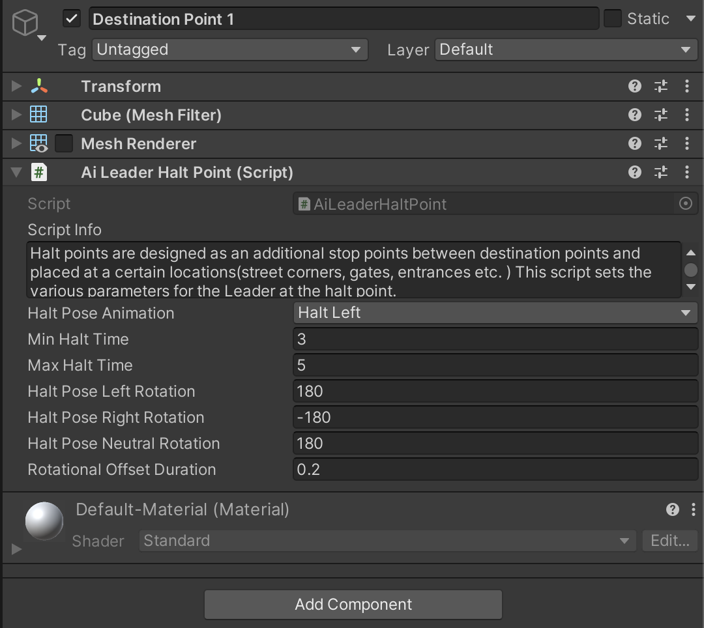
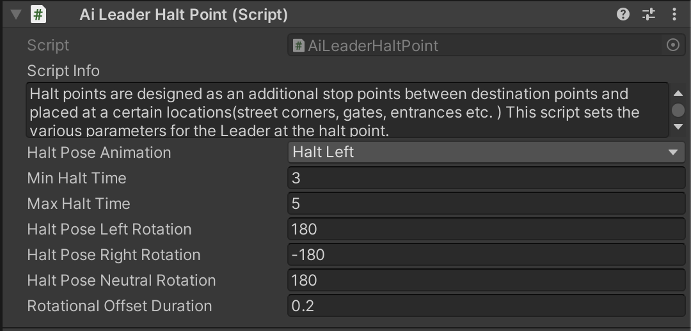

# AI Leader and Followers Part-2

    <iframe width="700" height="405" src="https://www.youtube.com/embed/hVD0wtHb4UM?si=PUNwfF04UUhETk_2" title="YouTube video player" frameborder="0" allow="accelerometer; autoplay; clipboard-write; encrypted-media; gyroscope; picture-in-picture; web-share" referrerpolicy="strict-origin-when-cross-origin" allowfullscreen></iframe>

## Introduction
This is the Part-2 of AI Leader and follower and in this part you will learn about how the AI use the halt point between destinations.

### Create Halt Point

To create a halt point for the AI Agent Leader you need to add a component to the destination point called as 'AI Leader Halt Point'. [See the Image Below]

### AI Leader Halt Point

Halt points are designed as an additional stop points between destination points and  placed at a certain locations(street corners, gates, entrances etc. ) This script sets the various parameters for the Leader at the halt point.

<table class="custom-table">
    <tr>
        <th>Fields</th>
        <th>Info</th>
    </tr>
    <tr>
        <td>Halt Pose Animation</td>
        <td>Animation Clip to be played back by the Leader at the halt point.</td>
    </tr>
    <tr>
        <td>Min Halt Time</td>
        <td>Minimum halt time in case followers are within separation limit. In case they are not it will be prolonged until they catch up with the Leader.</td>
    </tr>
    <tr>
        <td>Max Halt Time</td>
        <td>Maximum halt time in case followers are within separation limit. In case they are not it will be prolonged until they catch up with the Leader.</td>
    </tr>
    <tr>
        <td>Halt Pose Left Rotation</td>
        <td>Value of the leader's rotational offset at the Halt point in degrees to the left from the direction he was facing when approaching this halt point.</td>
    </tr>
    <tr>
        <td>Halt Pose Right Rotation</td>
        <td>Value of the leader's rotational offset at the Halt point in degrees to the right from the direction he was facing when approaching this halt point.</td>
    </tr>
    <tr>
        <td>Halt Pose Neutral Rotation</td>
        <td>Value of the leader's rotational offset at the Halt point in degrees to the neutral from the direction he was facing when approaching this halt point.</td>
    </tr>
    <tr>
        <td>Rotational Offset Duration</td>
        <td>Time it takes for the Leader to turn in the specified direction.</td>
    </tr>
</table>
