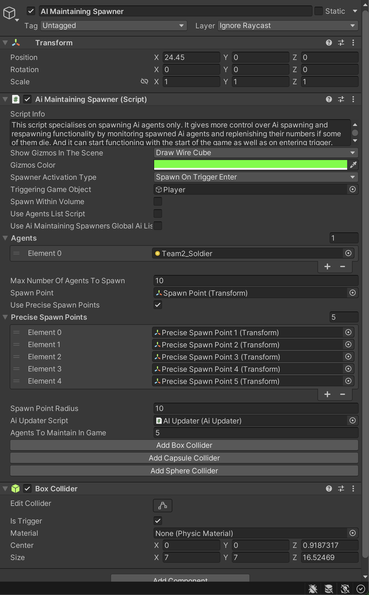

# AI Maintaining Spawner

    <iframe width="700" height="405" src="https://www.youtube.com/embed/hVD0wtHb4UM?si=PUNwfF04UUhETk_2" title="YouTube video player" frameborder="0" allow="accelerometer; autoplay; clipboard-write; encrypted-media; gyroscope; picture-in-picture; web-share" referrerpolicy="strict-origin-when-cross-origin" allowfullscreen></iframe>

## Introduction

In this tutorial you will learn how to setup AI maintaining spawner and spawn AI agents within a spawn point and collider volume. We will make sure to spawn agents on the NavMesh Surface and will also make sure to maintain a certain number of agents in the game.

### AI Maintaining Spawner

<table class="custom-table">
    <tr>
        <th>Fields</th>
        <th>Info</th>
    </tr>
    <tr>
        <td>ShowGizmosInTheScene</td>
        <td>Draw the gizmos of the spawning areas in the Unity scene view.</td>
    </tr>
    <tr>
        <td>GizmosColor</td>
        <td>Set the colour of the spawning area gizmos in the Unity scene view.</td>
    </tr>
    <tr>
        <td>TriggeringGameObject</td>
        <td>Drag & drop the gameobject (usually player) from the hierarchy into this field to trigger spawn events.</td>
    </tr>
    <tr>
        <td>SpawnerActivationType</td>
        <td>Choose one of the types of the 'AiMaintainingSpawner' activation. If 'SpawnOnTriggerEnter' is chosen, AI Agents will be spawned only if the 'TriggeringGameObject' (usually player) enters the trigger collider attached to the 'AiMaintainingSpawner' game object. If 'SpawnOnStart' is chosen, the spawner will start functioning with the start of the game after a specified delay.</td>
    </tr>
    <tr>
        <td>SpawnWithinVolume</td>
        <td>If checked, then AI agents will spawn within the volume of the trigger collider attached to the child game object of this 'AiMaintainingSpawner' named 'SpawnVolume'. You will need to create, add a trigger collider to it, and set up its dimensions to ensure that agents spawn only within certain rooms or other enclosed spaces.</td>
    </tr>
    <tr>
        <td>SpawnVolume</td>
        <td>Drag and drop 'SpawnVolume' child game object with the trigger collider attached to it into this field.</td>
    </tr>
    <tr>
        <td>UseAgentsListScript</td>
        <td>If checked, it will spawn agents listed inside the 'AiToSpawnList' script that can hold various types of AI agents. The spawner then randomly spawns AI agents from that list.</td>
    </tr>
    <tr>
        <td>AiAgentsListScript</td>
        <td>Drag and drop 'AiToSpawnList' game object with 'AiAgentsListScript' attached to it into this field from the hierarchy of the 'AiMaintainingSpawner' game object.</td>
    </tr>
    <tr>
        <td>Agents</td>
        <td>This dropdown list is an alternative to 'AiToSpawnList' for AI agents assignment. It can be set to the desired number of fields that would hold AI agent prefabs to be spawned. Drag and drop AI agents from the project into these fields.</td>
    </tr>
    <tr>
        <td>SpawnPoint</td>
        <td>Drag and drop the child game object named 'SpawnPoint' into this field.</td>
    </tr>
    <tr>
        <td>MaxNumberOfAgentsToSpawn</td>
        <td>Number of agents this spawner script can spawn in total.</td>
    </tr>
    <tr>
        <td>SpawnOnStartDelay</td>
        <td>This slider delays the spawning of AI agents. The minimal value of the delay can be 0.01 seconds, and the maximal value can be 600 seconds.</td>
    </tr>
    <tr>
        <td>UseAiMaintainingSpawnersGlobalAiList</td>
        <td>If checked, this script will use 'AiMaintainingSpawnersGlobalAiList' to store its spawned agents. If unchecked, this script will store its spawned agents itself.</td>
    </tr>
    <tr>
        <td>AiMaintainingSpawnersGlobalAiListScript</td>
        <td>Drag and drop 'TriggerSpawnersGlobalAiList' script from the hierarchy into this field.</td>
    </tr>
    <tr>
        <td>UsePreciseSpawnPoints</td>
        <td>If checked, AI agents will spawn at the specified spawn points that should be placed in the 'SpawnPoint' fields.</td>
    </tr>
    <tr>
        <td>PreciseSpawnPoints</td>
        <td>Set the number of preplaced Spawn points used for this wave. Drag and drop those spawn points to be used for this wave from the hierarchy tab into this field.</td>
    </tr>
    <tr>
        <td>MinCasualtiesCheckTime</td>
        <td>Minimum time to check the number of alive AI agents.</td>
    </tr>
    <tr>
        <td>MaxCasualtiesCheckTime</td>
        <td>Maximum time to check the number of alive AI agents.</td>
    </tr>
    <tr>
        <td>maxSpawnAttemptsPerObstacle</td>
        <td>Number of maximum attempts to spawn per obstacle.</td>
    </tr>
    <tr>
        <td>AiUpdaterScript</td>
        <td>Drag and drop the AI Updater game object from the hierarchy with 'AiUpdater' script attached to it into this field.</td>
    </tr>
    <tr>
        <td>AgentsToMaintainInGame</td>
        <td>Number of alive agents to keep in the game. This number will be replenished by this spawner as long as there are enough agents in 'MaxNumberOfAgentsToSpawn' for that.</td>
    </tr>
    <tr>
        <td>SpawnPointRadius</td>
        <td>Radius within limits of which AI Agents will be spawned.</td>
    </tr>
    <tr>
        <td>DisplaySpawnedAgentsList</td>
        <td>List of AI Agents to be displayed in this subsection for debugging purposes.</td>
    </tr>
</table>

