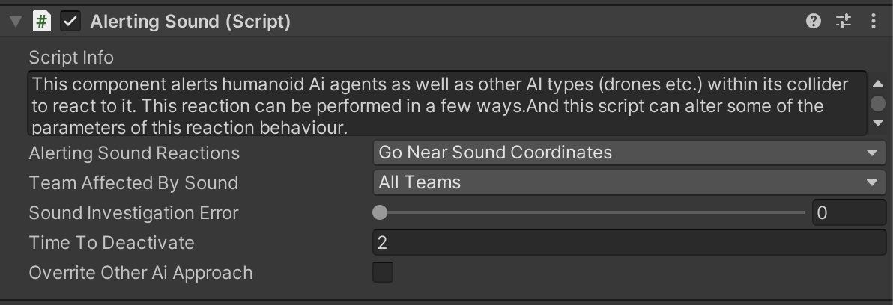
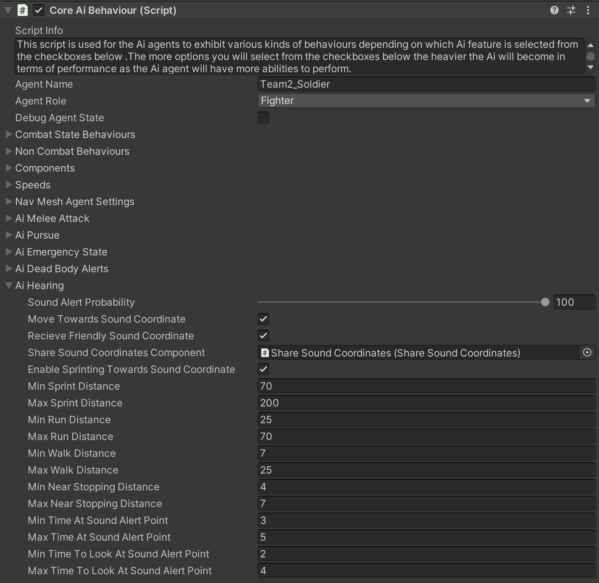

# Sound Alert Behaviour Part-4

    <iframe width="700" height="405" src="https://www.youtube.com/embed/hVD0wtHb4UM?si=PUNwfF04UUhETk_2" title="YouTube video player" frameborder="0" allow="accelerometer; autoplay; clipboard-write; encrypted-media; gyroscope; picture-in-picture; web-share" referrerpolicy="strict-origin-when-cross-origin" allowfullscreen></iframe>

## Introduction
In this tutorial you will learn about AI agent reaction towards alert sounds. Basically alert sounds are fire sound, Grenade explosion etc.. 

### Alerting Sound Activator

This Script activates the alerting sound and specifies if this sound will travel with its parent game object.[See the image below]

<table class="custom-table">
    <tr>
        <th>Fields</th>
        <th>Info</th>
    </tr>
    <tr>
        <td>AlertingSoundScript</td>
        <td>Drag and drop Sound Source (Alerting Sound) child game object of this Sound Activator into this field.</td>
    </tr>
    <tr>
        <td>KeepSoundAsChild</td>
        <td>If checked, 'AlertingSound' gameObject will stay with its parent 'SoundActivator' gameobject, thus will be able to move together with it. This will result in a dynamic trigger for something like a drone, rocket, or car creating fly-by or drive-by kind of sound that would affect all AI agents touched by the moving sound trigger. In case unchecked, the Sound gameObject will get unparented and will not follow the root gameObject. For example, weapon shot or explosion sound.</td>
    </tr>
    <tr>
        <td>MinInitialDelayBeforeActivation</td>
        <td>Minimum Delay before activating the 'AlertingSound' gameObject.</td>
    </tr>
    <tr>
        <td>MaxInitialDelayBeforeActivation</td>
        <td>Maximum Delay before activating the 'AlertingSound' gameObject.</td>
    </tr>
</table>

### Alerting Sound

This component alerts humanoid Ai agents as well as other AI types (drones etc.) within its collider to react to it. This reaction can be performed in a few ways.And this script can alter some of the parameters of this reaction behaviour.

<table class="custom-table">
    <tr>
        <th>Fields</th>
        <th>Info</th>
    </tr>
    <tr>
        <td>AlertingSoundReactions</td>
        <td>Choose one of the 2 behavioural responses of Ai agents affected by this sound alert. 'GoNearSoundCoordinates' to go towards the coordinate of this sound, or choose 'ForceEmergencyState' for Ai agent to go into emergency state.</td>
    </tr>
    <tr>
        <td>TeamAffectedBySound</td>
        <td>Choose the team which will be affected by this sound.</td>
    </tr>
    <tr>
        <td>TeamName</td>
        <td>Type the name of the team to be affected by this sound.</td>
    </tr>
    <tr>
        <td>SoundInvestigationError</td>
        <td>This field represents the sound location mistake the Ai agent will make. The greater the number, the further away the resulted investigation coordinate will get from the initial coordinate of the alerting sound.</td>
    </tr>
    <tr>
        <td>TimeToDeactivate</td>
        <td>Specify the time to deactivate this alerting sound game object.</td>
    </tr>
    <tr>
        <td>OverriteOtherAiApproach</td>
        <td>If checked, it will override the approach style of sound investigating Ai agents. If only one of those options is checked, then it will force itself on the way Ai agent will approach the sound and it will discard all the other approach styles. If two of those options are checked, then they will discard unchecked approach styles altogether. Quick Note - If all of checkboxes are checked, it will have the same effect as if none of them were checked, i.e., it will not take any effect over initial approach settings.</td>
    </tr>
    <tr>
        <td>AllowSprinting</td>
        <td>Allows only selected approach styles. If all or none of these options are selected, then default approach values will not be overridden.</td>
    </tr>
    <tr>
        <td>AllowRunning</td>
        <td>Allows only selected approach styles. If all or none of these options are selected, then default approach values will not be overridden.</td>
    </tr>
    <tr>
        <td>AllowWalking</td>
        <td>Allows only selected approach styles. If all or none of these options are selected, then default approach values will not be overridden.</td>
    </tr>
</table>

### AI Hearing 

This paragraph contains fields related to AI agent reactions to alerting sounds.

<table class="custom-table">
    <tr>
        <th>Fields</th>
        <th>Info</th>
    </tr>
    <tr>
        <td>SoundAlertProbability</td>
        <td>This slider sets the probability of this AI agent to react to sound alerts.</td>
    </tr>
    <tr>
        <td>MoveTowardsSoundCoordinate</td>
        <td>If checked, then Ai agent will move towards the alerting coordinate. Otherwise, he will look in the direction of that sound for a specified amount of time.</td>
    </tr>
    <tr>
        <td>RecieveFriendlySoundCoordinate</td>
        <td>If checked, then AI agent will join his friendly in alerting sound investigation if that friendly affects this agent with his sound alert radius. That secondary sound alert radius communicates the sound alert to all agents that got within this radius (even in cases when those agents are having zero probability to move out towards initial alerting sound that they heard themselves).</td>
    </tr>
    <tr>
        <td>ShareSoundCoordinatesComponent</td>
        <td>Reference to the component responsible for sharing sound coordinates.</td>
    </tr>
    <tr>
        <td>EnableSprintingTowardsSoundCoordinate</td>
        <td>Enable/disable sprinting towards sound coordinates.</td>
    </tr>
    <tr>
        <td>MinSprintDistance</td>
        <td>Minimal remaining distance to initial sound alert coordinate for the switch from walking or running to sprinting towards it.</td>
    </tr>
    <tr>
        <td>MaxSprintDistance</td>
        <td>Maximal remaining distance to initial sound alert coordinate for the switch from walking or running to sprinting towards it.</td>
    </tr>
    <tr>
        <td>MinRunDistance</td>
        <td>Minimal remaining distance to initial sound alert coordinate for the switch from walking or sprinting to running towards it.</td>
    </tr>
    <tr>
        <td>MaxRunDistance</td>
        <td>Maximal remaining distance to initial sound alert coordinate for the switch from walking or sprinting to running towards it.</td>
    </tr>
    <tr>
        <td>MinWalkDistance</td>
        <td>Minimal remaining distance to initial sound alert coordinate for the switch from running or sprinting to walking towards it.</td>
    </tr>
    <tr>
        <td>MaxWalkDistance</td>
        <td>Maximal remaining distance to initial sound alert coordinate for the switch from running or sprinting to walking towards it.</td>
    </tr>
    <tr>
        <td>MinNearStoppingDistance</td>
        <td>Minimum remaining distance to stop near the initial sound alert coordinate and to consider it as reached.</td>
    </tr>
    <tr>
        <td>MaxNearStoppingDistance</td>
        <td>Maximum remaining distance to stop near the initial sound alert coordinate and to consider it as reached.</td>
    </tr>
    <tr>
        <td>MinTimeAtSoundAlertPoint</td>
        <td>Set the minimum time the AI agent waits at the initial sound alert coordinate before returning to idle state.</td>
    </tr>
    <tr>
        <td>MaxTimeAtSoundAlertPoint</td>
        <td>Set the maximum time the AI agent waits at the initial sound alert coordinate before returning to idle state.</td>
    </tr>
    <tr>
        <td>MinTimeToLookAtSoundAlertPoint</td>
        <td>Set the minimum time the Stationary AI agent or agent with zero probability of moving towards initial sound alert coordinate, will look in the direction of the initial sound alert coordinate before returning to idle state.</td>
    </tr>
    <tr>
        <td>MaxTimeToLookAtSoundAlertPoint</td>
        <td>Set the maximum time the Stationary AI agent or agent with zero probability of moving towards initial sound alert coordinate, will look in the direction of the initial sound alert coordinate before returning to idle state.</td>
    </tr>
</table>
