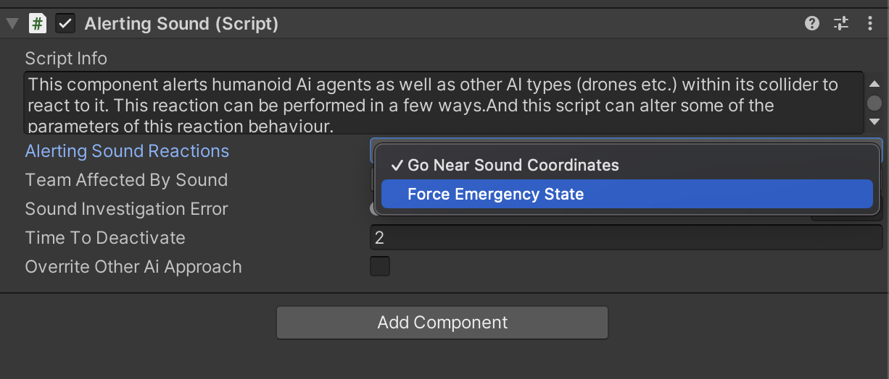

# Sound Investigation & Emergency Behaviour Part-6

    <iframe width="700" height="405" src="https://www.youtube.com/embed/hVD0wtHb4UM?si=PUNwfF04UUhETk_2" title="YouTube video player" frameborder="0" allow="accelerometer; autoplay; clipboard-write; encrypted-media; gyroscope; picture-in-picture; web-share" referrerpolicy="strict-origin-when-cross-origin" allowfullscreen></iframe>

## Introduction
In this tutorial you will learn how AI agent overrites sound investigation when emergency state activate.

### Alerting Sound Reaction 

When the option 'Force Emergency State' is selected, if an AI agent is moving towards a sound coordinate and enters a trigger radius where the 'Alerting Sound Reaction' is set to 'Force Emergency State,' the AI agent will immediately enter the emergency state and stop moving towards the sound coordinate.

### AI Hearing 

This paragraph contains fields related to AI agent reactions to alerting sounds.

<table class="custom-table">
    <tr>
        <th>Fields</th>
        <th>Info</th>
    </tr>
    <tr>
        <td>SoundAlertProbability</td>
        <td>This slider sets the probability of this AI agent to react to sound alerts.</td>
    </tr>
    <tr>
        <td>MoveTowardsSoundCoordinate</td>
        <td>If checked, then Ai agent will move towards the alerting coordinate. Otherwise, he will look in the direction of that sound for a specified amount of time.</td>
    </tr>
    <tr>
        <td>RecieveFriendlySoundCoordinate</td>
        <td>If checked, then AI agent will join his friendly in alerting sound investigation if that friendly affects this agent with his sound alert radius. That secondary sound alert radius communicates the sound alert to all agents that got within this radius (even in cases when those agents are having zero probability to move out towards initial alerting sound that they heard themselves).</td>
    </tr>
    <tr>
        <td>ShareSoundCoordinatesComponent</td>
        <td>Reference to the component responsible for sharing sound coordinates.</td>
    </tr>
    <tr>
        <td>EnableSprintingTowardsSoundCoordinate</td>
        <td>Enable/disable sprinting towards sound coordinates.</td>
    </tr>
    <tr>
        <td>MinSprintDistance</td>
        <td>Minimal remaining distance to initial sound alert coordinate for the switch from walking or running to sprinting towards it.</td>
    </tr>
    <tr>
        <td>MaxSprintDistance</td>
        <td>Maximal remaining distance to initial sound alert coordinate for the switch from walking or running to sprinting towards it.</td>
    </tr>
    <tr>
        <td>MinRunDistance</td>
        <td>Minimal remaining distance to initial sound alert coordinate for the switch from walking or sprinting to running towards it.</td>
    </tr>
    <tr>
        <td>MaxRunDistance</td>
        <td>Maximal remaining distance to initial sound alert coordinate for the switch from walking or sprinting to running towards it.</td>
    </tr>
    <tr>
        <td>MinWalkDistance</td>
        <td>Minimal remaining distance to initial sound alert coordinate for the switch from running or sprinting to walking towards it.</td>
    </tr>
    <tr>
        <td>MaxWalkDistance</td>
        <td>Maximal remaining distance to initial sound alert coordinate for the switch from running or sprinting to walking towards it.</td>
    </tr>
    <tr>
        <td>MinNearStoppingDistance</td>
        <td>Minimum remaining distance to stop near the initial sound alert coordinate and to consider it as reached.</td>
    </tr>
    <tr>
        <td>MaxNearStoppingDistance</td>
        <td>Maximum remaining distance to stop near the initial sound alert coordinate and to consider it as reached.</td>
    </tr>
    <tr>
        <td>MinTimeAtSoundAlertPoint</td>
        <td>Set the minimum time the AI agent waits at the initial sound alert coordinate before returning to idle state.</td>
    </tr>
    <tr>
        <td>MaxTimeAtSoundAlertPoint</td>
        <td>Set the maximum time the AI agent waits at the initial sound alert coordinate before returning to idle state.</td>
    </tr>
    <tr>
        <td>MinTimeToLookAtSoundAlertPoint</td>
        <td>Set the minimum time the Stationary AI agent or agent with zero probability of moving towards initial sound alert coordinate, will look in the direction of the initial sound alert coordinate before returning to idle state.</td>
    </tr>
    <tr>
        <td>MaxTimeToLookAtSoundAlertPoint</td>
        <td>Set the maximum time the Stationary AI agent or agent with zero probability of moving towards initial sound alert coordinate, will look in the direction of the initial sound alert coordinate before returning to idle state.</td>
    </tr>
</table>
