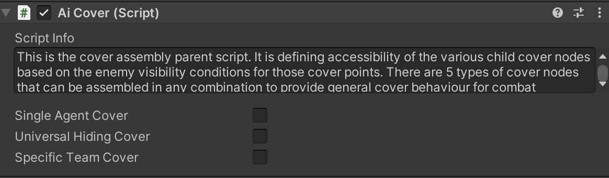

# AI Crouch Hiding Cover

    <iframe width="700" height="405" src="https://www.youtube.com/embed/hVD0wtHb4UM?si=PUNwfF04UUhETk_2" title="YouTube video player" frameborder="0" allow="accelerometer; autoplay; clipboard-write; encrypted-media; gyroscope; picture-in-picture; web-share" referrerpolicy="strict-origin-when-cross-origin" allowfullscreen></iframe>

## Introduction
This is the Part-1 of Humanoid AI Covers and in this part you will learn about how to setup the crouch hiding cover.

### Crouch Hiding Cover 

To setup the crouch hiding cover first you need to drag and drop the model from the project to the hierarchy and rename it 
to 'Crouch Hiding Cover' and than follow the steps below :

1.First Add the primitive collider to this model(renamed to crouch hiding cover) example - Box,Capsule Collider etc.. whichever is more suitable.

2.Add the 'Nav Mesh Obstacle' component to the crouch hiding cover gameObject and adjust it.

3.Add the 'AI Cover script' component.

4.Add the 'Debug Cover State' component to it.

5.After this you need to create an empty gameObject as a child of the crouch hiding cover gameObject and call it as 'Cover Point' and in that gameObject add a capsule collider and set it to be is trigger.

6.Add the 'Cover Node' component to this child gameObject.

 

#### Setup Open Fire Points

Open Fire Points allow the agent to stand Or crouch and shoot at his enemy after occupying the cover point.This behaviour may be set the way so that Ai agent would cycle between cover point and open fire point (i.e return to the cover point after open fire point's timer is expired and vice versa) for entirety of combat state unless this cover becomes invalid.Open fire points are of stand type by default.If you want open fire point to be of crouch type then you have to setup open fire point to be crouch type by selecting its tag to be 'CrouchFirePoint'.

To setup the open fire points you need to right click to create an empty gameObject as a child of the crouch hiding cover gameObject and call it as 'Open Fire Point' and place it in the scene view wherever you want but just make sure it is close to the NavMesh and after that if you want to use it follow the steps provided below :

1.Select the cover point and check the checkbox 'Use Open Fire Points' located in the script 'Cover Node'.

2.Drag and drop the 'Open Fire Point' to the array list called 'Open Fire Points'.

TO MAKE THE OPEN FIRE POINT TO BE CROUCHING FIRE POINT FOR THE AGENT YOU JUST NEED TO CHANGE THE 'Open Fire Point' GAMEOBJECT TAG OF TO BE 'CrouchFirePoint'.

#### Setup Secondary Open Fire Points

'Secondary Open Fire Point' is a backup option for the cases when predefined 'Open Fire Point' is unavailable(occupied coz same OpenFirePoint can be setup to be shared between few cover nodes,or not provided at all for this cover node). It can be  created within specified radius from this cover node.In case this would not be desirable option due to the possibility for Ai agent to pick bad spot like in front of the cover if the value of that radius is big enough to allow that,then this value can be made small enough to force Ai agent to just stand up from the 'Crouch Cover Point' and shoot his weapon (If this node is setup to be crouch cover type).If none of the solutions above are suitable for the cover you are making,then you can create an empty game object, position it the way you like and drag and drop it into this field.This way the radius for the random OpenFirePoint will be created from that game object instead of cover node itself.

To setup the secondary open fire point you need to right click to create an empty gameObject as a child of the crouch hiding cover gameObject and call it as 'Secondary Open Fire Point' and place it in the scene view wherever you want but just make sure it is close to the NavMesh and after that if you want to use it follow the steps provided below :

There will be two sitations where the agent will going to prefer using the 'Secondary Open Fire Point'. 

1.When the 'Open Fire Point' is not defined in the game.

2.When the 'Open Fire Point' is defined but other agent friendly agent is already occupying it. 

### AI Cover Script

 

This is the cover assembly parent script.It is defining accessibility of the various child cover nodes based on the enemy visibility conditions for those cover points.There are 5 types of cover nodes that can be assembled in any combination to provide general cover behaviour for combat situations. 4 of the 5 cover points are used during AI agents  combat state.When request is made to the cover assembly for availability of it`s child cover nodes then the visibility check is done by all cover points in the assembly.Those cover points that have Ai agents current closest enemy within their field of view(240 degrees) are discarded as invalid. The remaining valid cover points ar then sorted by AI agent and best cover point is selected. It is the cover point that has the biggest angle to turn towards current enemy of interest  directly.In other words the on that is closest to being directly opposite to the current closest enemy of Ai agent who made cover request.Fifth cover node type is called 'Emergency Cover' and is designed for the non combat or pre-combat cover behaviour.For example  when Ai agents are under the threat but can not detect and locate the attackers.In this case they will sprint towards emergency cover and will hide there for some specified amount of time before moving out towards supposed enemy position by performing movement between available emergency covers and/or sprinting  in a zigzag pattern to increase their survival chances.

<table class="custom-table">
    <tr>
        <th>Fields</th>
        <th>Info</th>
    </tr>
    <tr>
        <td>Single Agent Cover</td>
        <td>This checkbox limits the cover assembly capacity to only one AI agent at a time regardless of how many child cover nodes it has.</td>
    </tr>
     <tr>
        <td>Universal Hiding Cover</td>
        <td>Enables this cover assembly to become available for all AI agents of both opposing teams. This allows opposing Ai agents to occupy opposite Hide Cover nodes of the same Cover assembly.</td>
    </tr>
     <tr>
        <td>Specific Team Cover</td>
        <td>Specifies team that is allowed to access this cover assembly.Useful for saving  performance in cases when  there is no possible way for second team to reach and  occupy this cover assembly that is on the roof of the building for example or any other isolated area.If checked then additional 'Team Name' field will appear to enter the name of the designated team.</td>
    </tr>
      <tr>
        <td>Team Name</td>
        <td>If the above field name 'SpecificTeamCover' is checked than it is required to enter the TeamName for which this whole cover can be available too.</td>
    </tr>
</table>

### Debug Cover State Script

 

The 'DebugCoverState' script is designed to assist in debugging the cover system, specifically for Humanoid AI agents. It provides visual feedback on the state of cover points (vacant, occupied, or invalid) by displaying debug information using TextMeshPro components.

<table class="custom-table">
    <tr>
        <th>Fields</th>
        <th>Info</th>
    </tr>
    <tr>
        <td>Enable Debugging</td>
        <td>Toggle to activate or deactivate debugging features.</td>
    </tr>
    <tr>
        <td>Debug Info Text UI</td>
        <td>Drag and drop TextMeshPro prefab named 'DebugInfoUI_Covers & FirePoints' from the project window into this field. This field is responsible for debugging cover state in a form of text whether it is vacant, occupied, or invalid. It is displaying the responses of the cover points to AI agent requests. Debug text is displayed for a specified amount of time right after a request is made from an Ai agent for available cover points of this assembly. The shorter you set the time for the debug text to stay, the more subsequent responses it will be able to display.</td>
    </tr>
    <tr>
        <td>Debug Info Text UI Offset</td>
        <td>Sets the position of debugging text relative to the cover node.</td>
    </tr>
    <tr>
        <td>Min Debug Text Visibility Time</td>
        <td>Minimum Time of Debug Text Visibility. If you configure the text display time to be very short, it will have a better chance to indicate more responses from Cover Points to AI agents for available covers of this cover assembly.</td>
    </tr>
    <tr>
        <td>Max Debug Text Visibility Time</td>
        <td>Maximum Time of Debug Text Visibility. If you configure the text display time to be very short, it will have a better chance to indicate more responses from Cover Points to AI agents for available covers of this cover assembly.</td>
    </tr>
    <tr>
        <td>Debug Text Colors</td>
        <td>Configure text colors based on the state of the cover points.</td>
    </tr>
    <tr>
        <td>Team Name</td>
        <td>Type in the name of the team you came up with into this field.</td>
    </tr>
    <tr>
        <td>Occupying Text Color</td>
        <td>This text is displayed on top of the cover point as soon as the Ai agent made a request to this cover assembly and got approved with a cover point. Text will start to be displayed immediately after the cover point gets assigned to Ai agent even before said Agent will reach that cover point.</td>
    </tr>
    <tr>
        <td>Vacant Text Color</td>
        <td>'Vacant' text is displayed right after Ai agent's request for the available cover points on top of the points not chosen by AI agent but are still valid for the time being. In this case, another Ai agent from the same team might make his own request to this cover assembly for the cover and will be provided with those remaining 'Vacant' cover points for him to choose the most suitable one to be occupied.</td>
    </tr>
    <tr>
        <td>Invalid Text Color</td>
        <td>Invalid text is displayed right after Ai agent's request for the available cover points on top of the points when they are invalid and can't be registered at that moment. It will display on those cover points which are invalid at that moment.</td>
    </tr>
</table>

### Cover Node Script

 

This script allows for creation of 4 types of cover nodes. First type of cover node is called 'Crouch Firing Cover'. Its forcing AI agent to crouch while occupying it. And allows AI agent to perform crouch fire at the enemies.Second crouch type of cover node(point) is called 'Crouch Hiding cover'.Its also forcing occupying AI Agent to crouch but does not allow Ai agent to shoot.Third and fourth cover nodes (points) types are called 'Stand Firing Cover' and 'Stand Hiding Cover'. They are the same as the first two crouching nodes with the only difference being is that they are forcing covering Ai agents to stand.

<table class="custom-table">
    <tr>
        <th>Fields</th>
        <th>Info</th>
    </tr>
    <tr>
        <td>Choose Cover Type</td>
        <td>Select one of the available cover types (that are described in the script info) for this cover node.</td>
    </tr>
    <tr>
        <td>Use Open Fire Points</td>
        <td>Allows the use of additional 'Open Fire Points' for Ai agent behind cover. Game object named 'Open Fire Point' is the auxiliary element of the cover assembly that can be useful to both Firing and Hiding cover variations. For Firing covers - as an additional firing point for variety of firing behaviour of Ai agent in Firing covers. And for Hiding covers it is the only possible way for Ai agent behind those covers to be able to shoot at enemies. There is a set of timers in 'Core Ai Behaviour' script's paragraph named 'Ai Covers' that regulate covering related behaviours including Open Fire Points related parameters.</td>
    </tr>
    <tr>
        <td>Open Fire Points</td>
        <td>Add one or more 'Open Fire Point(s)' to this cover assembly for Ai agent(s) to use after cover occupying time is expired. This behaviour may be set the way so that Ai agent would cycle between cover point and open fire point (i.e return to the cover point after open fire point's timer is expired and vice versa) for entirety of combat state unless this cover becomes invalid. Open fire points are of stand type by default. If you want open fire point to be of crouch type then you have to setup open fire point to be crouch type by selecting its tag to be 'CrouchFirePoint'.</td>
    </tr>
    <tr>
        <td>Secondary Open Fire Point</td>
        <td>'Secondary Open Fire Point' is a backup option for the cases when predefined 'Open Fire Point' is unavailable (occupied because same OpenFirePoint can be setup to be shared between few cover nodes, or not provided at all for this cover node). It can be created within specified radius from this cover node. In case this would not be desirable option due to the possibility for Ai agent to pick bad spot like in front of the cover if the value of that radius is big enough to allow that, then this value can be made small enough to force Ai agent to just stand up from the 'Crouch Cover Point' and shoot his weapon (If this node is setup to be crouch cover type). If none of the solutions above are suitable for the cover you are making, then you can create an empty game object, position it the way you like and drag and drop it into this field. This way the radius for the random OpenFirePoint will be created from that game object instead of cover node itself.</td>
    </tr>
    <tr>
        <td>Secondary Open Fire Point Radius</td>
        <td>Value of this field sets the limit for 'Procedural Open Fire Point Radius' within which open fire point coordinate will be created.</td>
    </tr>
    <tr>
        <td>Stand Hide Cover Directions</td>
        <td>This list of up to 3 hiding directions or hiding positions for Ai agent to assume when occupying Hiding cover. Neutral, Left, and Right. All 3 directions may be useful in case of a 3D object for this Cover assembly being something like a column or a pillar. Ai agent then will orient himself in any of the available directions depending on closer to which side of the cover the closest enemy currently is situated.</td>
    </tr>
    <tr>
        <td>Stand Hide Cover Animation Player</td>
        <td>In case chosen cover node type is 'Stand Hiding Cover' and Stand Hide Cover Directions are set in the fields above, than this list will provide animation clips to be played back by AI agent occupying this Stand Hiding Cover for each respected direction. Which one of those 3 hiding directions will be selected and which one of the 3 corresponding stand hiding animations will be used by hiding AI agent is decided by the direction of the closest enemy that Ai agent will be hiding from. Stand Hiding Cover node can have 3, 2 or as little as one hiding direction based on near what kind of 3d object this node is placed. If it is a column or a pillar like 3d object then you might set all 3 hiding directions. If it is something like edge of the wall or side of the gates or the corner of the building then 2 hiding directions will be enough. You can get away with only one 'Neutral' hiding posture for the Ai agent if you'd like. It is not mandatory to have all 3 or 2 directions for any given 'Stand Hiding Cover' node.</td>
    </tr>
</table>