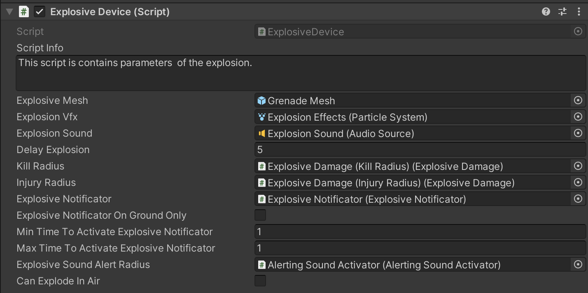

# Grenade Setup Part-1

    <iframe width="700" height="405" src="https://www.youtube.com/embed/hVD0wtHb4UM?si=PUNwfF04UUhETk_2" title="YouTube video player" frameborder="0" allow="accelerometer; autoplay; clipboard-write; encrypted-media; gyroscope; picture-in-picture; web-share" referrerpolicy="strict-origin-when-cross-origin" allowfullscreen></iframe>

## Introduction
This is the Part-1 AI Grenades and in this part you will learn how to setup grenade for the 'Humanoid AI Agent' to throw at enemies.

### AI Grenade Setup

To be able to setup the grenade you need to follow the above tutorial which will guide you step by step on how to setup the grenade.

#### Explosive Collision

This script adds rigidbody to explosive just before it is about to collide any static or dynamic object along it`s trajectory.After adding rigidbody it applies the momentum force in the forward direction of the explosive specified in the field called 'Force Momentum'.For convenience reasons this script has fields that allow to set the properties of the rigidbody prior to its creation.

<table class="custom-table">
    <tr>
        <th>Fields</th>
        <th>Info</th>
    </tr>
    <tr>
        <td>Explosive Device Component</td>
        <td>Drag and drop explosive explosion script attached with this gameObject from the hierarchy or within the inspector into this field.</td>
    </tr>
    <tr>
        <td>Explosive Rigidbody Mass</td>
        <td>Specify the value for Explosive rigidbody mass.</td>
    </tr>
    <tr>
        <td>Explosive Rigidbody Drag</td>
        <td>Specify the value for Explosive rigidbody drag.</td>
    </tr>
    <tr>
        <td>Explosive Rigidbody Angular Drag</td>
        <td>Specify the value for Explosive angular drag.</td>
    </tr>
    <tr>
        <td>Explosive Rigidbody Use Gravity</td>
        <td>If checked, rigidbody will use gravity.</td>
    </tr>
    <tr>
        <td>Explosive Rigidbody Is Kinematic</td>
        <td>If checked, rigidbody will be set as kinematic.</td>
    </tr>
    <tr>
        <td>Explosive Rigidbody Interpolate</td>
        <td>Specify the rigidbody interpolation.</td>
    </tr>
    <tr>
        <td>Explosive Rigidbody Collision Detection Mode</td>
        <td>Choose one of the collision detection modes for the rigidbody.</td>
    </tr>
    <tr>
        <td>Force Momentum On Collision</td>
        <td>Determines the force momentum applied to the grenade in the forward direction when it collides with an object such as a wall or roof. Example: If set to 10, the grenade will experience a forward impulse force of 10 units upon collision.</td>
    </tr>
</table>

#### Explosive Device

This script contains parameters  of the explosion.

<table class="custom-table">
    <tr>
        <th>Fields</th>
        <th>Info</th>
    </tr>
    <tr>
        <td>Explosive Mesh</td>
        <td>Drag and drop the Explosive gameObject from the hierarchy into this field to deactivate when it will explode.</td>
    </tr>
    <tr>
        <td>Explosion Vfx</td>
        <td>Drag and drop Explosive`s child VFX explosion prefab into this field.</td>
    </tr>
    <tr>
        <td>Explosion Sound</td>
        <td>Drag and drop explosion sound from the project tab.</td>
    </tr>
    <tr>
        <td>Delay Explosion</td>
        <td>Specify delay before explosion.</td>
    </tr>
    <tr>
        <td>Kill Radius</td>
        <td>Drag and drop the component called 'Kill radius' from the hierarchy into this field.</td>
    </tr>
    <tr>
        <td>Injury Radius</td>
        <td>Drag and drop the component called 'Injury radius' from the hierarchy into this field.</td>
    </tr>
    <tr>
        <td>Explosive Notificator</td>
        <td>Drag and drop the gameobject component called 'Explosive Notificator' with the script called 'Explosive Notificator' from the Explosive hierarchy into this field.</td>
    </tr>
    <tr>
        <td>Explosive Notificator On Ground Only</td>
        <td>If enabled than Ai agent may or may not react to the incoming Explosive depending on the situation and in case the Explosive alert behaviour is activated on that Ai agent or not. If enabled then 'ExplosiveNotificator' will be activated only after Explosive is landed on the surface.</td>
    </tr>
    <tr>
        <td>Min Time To Activate Explosive Notificator</td>
        <td>Minimum time to wait before activating ExplosiveNotificator radius.</td>
    </tr>
    <tr>
        <td>Max Time To Activate Explosive Notificator</td>
        <td>Maximum time to wait before activating ExplosiveNotificator radius.</td>
    </tr>
    <tr>
        <td>Explosive Sound Alert Radius</td>
        <td>Drag and drop game object named 'ExplosiveSoundAlertRadius' with Sound Manager Script attached to it from the Explosive hierarchy into this field.</td>
    </tr>
    <tr>
        <td>Can Explode In Air</td>
        <td>If checked than the explosion timer will start from the launch of the Explosive, but if unchecked than the timer will start only upon landing of the Explosive.</td>
    </tr>
    <tr>
        <td>Explosive Rigidbody Mass</td>
        <td>Specify the value for Explosive rigidbody mass.</td>
    </tr>
    <tr>
        <td>Explosive Rigidbody Drag</td>
        <td>Specify the value for Explosive rigidbody drag.</td>
    </tr>
    <tr>
        <td>Explosive Rigidbody Angular Drag</td>
        <td>Specify the value for Explosive angular drag.</td>
    </tr>
    <tr>
        <td>Explosive Rigidbody Use Gravity</td>
        <td>If checked, rigidbody will use gravity.</td>
    </tr>
    <tr>
        <td>Explosive Rigidbody Is Kinematic</td>
        <td>If checked, rigidbody will be set as kinematic.</td>
    </tr>
    <tr>
        <td>Explosive Rigidbody Interpolate</td>
        <td>Specify the rigidbody interpolation.</td>
    </tr>
    <tr>
        <td>Explosive Rigidbody Collision Detection Mode</td>
        <td>Choose one of the collision detection modes for the rigidbody.</td>
    </tr>
    <tr>
        <td>Force Momentum On Collision</td>
        <td>Determines the force momentum applied to the grenade in the forward direction when it collides with an object such as a wall or roof. Example: If set to 10, the grenade will experience a forward impulse force of 10 units upon collision.</td>
    </tr>
</table>

#### Explosive Notificator

This script is responsible for explosion behaviour of the grenade and also thus notify other humanoid Ai agent's about incoming grenade.This script is responsible to notify other humanoid Ai agent to sprint away from the incoming grenade based upon the configuration of the humanoid Ai agent.

#### Explosive Damage

This script is responsible for explosion behaviour of the grenade and also thus notify other humanoid Ai agent's about incoming grenade.This script is responsible for grenade damage behaviour to other entites in game like - Player or Ai.

<table class="custom-table">
    <tr>
        <th>Fields</th>
        <th>Info</th>
    </tr>
    <tr>
        <td>Explosive Device Component</td>
        <td>Drag and drop 'ExplosiveDevice' script from the hierarchy into this field.</td>
    </tr>
    <tr>
        <td>Damage</td>
        <td>Specify the damage the grenade will give to other entities if touched by this trigger. In case target is behind a wall or cover then this value will not be used.</td>
    </tr>
    <tr>
        <td>Min Explosive Force</td>
        <td>Minimum explosive force value will be applied to other Humanoid AI agents on grenade explosion. The higher the value, the higher the humanoid AI agent will fly if caught in the grenade trap. For the player, this value is not true, but you can add a camera shaker effect script to the player's camera and tweak the values there, which will shake the player's camera.</td>
    </tr>
    <tr>
        <td>Max Explosive Force</td>
        <td>Maximum explosive force value will be applied to other Humanoid AI agents on grenade explosion. The higher the value, the higher the humanoid AI agent will fly if caught in the grenade trap. For the player, this value is not true, but you can add a camera shaker effect script to the player's camera and tweak the values there, which will shake the player's camera.</td>
    </tr>
    <tr>
        <td>Explosion Radius</td>
        <td>Explosive radius value will be applied to other Humanoid AI agents on grenade explosion if they are within the explosion radius. The higher the value, the higher the humanoid AI agent will fly if caught in the grenade trap. For the player, this value is not true, but you can add a camera shaker effect script to the player's camera and tweak the values there, which will shake the player's camera.</td>
    </tr>
    <tr>
        <td>Time To Deactivate</td>
        <td>Time to deactivate the grenade damage script.</td>
    </tr>
    <tr>
        <td>Debug Raycast From Origin To Target Position</td>
        <td>If enabled, then before explosion, this script will draw a raycast from the origin point to the target destination.</td>
    </tr>
    <tr>
        <td>Enemy Raycaster</td>
        <td>Drag and drop the enemy raycaster gameObject from the hierarchy into this field.</td>
    </tr>
    <tr>
        <td>Object Detector</td>
        <td>Drag and drop the object detector gameObject from the hierarchy into this field.</td>
    </tr>
    <tr>
        <td>Ignored Layers</td>
        <td>Specify the layers to be ignored when raycasting using 'EnemyRaycaster' and 'ObjectDetector'.</td>
    </tr>
    <tr>
        <td>Randomise Damage Behind Cover</td>
        <td>If enabled, then either the 'MinDamageBehindCover' will be applied or the 'MaxDamageBehindCover' on grenade explosion. If disabled, then only 'MinDamageBehindCover' will be applied.</td>
    </tr>
    <tr>
        <td>Min Damage Behind Cover</td>
        <td>Specify the minimum damage to give to the target behind cover.</td>
    </tr>
    <tr>
        <td>Max Damage Behind Cover</td>
        <td>Specify the maximum damage to give to the target behind cover.</td>
    </tr>
    </table>