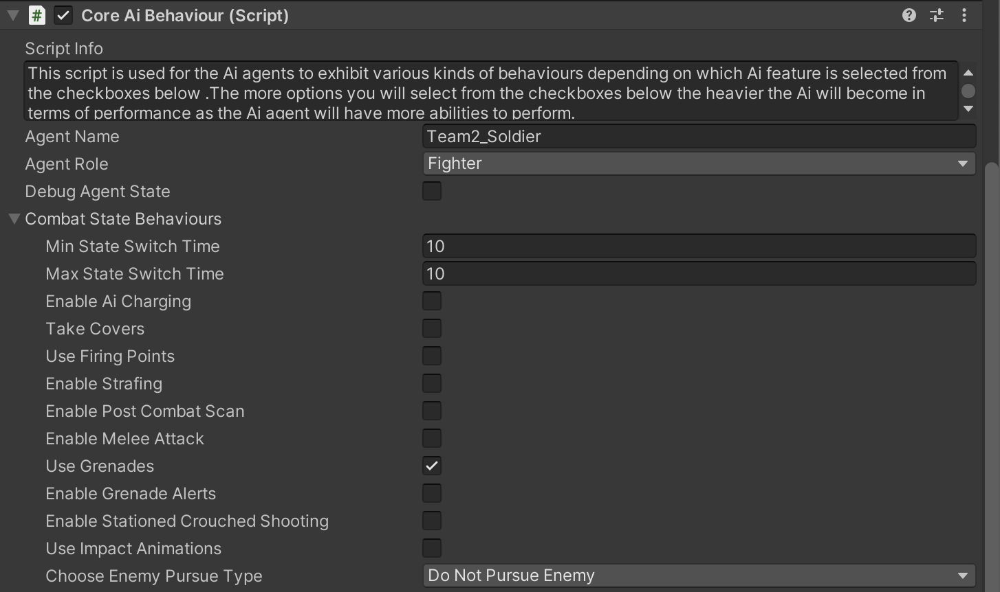
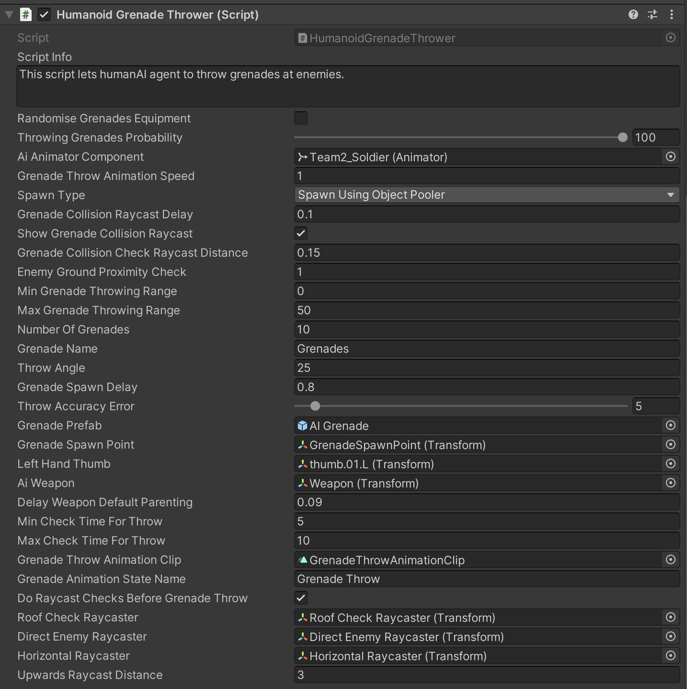

# AI Grenade Throw Part-2

    <iframe width="700" height="405" src="https://www.youtube.com/embed/hVD0wtHb4UM?si=PUNwfF04UUhETk_2" title="YouTube video player" frameborder="0" allow="accelerometer; autoplay; clipboard-write; encrypted-media; gyroscope; picture-in-picture; web-share" referrerpolicy="strict-origin-when-cross-origin" allowfullscreen></iframe>

## Introduction
This is the Part-2 of AI Grenades and in this part you will learn about fields inside the 'Humanoid Grenade Thrower' script.

### Use Grenades

To make Humanoid AI agent to be able to throw grenades at his enemies. You need to enable use grenades checkbox by going to 'Core AI Behaviour' script and than under 
'Combat state behaviours' check the checkbox 'Use Grenades'.

#### Humanoid Grenade Thrower

This script lets humanAI agent to throw grenades at enemies.

<table class="custom-table">
    <tr>
        <th>Fields</th>
        <th>Info</th>
    </tr>
    <tr>
        <td>Randomise Grenades Equipment</td>
        <td>If checked then spawned AI agent will or will not have grenades to throw for his entire lifespan.</td>
    </tr>
    <tr>
        <td>Throwing Grenades Probability</td>
        <td>If set to 100 AI agent will always throw grenades at enemies if within grenade throwing range.</td>
    </tr>
    <tr>
        <td>AI Animator Component</td>
        <td>Drag and drop animator that includes a grenade throwing animation clip.</td>
    </tr>
    <tr>
        <td>Grenade Throw Animation Speed</td>
        <td>Speed of the grenade throw animation.</td>
    </tr>
    <tr>
        <td>Spawn Type</td>
        <td>Lets you choose which of the two available grenade spawning methods will be used. First option is 'Spawn using object pooler' for optimizing processor performance by allocating a couple of megabytes of RAM for storage of a predefined amount of grenades to be pooled from the memory. Second option is 'Spawn Using Instantiation' which does not require extra RAM allocation and relies entirely on the CPU and contributes to garbage collection process. Choose one of the two options depending on the target device or platform. Usually first option is more preferable for mobile devices. In the case of consoles or desktop, it will not make any noticeable difference. If spawn using object pooler option is selected, then the user has to specify the overall amount of grenades inside the object pooler script.</td>
    </tr>
    <tr>
        <td>Grenade Collision Raycast Delay</td>
        <td>Specify the time when Grenade collision raycasting will be enabled when the grenade is thrown by the AI agent.</td>
    </tr>
    <tr>
        <td>Show Grenade Collision Raycast</td>
        <td>Display raycast from origin point in 6 directions - Forward, backward, right, left, Up, and down to detect colliders.</td>
    </tr>
    <tr>
        <td>Grenade Collision Check Raycast Distance</td>
        <td>Distance to create raycast from origin point in 6 directions - Forward, backward, right, left, Up, and down to detect colliders.</td>
    </tr>
    <tr>
        <td>Prelanding Rigidbody Activation Distance</td>
        <td>The Distance when the thrown grenade will activate rigidbody on it.</td>
    </tr>
    <tr>
        <td>Enemy Ground Proximity Check</td>
        <td>This field helps AI agent to know if the enemy is a viable target for a hand grenade. To prevent the agent from spending his grenades trying to destroy aerial targets that are above the specified altitude.</td>
    </tr>
    <tr>
        <td>Min Grenade Throwing Range</td>
        <td>Min allowed distance towards the enemy for throwing grenades. As soon as enemies are within the specified distance AI agent will be able to throw the grenades.</td>
    </tr>
    <tr>
        <td>Max Grenade Throwing Range</td>
        <td>Max allowed distance towards the enemy for throwing grenades. As soon as enemies are within the specified distance AI agent will be able to throw the grenades.</td>
    </tr>
    <tr>
        <td>Number Of Grenades</td>
        <td>Amount of grenades carried by AI agent.</td>
    </tr>
    <tr>
        <td>Grenade Name</td>
        <td>This field becomes relevant if 'Spawn using object pooler' option is selected. Name in the field should match the name of grenade prefab in object pooler for AI agent to be able to spawn grenades for the grenade attacks. If 'Spawn Using Instantiation' option is selected then Grenade Prefab field which is located below becomes relevant for grenade throwing ability.</td>
    </tr>
    <tr>
        <td>Find Enemies Script</td>
        <td>Drag and drop 'Find enemies' component from the top of the inspector into this field.</td>
    </tr>
    <tr>
        <td>Throw Angle</td>
        <td>Defines the trajectory of the thrown grenade.</td>
    </tr>
    <tr>
        <td>Grenade Spawn Delay</td>
        <td>Delays grenade spawn to match animation length and spawn it at the right moment of grenade throw animation.</td>
    </tr>
    <tr>
        <td>Throw Accuracy Error</td>
        <td>Affect how close or far away grenade will land from the target. The bigger the value the bigger the distance from the target to the place where the grenade lands.</td>
    </tr>
    <tr>
        <td>Grenade Prefab</td>
        <td>Drag and drop grenade prefab from the project folder into this field. Different AI agent types can have their own unique grenade.</td>
    </tr>
    <tr>
        <td>Grenade Spawn Point</td>
        <td>Drag and drop skeletal bone or its child object for grenade origin point at spawn.</td>
    </tr>
    <tr>
        <td>Left Hand Thumb</td>
        <td>Drag and drop Left hand thumb bone which is the child of the pelvis bone from the hierarchy into this field.</td>
    </tr>
    <tr>
        <td>AI Weapon</td>
        <td>Drag and drop weapons which are the child of the pelvis bone from the hierarchy into this field.</td>
    </tr>
    <tr>
        <td>Delay Weapon Default Parenting</td>
        <td>Delay time for weapon to be set back to its default parenting.</td>
    </tr>
    <tr>
        <td>Min Check Time For Throw</td>
        <td>To set minimum time intervals for AI agent to check if conditions are suitable for grenade throw.</td>
    </tr>
    <tr>
        <td>Max Check Time For Throw</td>
        <td>To set maximum time intervals for AI agent to check if conditions are suitable for grenade throw.</td>
    </tr>
    <tr>
        <td>Grenade Throw Animation Clip</td>
        <td>This field is responsible for applying the correct delay before grenade spawn when AI agent is performing grenade throw. It is referencing the time length of the grenade throw animation clip being played inside the animator controller. This functionality is achieved by putting the same animation clip that is played inside the animator controller into this field.</td>
    </tr>
    <tr>
        <td>Grenade Animation State Name</td>
        <td>Copy the name of the animation state from GRENADE layer inside the animator controller and paste it into this field. Grenade thrower script is referencing the name of the animation state inside the GRENADE layer of the animator controller to playback whatever animation clip is within that state. Make sure that the text in this field is exactly the same as the name of the animation state this field is referencing.</td>
    </tr>
    <tr>
        <td>Do Raycast Checks Before Grenade Throw</td>
        <td>Enable this checkbox only if you want the AI agent to do raycast checks before throwing a grenade towards the enemy. If your level is simple where you want the AI agent to throw a grenade in every situation you can disable this checkbox i.e fighting on 2 sides of the roof. Whereas if your level is complicated i.e construction site where lots of geometry is involved like stairs. You can enable this checkbox which will then make sure that AI agent does proper raycast checks towards the enemy before grenade throw.</td>
    </tr>
    <tr>
        <td>Roof Check Raycaster</td>
        <td>Drag and drop 'Roof Check Raycaster' gameObject attached as a child of this AI agent.</td>
    </tr>
    <tr>
        <td>Direct Enemy Raycaster</td>
        <td>Drag and drop 'Enemy Raycaster' gameObject attached as a child of this AI agent.</td>
    </tr>
    <tr>
        <td>Horizontal Raycaster</td>
        <td>Drag and drop 'Horizontal Raycaster' gameObject attached as a child of this AI agent.</td>
    </tr>
    <tr>
        <td>Upwards Raycast Distance</td>
        <td>Specify what would be the highest point the raycast will be drawn to detect obstacles before deciding whether to throw the grenade or not. While this is not the only condition for AI agent to check for before deciding whether to throw the grenade or not. Suppose if this condition is true meaning there is a roof above AI agent but the enemy is clearly visible to AI agent according to 'Enemy Raycaster' then AI agent will throw the grenade. One of the conditions should be true before deciding whether to throw the grenade or not.</td>
    </tr>
</table>
