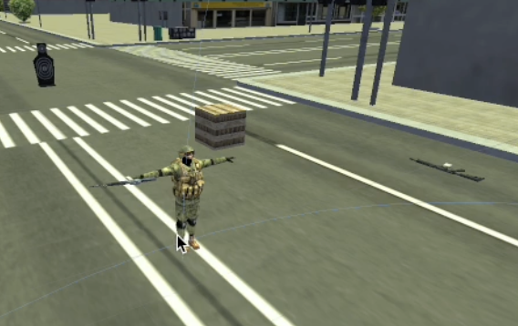

# Friendly Fire

    <iframe width="700" height="405" src="https://www.youtube.com/embed/hVD0wtHb4UM?si=PUNwfF04UUhETk_2" title="YouTube video player" frameborder="0" allow="accelerometer; autoplay; clipboard-write; encrypted-media; gyroscope; picture-in-picture; web-share" referrerpolicy="strict-origin-when-cross-origin" allowfullscreen></iframe>

## Introduction
This video guides you on how to setup the friendly fire for the player. 

### Add The Scripts
Select the Player and add two scripts - Friendly Fire and Cross hair color changer and assign the necessary gameObjects and components like shown in the video tutorial above.Your setup should look like this.

### Activate the Soldier AI 
First,you need to activate back the soldier AI from the hierarchy and change its Team ID to be 'Team1' to match the Player Team ID. Change the health of the AI agent to be 100.

### Friendly Fire

This script regulates friendly fire and its consequences to player.

<table class="custom-table">
<tr>
<th>Fields</th>
<th>Info</th>
</tr>
<tr>
<td>FriendlyFireOptions</td>
<td>Select one of the available options for Friendly Fire:
<ul>
<li><b>GameOver:</b> Ends the game as soon as the player shoots a friendly AI.</li>
<li><b>PlayerBecomesTraitor:</b> Friendly AI agents will shoot back at the player after a specified number of shots.</li>
<li><b>DisableShootingFriendlies:</b> Stops weapon functionality when pointing at friendly AI agents.</li>
<li><b>FriendliesDoNotReact:</b> Allows friendly fire without consequences for the player.</li>
</ul>
</td>
</tr>
<tr>
<td>TargetsScript</td>
<td>Drag and drop the Target script into this field.</td>
</tr>
<tr>
<td>DefaultGameOverPanel</td>
<td>Drag and drop the default Game Over panel from the hierarchy into this field.</td>
</tr>
<tr>
<td>FriendlyFireGameOverPanel</td>
<td>Drag and drop the Friendly Fire Game Over panel from the hierarchy into this field.</td>
</tr>
<tr>
<td>WarningsToPlayer</td>
<td>Number of times the player can shoot friendlies without being punished.</td>
</tr>
<tr>
<td>MakePlayerTraitorImmediatelyIfFriendlyDie</td>
<td>If enabled, the player becomes a traitor immediately after a nearby friendly dies.</td>
</tr>
<tr>
<td>FriendlyFireGameOverUIActivationDelay</td>
<td>Delay (in seconds) before activating the Game Over panel.</td>
</tr>
<tr>
<td>RestartGameUIButton</td>
<td>Drag and drop the respective button from the UI Canvas.</td>
</tr>
<tr>
<td>AudioSourceComponent</td>
<td>Audio source component used to play sounds based on friendly distance.</td>
</tr>
<tr>
<td>AudioClipsToPlaybackBasedOnFriendlyDistance</td>
<td>List of audio clips to play based on the distance of friendlies, with customizable ranges and volumes.</td>
</tr>
</table>

### Cross hair color changer

This script sets default crosshair color and  changes the color of the crosshair to the specified colors for the cases when crosshair is on friendly or  enemy Ai agents.

<table class="custom-table">
<tr>
<th>Fields</th>
<th>Info</th>
</tr>
<tr>
<td>FriendlyFireScript</td>
<td>Drag and drop Player root game object with FriendlyFire script attached to it into this field.</td>
</tr>
<tr>
<td>CrossHair</td>
<td>Drag and drop crosshair image UI elements into this list.</td>
</tr>
<tr>
<td>PlayerManagerComponent</td>
<td>Drag and drop Player Manager from player's hierarchy into this field.</td>
</tr>
<tr>
<td>DefaultCrossHairColor</td>
<td>Choose a default color to use when not aiming at friendlies or enemies, such as when looking at the environment or props.</td>
</tr>
<tr>
<td>OnEnemyCrosshairColor</td>
<td>Choose a color for crosshair to change when aiming at an enemy.</td>
</tr>
<tr>
<td>OnFriendlyCrossHairColor</td>
<td>Choose a color for crosshair to change when aiming at a friendly.</td>
</tr>
</table>
