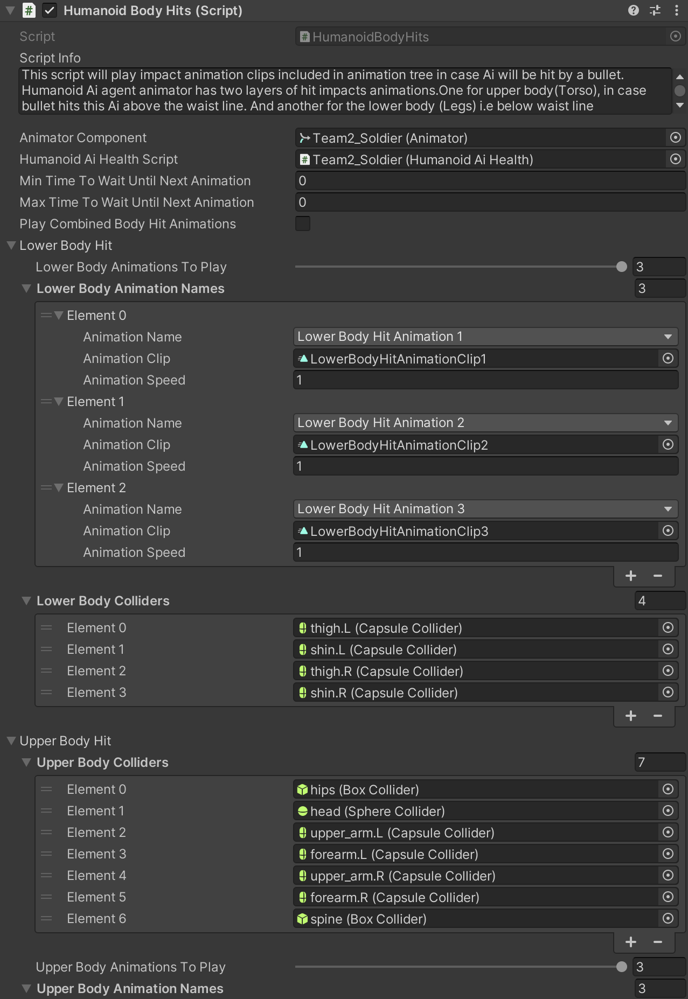
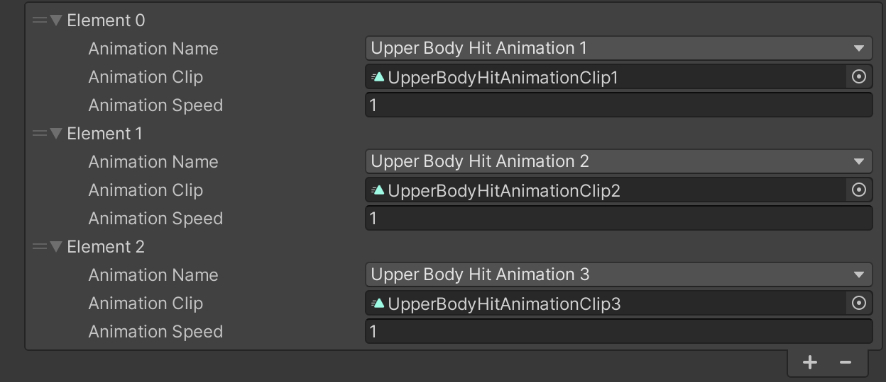

# Humanoid Body Hits

    <iframe width="700" height="405" src="https://www.youtube.com/embed/hVD0wtHb4UM?si=PUNwfF04UUhETk_2" title="YouTube video player" frameborder="0" allow="accelerometer; autoplay; clipboard-write; encrypted-media; gyroscope; picture-in-picture; web-share" referrerpolicy="strict-origin-when-cross-origin" allowfullscreen></iframe>

## Introduction
This video will help you understand how to enable and setup body hit animation for the humanoid AI agent.

### Enable Impact Animations
First check the checkbox 'Use Impact Animations' located in the combat state behaviour.[See the image below] 

Enabling this checkbox will enable the 'HumanoidBodyHits' script below.

    

<table class="custom-table">
    <tr>
        <th>Fields</th>
        <th>Info</th>
    </tr>
    <tr>
        <td>Animator Component</td>
        <td>Drag and drop into this field 'Animator' component located above in the inspector.</td>
    </tr>
    <tr>
        <td>Humanoid Ai Health</td>
        <td>Drag and drop into this field 'Humanoid Ai Health' component located above in the inspector.</td>
    </tr>
    <tr>
        <td>Min Time To Wait Until Next Animation</td>
        <td>Minimum time to wait until the next animation.</td>
    </tr>
    <tr>
        <td>Max Time To Wait Until Next Animation</td>
        <td>Maximum time to wait until the next animation.</td>
    </tr>
    <tr>
        <td>Play Combined Body Hit Animations</td>
        <td>Enable to play combined upper and lower body hit animations.</td>
    </tr>
    <tr>
        <td>Lower Body Hit</td>
        <td>Configuration for lower body hit animations.</td>
    </tr>
    <tr>
        <td>Lower Body Animations To Play</td>
        <td>Specify number of animations to add for this humanoid AI agent.</td>
    </tr>
    <tr>
        <td>Lower Body Animation Names</td>
        <td>Put the number of animation clips for AI agent to play when being hit by a bullet. Copy and paste names of those clips into the fields.To introduce visual variety and to avoid repetitive animations this list can have any amount of animation clips.Each time Ai agent is hit by a bullet random animation from this list will be played. </td>
    </tr>
    <tr>
        <td>Lower Body Colliders</td>
        <td>Drag and drop all the bones from the lower body into this list. As long as all intended bones are in this list, the script will register all the hits to those colliders on those bones and will play respective animation clips.</td>
    </tr>
    <tr>
        <td>Upper Body Hit</td>
        <td>Configuration for upper body hit animations.</td>
    </tr>
    <tr>
        <td>Upper Body Animations To Play</td>
        <td>Specify number of animations to add for this humanoid AI agent.</td>
    </tr>
    <tr>
        <td>Upper Body Animation Names</td>
        <td>Put the number of animation clips for AI agent to play when being hit by a bullet. Copy and paste names of those clips into the fields.To introduce visual variety and to avoid repetitive animations this list can have any amount of animation clips.Each time Ai agent is hit by a bullet random animation from this list will be played.</td>
    </tr>
    <tr>
        <td>Upper Body Colliders</td>
        <td>Drag and drop all the bones from the upper body into this list. As long as all intended bones are in this list, the script will register all the hits to those colliders on those bones and will play respective animation clips.</td>
    </tr>
</table>

