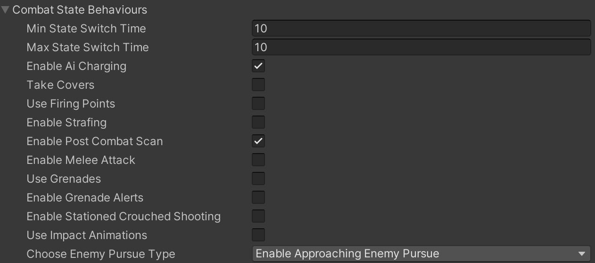
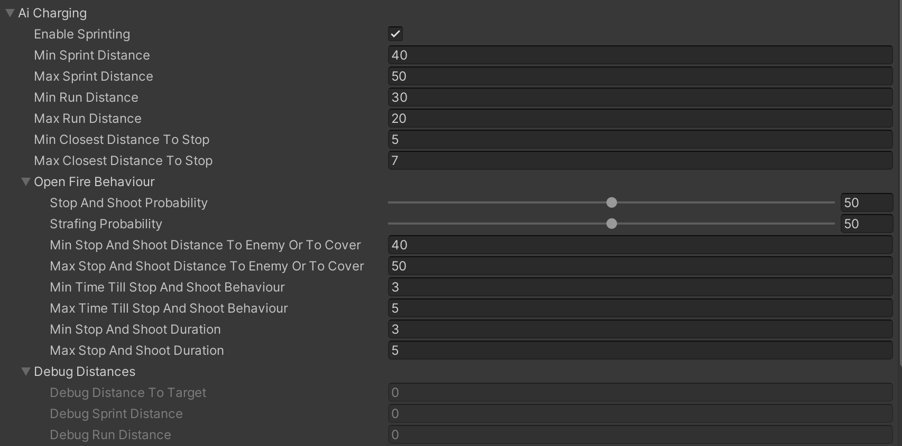

# Charging Behaviour

    <iframe width="700" height="405" src="https://www.youtube.com/embed/hVD0wtHb4UM?si=PUNwfF04UUhETk_2" title="YouTube video player" frameborder="0" allow="accelerometer; autoplay; clipboard-write; encrypted-media; gyroscope; picture-in-picture; web-share" referrerpolicy="strict-origin-when-cross-origin" allowfullscreen></iframe>

## Introduction
This video will help you understand how to achieve 'Charging' behaviour on the humanoid AI agent during combat state.

### AI Charging
First enable 'Ai Charging' located in the combat state behaviour.[See the image below] 

Enabling it will show Strafing options in the script which you can tweak to achieve the desired behaviour.

<table class="custom-table">
    <tr>
        <th>Fields</th>
        <th>Info</th>
    </tr>
    <tr>
        <td>Enable Sprinting</td>
        <td>If unchecked, AI agent will perform assault by Walking/Running/Sprinting and shooting its target.</td>
    </tr>
    <tr>
        <td>Min Sprint Distance</td>
        <td>Minimal remaining distance to pursue point for the switch from walking or running to sprinting towards it.</td>
    </tr>
    <tr>
        <td>Max Sprint Distance</td>
        <td>Maximum distance for sprinting towards coordinate.</td>
    </tr>
    <tr>
        <td>Min Run Distance</td>
        <td>Minimal remaining distance to pursue point for the switch from walking or sprinting to running towards it.</td>
    </tr>
    <tr>
        <td>Max Run Distance</td>
        <td>Maximal remaining distance to pursue point for the switch from walking or sprinting to running towards it.</td>
    </tr>
    <tr>
        <td>Min Closest Distance To Stop</td>
        <td>Minimal closest distance to stop.</td>
    </tr>
    <tr>
        <td>Max Closest Distance To Stop</td>
        <td>Maximal closest distance to stop.</td>
    </tr>
    <tr>
        <td>Open Fire Behaviour</td>
        <td>Fields in this subsection are setting Ai agent's weapon firing behaviour while he is moving towards or between covers. This subsection is reused in 3 different combat related paragraphs: Ai Charging, Ai Covers, and Ai Firing Points. In each of these cases, this subsection defines Open Fire Behaviour in relation to the parent paragraph's subject.</td>
    </tr>
    <tr>
        <td>Stop And Shoot Probability</td>
        <td>This slider sets the probability of 'Stop And Shoot' behaviour while Ai agent is moving towards or between covers.</td>
    </tr>
    <tr>
        <td>Strafing Probability</td>
        <td>This slider sets the probability of 'Strafing' behaviour while Ai agent is moving towards or between covers.</td>
    </tr>
    <tr>
        <td>Min Stop And Shoot Distance To Enemy Or To Cover</td>
        <td>Minimal distance towards the cover to activate Stop&Shoot behaviour.</td>
    </tr>
    <tr>
        <td>Max Stop And Shoot Distance To Enemy Or To Cover</td>
        <td>Maximum distance towards the cover to activate Stop&Shoot behaviour.</td>
    </tr>
    <tr>
        <td>Min Time Till Stop And Shoot Behaviour</td>
        <td>Minimum time since Ai agent decided to go towards or between covers till he starts Stop&Shoot behaviour.</td>
    </tr>
    <tr>
        <td>Max Time Till Stop And Shoot Behaviour</td>
        <td>Maximum time since Ai agent decided to go towards or between covers till he starts Stop&Shoot behaviour.</td>
    </tr>
    <tr>
        <td>Min Stop And Shoot Duration</td>
        <td>Minimum duration in seconds of the Stop&Shoot behaviour.</td>
    </tr>
    <tr>
        <td>Max Stop And Shoot Duration</td>
        <td>Maximum duration in seconds of the Stop&Shoot behaviour.</td>
    </tr>
    <tr>
        <td>Debug Distances</td>
        <td>Values in this section will display the distance to target as well as random value between Min/Max SprintDistance and RunDistance.</td>
    </tr>
    <tr>
        <td>Debug Distance To Target</td>
        <td>Display the current distance to target.</td>
    </tr>
    <tr>
        <td>Debug Sprint Distance</td>
        <td>Display the random value of Min/Max SprintDistance.</td>
    </tr>
    <tr>
        <td>Debug Run Distance</td>
        <td>Display the random value of Min/Max RunDistance.</td>
    </tr>
</table>

