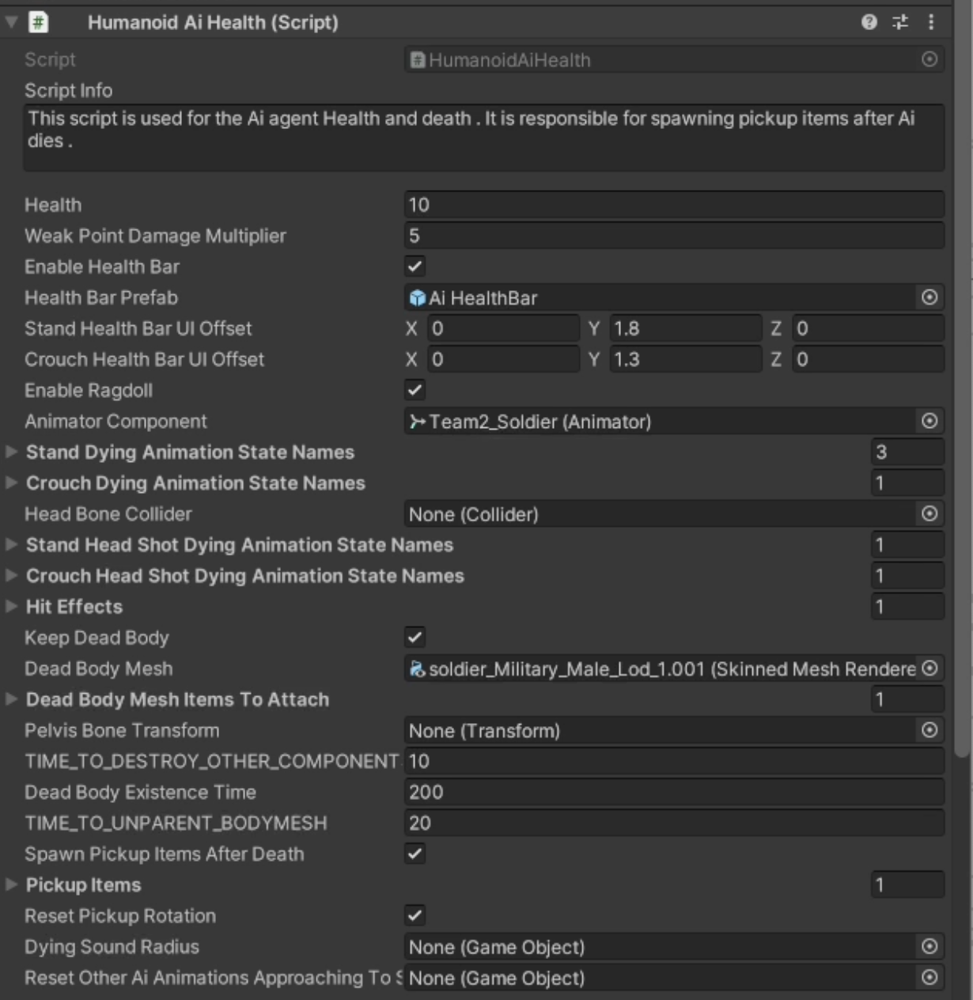

# Agent Health

    <iframe width="560" height="315" src="https://www.youtube.com/embed/hVD0wtHb4UM?si=PUNwfF04UUhETk_2" title="YouTube video player" frameborder="0" allow="accelerometer; autoplay; clipboard-write; encrypted-media; gyroscope; picture-in-picture; web-share" referrerpolicy="strict-origin-when-cross-origin" allowfullscreen></iframe>

## Introduction
This video will help you understand about 'Health Script' of the Humanoid AI agent.

### Health Script

<table class="custom-table">
    <tr>
        <th>Fields</th>
        <th>Info</th>
    </tr>
    <tr>
        <td>Health</td>
        <td>Health of the Ai agent which get decreased when the Ai agent takes damage.</td>
    </tr>
    <tr>
        <td>Weak Point Damage Multiplier</td>
        <td>Multiplies the damage of the bullet or grenade with the value in this field.</td>
    </tr>
     <tr>
        <td>Enable Health Bar</td>
        <td>Enable this checkbox to spawn the 'Healthbar UI' on top of the Ai agent.</td>
    </tr>
     <tr>
        <td>Health Bar Prefab</td>
        <td>Drag and drop 'Healthbar UI' prefab from the project into this field.</td>
    </tr> 
     <tr>
        <td>Stand Health Bar UI Offset</td>
        <td>Adjust the position of the spawned 'HealthBar UI' during the time Ai agent is standing.</td>
    </tr> 
     <tr>
        <td>Crouch Health Bar UI Offset</td>
        <td>Adjust the position of the spawned 'HealthBar UI' during the time Ai agent is crouching.</td>
    </tr> 
     <tr>
        <td>Enable Ragdoll</td>
        <td>If enabled for Ai agent than it will use the ragdoll physics when it dies. If disabled Ai agent will use random animation clips.</td>
    </tr> 
     <tr>
        <td>Animator Component</td>
        <td>Drag and drop the animator component attached with this Ai agent from the hierarchy into this field.</td>
    </tr> 
     <tr>
        <td>Stand Dying Animation State Names</td>
        <td>You can put one or several animation state names into the fields below for the Ai to playback when it dies during stand shooting.Names you put into the fields should precisely match the names of the animation states inside animator controller.</td>
    </tr> 
     <tr>
        <td>Crouch Dying Animation State Names</td>
        <td>You can put one or several animation state names into the fields below for the Ai to playback when it dies during crouch shooting.Names you put into the fields should precisely match the names of the animation states inside animator controller.</td>
    </tr> 
     <tr>
        <td>Head Bone Collider</td>
        <td>Drag and drop the collider attached with the 'HeadBone' which is the child of this Ai agent pelvis bone from the hierarchy into this field.</td>
    </tr> 
     <tr>
        <td>Stand HeadShot Dying Animation State Names</td>
        <td>You can put one or several animation state names into the fields below for the Ai to playback when it dies during stand shooting.Names you put into the fields should precisely match the names of the animation states inside animator controller.</td>
    </tr> 
     <tr>
        <td>Crouch HeadShot Dying Animation State Names</td>
        <td>You can put one or several animation state names into the fields below for the Ai to playback when it dies during crouch shooting.Names you put into the fields should precisely match the names of the animation states inside animator controller.</td>
    </tr> 
     <tr>
        <td>Keep DeadBody</td>
        <td>If Enabled other components will be destroy and the mesh will be unparent.</td>
    </tr> 
     <tr>
        <td>DeadBody Mesh</td>
        <td>In case developers will want to keep dead body of killed Ai agents for sometime after agents die they should drag skinned mesh renderer from Ai hierarchy into this field.When the Ai agent will die his deadbody will appear in the exact pose of the last frame of the ragdoll or dying animation.This DeadBodyMesh is also required to store the coordinates for the investigation after the emergency state has been expired.</td>
    </tr> 
     <tr>
        <td>DeadBody Mesh Items To Attach</td>
        <td>Add all the additional Items like googles,Mask to attach with the Deadbody Mesh during the time it spawn.</td>
    </tr> 
     <tr>
        <td>Pelvis Bone Transform</td>
        <td>Drag the Pelvis Bone of the Ai skinned mesh into this field.The pelvic bone of the skinned mesh that you imported does not have to be named - pelvis.In the skinned meshes provided for the kit pelvic bone has a name - hips.</td>
    </tr> 
     <tr>
        <td>TIME_TO_DESTROY_OTHER_COMPONENTS</td>
        <td>Will destroy all other components (scripts and skeleton) except Humanoid Ai Health script.This field is responsible for creating dead body mesh that will stay in the level for specified amount of time.</td>
    </tr> 
     <tr>
        <td>DeadBody Existence Time</td>
        <td>The time deadbody will stay visible in the game.</td>
    </tr> 
     <tr>
        <td>TIME_TO_UNPARENT_BODYMESH</td>
        <td>Unparenting the resulted non skeletal body mesh is necessary to achieve this dead body effect.This delay value should be tweaked so that there would be enough time to inherit skeletal position of the last frame that skeleton existed.</td>
    </tr> 
     <tr>
        <td>Spawn Pickup Items After Death</td>
        <td>If enabled than the Ai agent will spawn pickup items after death.</td>
    </tr> 
     <tr>
        <td>Pickup Items</td>
        <td>Drag and drop one or more items from the project window into this field to spawn when the Ai agent deadbody existence time get expired.</td>
    </tr> 
     <tr>
        <td>Reset Pickup Rotation</td>
        <td>If checked than spawned pickup items will not inherit Ai root object rotation value.</td>
    </tr> 
     <tr>
        <td>Dying Sound Radius</td>
        <td>This radius is enabled every time Ai agent dies regardless of the reason of his death.It will cause emergency alert state for any Ai agent that will be within dying sound radius.</td>
    </tr> 
     <tr>
        <td>Sound Investigating Approach Style Reset</td>
        <td>Drag and drop 'SoundInvestigatingApproachStyleReset' script located in the hierarchy of this Agent.</td>
    </tr> 

</table>

