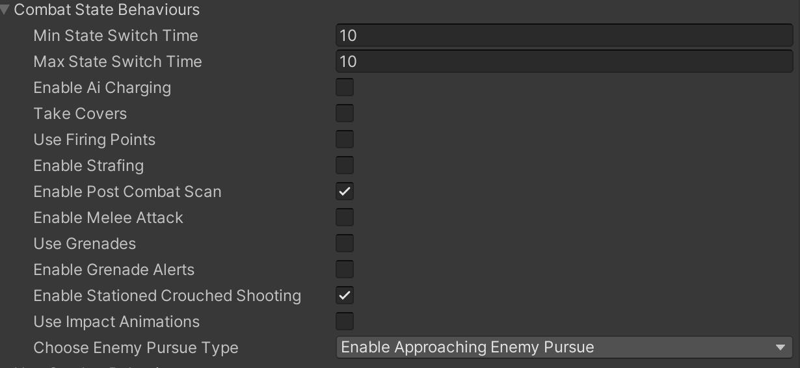
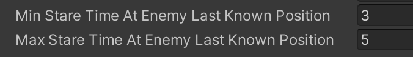

# Pursue Behaviour

    <iframe width="560" height="315" src="https://www.youtube.com/embed/hVD0wtHb4UM?si=PUNwfF04UUhETk_2" title="YouTube video player" frameborder="0" allow="accelerometer; autoplay; clipboard-write; encrypted-media; gyroscope; picture-in-picture; web-share" referrerpolicy="strict-origin-when-cross-origin" allowfullscreen></iframe>

## Introduction
This video will guide you on how to achieve AI agent pursue behaviour in case of enemy lost.There are 2 types of pursue behaviour - Stationed and Approaching.

### Pursue Type : Stationed

If the selected option is 'Enable Stationed Enemy Pursue' than this humanoid AI agent will be stationed while staring at the last enemy known position for some seconds specified
in the Min/Max Stare time fields.

### Pursue Type : Approaching

If the selected option is 'Enable Approaching Enemy Pursue' than this humanoid AI agent will be approaching at the last enemy known position.
After the Enemy Lost, 'Humanoid AI' agent will first stare at the enemy last known position and then after the stare time is completed agent will start approaching towards the last enemy known position.

Let's talk about three scenarios that can be possible:

### Scenario 1 : NavMeshPath Complete

When the NavMeshPath to the enemy is completed the 'Humanoid AI' agent will be sprinting,running and than walking towards the enemy last know coordinate based on the distance.

### Scenario 2 : NavMeshPath Partial

When the NavMeshPath to the enemy is partial(Where the target is on the roof) the 'Humanoid AI' agent will create the closest point on the NavMesh from the current target position which is reachable and will be sprinting,running and than walking towards it based on the distance.

### Scenario 3 : NavMeshPath Invalid

When the NavMeshPath to the enemy is invalid(Where both the target and the agent is on the opposite sides of buildings) the 'Humanoid AI' agent will make sure to only stare at the enemy current position until the combat state restarted.

<table class="custom-table">
    <tr>
        <th>Fields</th>
        <th>Info</th>
    </tr>
    <tr>
        <td>Enemy Pursue Error Radius</td>
        <td>This slider sets the offset radius from last seen enemy coordinate. Pursuing Ai will set random coordinate to go to within that radius.</td>
    </tr>
    <tr>
        <td>Aimed Scaning At Enemy Last Known Position</td>
        <td>This subsection contains the values of aimed turns(scanning) for this agent after arriving at the LastKnownEnemyPosition coordinate. It will playback idle turning clips assigned to respective turning directions for lower body layer inside Animator while playing upper body aiming animation clip for all of those turns.</td>
    </tr>
    <tr>
        <td>Turn Direction</td>
        <td>Choose one of 4 turning directions from this list. AI agent will play corresponding animation clip from the animation tree that is assigned to this direction.</td>
    </tr>
    <tr>
        <td>Min Aimed Turn Animation Speed</td>
        <td>Minimal playback speed of the the turn animation clip.</td>
    </tr>
    <tr>
        <td>Max Aimed Turn Animation Speed</td>
        <td>Maximal playback speed of the the turn animation clip.</td>
    </tr>
    <tr>
        <td>Min Time Between Aimed Turns</td>
        <td>Minimum time to keep aimed look in the direction that resulted after playing previous aimed animation turn clip, before starting playback of the new turn animation clip.</td>
    </tr>
    <tr>
        <td>Max Time Between Aimed Turns</td>
        <td>Maximum time to keep aimed look in the direction that resulted after playing previous aimed animation turn, before starting playback of the new one.</td>
    </tr>
    <tr>
        <td>Min Scan Completion Time</td>
        <td>Minimum time to keep aimed scanning before switching to non combat state.</td>
    </tr>
    <tr>
        <td>Max Scan Completion Time</td>
        <td>Maximum time to keep aimed scanning before switching to non combat state.</td>
    </tr>
    <tr>
        <td>Play Animations Sequentially</td>
        <td>If checked scan animations will playback sequentially.In case unchecked the scan animations will playback randomly.</td>
    </tr>
    <tr>
        <td>Aimed Turning Animations</td>
        <td>Create up to 4 turning directions for Ai agent to perform during aimed scanning.</td>
    </tr>
    <tr>
        <td>Min Near Stopping Distance</td>
        <td>Minimum distance to stop near the Pursue point and to consider it as reached.</td>
    </tr>
    <tr>
        <td>Max Near Stopping Distance</td>
        <td>Maximum distance to stop near the Pursue point and to consider it as reached.</td>
    </tr>
    <tr>
        <td>Min Sprint Distance</td>
        <td>Minimal remaining distance to pursue point for the switch from walking or running to sprinting towards it.</td>
    </tr>
    <tr>
        <td>Max Sprint Distance</td>
        <td>Maximum distance for sprinting towards coordinate.</td>
    </tr>
    <tr>
        <td>Min Run Distance</td>
        <td>Minimal remaining distance to pursue point for the switch from walking or sprinting to running towards it.</td>
    </tr>
    <tr>
        <td>Max Run Distance</td>
        <td>Maximal remaining distance to pursue point for the switch from walking or sprinting to running towards it.</td>
    </tr>
    <tr>
        <td>Min Walk Distance</td>
        <td>Minimal remaining distance to pursue point for the switch from running or sprinting to walking towards it.</td>
    </tr>
    <tr>
        <td>Max Walk Distance</td>
        <td>Maximal remaining distance to pursue point for the switch from running or sprinting to walking towards it.</td>
    </tr>
    <tr>
        <td>Min Stare Time At Enemy Last Known Position</td>
        <td>Minimum staring time of any non Stationed AI agent at the last known position of the enemy before beginning pursue.</td>
    </tr>
    <tr>
        <td>Max Stare Time At Enemy Last Known Position</td>
        <td>Maximum staring time of any non Stationed AI agent at the last known position of the enemy before beginning pursue.</td>
    </tr>
    <tr>
        <td>Debug Pursue Distances</td>
        <td>This sub section contains values which show the distance to the last known position of the enemy.</td>
    </tr> 
    <tr>
    <td>Debug Distance To Coordinate</td>
    <td>Debug the distance to coordinate(Enemy Last Known Position) to reach</td>
    </tr>
   <tr>
    <td>Debug Sprint Distance</td>
    <td>Debug the sprint distance to coordinate(Enemy Last Known Position) to reach</td>
   </tr>
   <tr>
    <td>Debug Run Distance</td>
    <td>Debug the run distance to coordinate(Enemy Last Known Position) to reach</td>
   </tr>
    <tr>
    <td>Debug Walk Distance</td>
    <td>Debug the walk distance to coordinate(Enemy Last Known Position) to reach</td>
    </tr>
</table>

