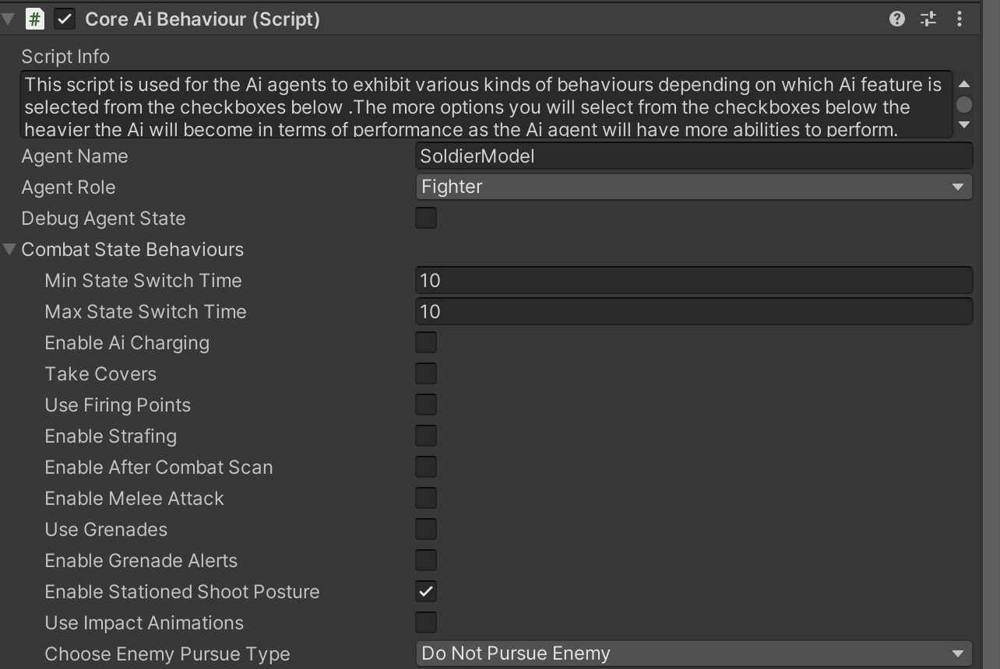
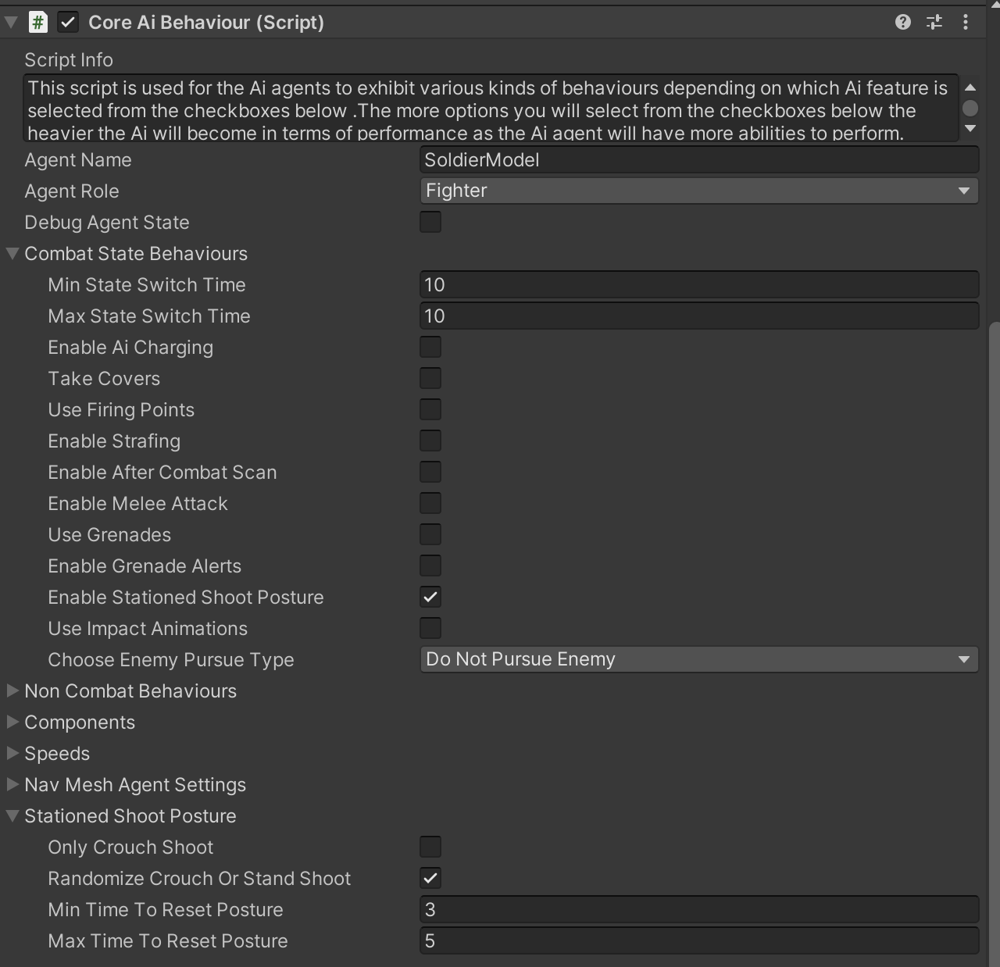

# Stationed Shoot Posture

    <iframe width="700" height="405" src="https://www.youtube.com/embed/hVD0wtHb4UM?si=PUNwfF04UUhETk_2" title="YouTube video player" frameborder="0" allow="accelerometer; autoplay; clipboard-write; encrypted-media; gyroscope; picture-in-picture; web-share" referrerpolicy="strict-origin-when-cross-origin" allowfullscreen></iframe>

## Introduction
This video will guide you on how to achieve 'Stand' and 'Crouch' shooting
on this Humanoid AI agent when the agent is Stationary.

### Stationed Shoot Posture
First enable 'Stationed Shoot Posture' located in the combat state behaviour.[See the image below] 

Enabling it will show Stationed Shoot Posture options in the script which you can tweak to achieve the desired behaviour.

<table class="custom-table">
    <tr>
        <th>Fields</th>
        <th>Info</th>
    </tr>
    <tr>
        <td>Only Crouch Shoot</td>
        <td>Enable shooting only in crouched position while stationary and in combat.</td>
    </tr>
    <tr>
        <td>Randomize Crouch Or StandShoot</td>
        <td>Randomly alternate between sitting and standing while shooting, but only when stationary and in combat.</td>
    </tr>
     <tr>
        <td>Min Time To Reset Posture</td>
        <td>Minimum time to reset posture after shooting, applicable when stationary and in combat.</td>
    </tr>
     <tr>
        <td>Max Time To Reset Posture</td>
        <td>Maximum time to reset posture after shooting, applicable when stationary and in combat.</td>
    </tr> 
</table>

