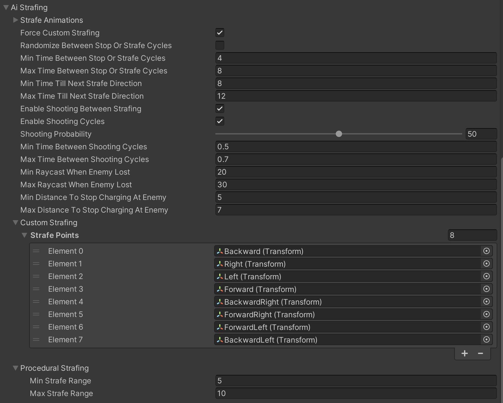

# Strafing

    <iframe width="700" height="405" src="https://www.youtube.com/embed/hVD0wtHb4UM?si=PUNwfF04UUhETk_2" title="YouTube video player" frameborder="0" allow="accelerometer; autoplay; clipboard-write; encrypted-media; gyroscope; picture-in-picture; web-share" referrerpolicy="strict-origin-when-cross-origin" allowfullscreen></iframe>

## Introduction
This video will guide you on how to achieve 'Strafing' behaviour on the humanoid AI agent during combat state.

### Agent Strafing
First enable 'Strafing' located in the combat state behaviour.[See the image below] 

Enabling it will show Strafing options in the script which you can tweak to achieve the desired behaviour.

<table class="custom-table">
    <tr>
        <th>Fields</th>
        <th>Info</th>
    </tr>
    <tr>
        <td>Strafe Animations</td>
        <td>Select the animation to play when Ai agent is moving forward, backward, right, left, etc., in combat state.</td>
    </tr>
    <tr>
        <td>Force Custom Strafing</td>
        <td>If enabled, Ai agent will move between Predefined Custom strafe directions specified in the field 'Custom Strafe Directions'. This becomes very useful when you want the Ai agent to strafe only in one or two directions, for example: strafing right or left.</td>
    </tr>
    <tr>
        <td>Randomize Between Stop Or Strafe Cycles</td>
        <td>If enabled, Ai agent will have a 50/50 chance of deciding whether to strafe and shoot or stop and shoot.</td>
    </tr>
    <tr>
        <td>Min Time Between Stop Or Strafe Cycles</td>
        <td>Minimum time to perform either Stop and shoot or Strafe and shoot cycles in case the checkbox named 'Randomize Between Stop Or Strafe Cycles' is enabled.</td>
    </tr>
    <tr>
        <td>Max Time Between Stop Or Strafe Cycles</td>
        <td>Maximum time to perform either Stop and shoot or Strafe and shoot cycles in case the checkbox named 'Randomize Between Stop Or Strafe Cycles' is enabled.</td>
    </tr>
    <tr>
        <td>Min Time Till Next Strafe Direction</td>
        <td>Minimum time to create a new strafe coordinate within the range specified above.</td>
    </tr>
    <tr>
        <td>Max Time Till Next Strafe Direction</td>
        <td>Maximum time to create a new strafe coordinate within the range specified above.</td>
    </tr>
    <tr>
        <td>Enable Shooting Between Strafing</td>
        <td>Combines shooting and strafing functionalities.</td>
    </tr>
    <tr>
        <td>Enable Shooting Cycles</td>
        <td>Enables strafing AI agent to have periods of aiming without actual shooting between shooting cycles. Otherwise, AI agent will continuously shoot at its target until this target is destroyed or no more ammo is left in the magazine, in which case AI agent will reload his weapon and continue firing at its target.</td>
    </tr>
    <tr>
        <td>Shooting Probability</td>
        <td>Adjust the slider value and decide what should be the shooting probability of this Ai agent. The bigger the number, the higher the chances of the Ai agent to consider shooting, and the smaller number will result in less chance of shooting.</td>
    </tr>
    <tr>
        <td>Min Time Between Shooting Cycles</td>
        <td>Minimal possible period of time for strafing and aiming weapon between shooting cycles (i.e., without actually firing it).</td>
    </tr>
    <tr>
        <td>Max Time Between Shooting Cycles</td>
        <td>Maximal possible period of time for strafing and aiming weapon between shooting cycles (i.e., without actually firing it).</td>
    </tr>
    <tr>
        <td>Min Raycast When Enemy Lost</td>
        <td>Minimal raycast checks to do if target is not in view during strafing.</td>
    </tr>
    <tr>
        <td>Max Raycast When Enemy Lost</td>
        <td>Maximum raycast checks to do if target is not in view during strafing.</td>
    </tr>
    <tr>
        <td>Min Distance To Stop Charging At Enemy</td>
        <td>Minimum distance to stop charging at enemy.</td>
    </tr>
    <tr>
        <td>Max Distance To Stop Charging At Enemy</td>
        <td>Maximum distance to stop charging at enemy.</td>
    </tr>
    <tr>
        <td>Custom Strafing</td>
        <td>Custom Strafing is based on a set of custom strafing points that allows to limit overall number and choice of available strafing directions for AI agent.</td>
    </tr>
     <tr>
        <td>Strafe Points</td>
        <td>This section stores all custom strafe points that represent their respective directions and define maximal possible strafing ranges (that can be limited by 'Min/Max time   Till Next Strafe Direction' timer) by their actual distances from AI agent`s root game object.Number of custom strafe points added to AI agent can be as low as one or two or all the way up to eight.</td>
    </tr>
    <tr>
        <td>Procedural Strafing</td>
        <td>This solution provides 360 strafing directions to AI agent. Actual distances of those directions will be also limited by 'Min/Max time Till Next Strafe Direction' timer same as custom strafe directions. Procedural strafing is more preferable for cases when AI agent is situated on small isolated Navmesh pieces as it will still allow AI agent to strafe within limited ranges like balcony, watch tower or a small roof or any enclosure of a small space.</td>
    </tr>
    <tr>
        <td>Min Strafe Range</td>
        <td>Minimum range to create a strafe coordinate for the Ai agent to move from its current position.</td>
    </tr>
     <tr>
        <td>Max Strafe Range</td>
        <td>Maximum range to create a strafe coordinate for the Ai agent to move from its current position.</td>
    </tr>
</table>

