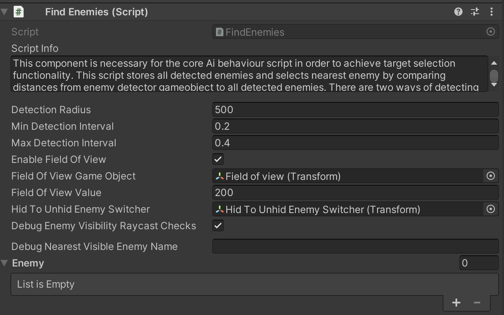
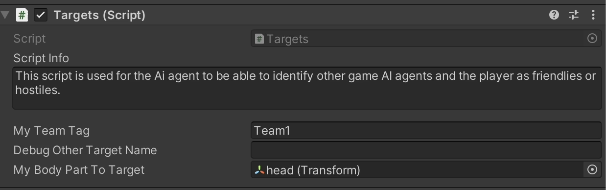
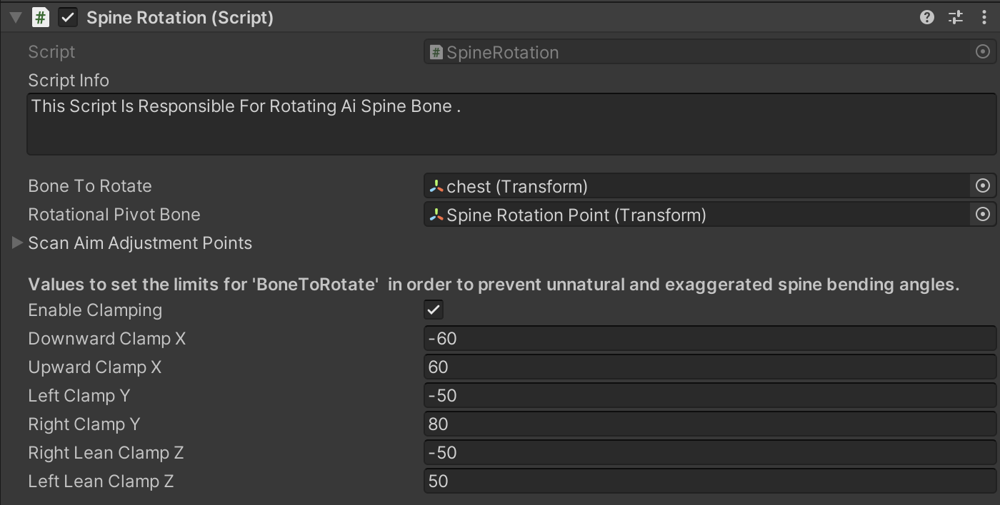

# Humanoid AI Agent Tactical Interactions

    <iframe width="560" height="315" src="https://www.youtube.com/embed/hVD0wtHb4UM?si=PUNwfF04UUhETk_2" title="YouTube video player" frameborder="0" allow="accelerometer; autoplay; clipboard-write; encrypted-media; gyroscope; picture-in-picture; web-share" referrerpolicy="strict-origin-when-cross-origin" allowfullscreen></iframe>

## Introduction
This video will help you understand Humanoid AI agent tactial interactions.How the AI agent detection enemies,Rotate spine bone,do enemy visibility checks,switch teams and much
more.This video highlights five scripts - FindEnemies Script,Humanoid Visibility Checker,Spine Rotation,Targets and Switch Team.

### FindEnemies Script
This component is necessary for the core Ai behaviour script in order to achieve target selection functionality. This script stores all detected enemies and selects nearest enemy by comparing distances from enemy detector gameobject to all detected enemies. There are two ways of detecting enemies.

1.Using detection radius i.e automatically detecting all Ai agents and discriminating enemies from friendlies.This method is used as a simpliest detection solution and can be used in situations where more complex solutions are not required. 

2.Using field of view within detection radius size to imitate human vision. This is more computationally complex solution and used in cases where first solution would not suffice developers due to its primitive nature that is more suitable for arcade gameplay but insufficient for tactical behaviour.Combining these detection methods to optimise mobile performance will have noticeable affect. In case of PC target platform difference in perfomance will have less noticeable.

<table class="custom-table">
    <tr>
        <th>Fields</th>
        <th>Info</th>
    </tr>
    <tr>
        <td>Detection Radius</td>
        <td>Radius within which AI agent can detect its enemies. AI agent will sort out closest enemy in any direction within this radius regardless of obstacles in-between like buildings, vehicles, terrain, vegetation etc. If 'Enable Field Of View' checkbox is checked then AI agent will not act upon detected enemies within this radius unless they get within his unobstructed field of view.</td>
    </tr>
    <tr>
        <td>Min Detection Interval</td>
        <td>Minimum time between closest enemy visibility checks.</td>
    </tr>
     <tr>
        <td>Max Detection Interval</td>
        <td>Maximum time between closest enemy visibility checks.</td>
    </tr>
     <tr>
        <td>Enable Field Of View</td>
        <td>This checkbox is conditioning successful detection to a specified angle within detection radius and absence of visual obstacles between AI agent and its enemy.</td>
    </tr>
      <tr>
        <td>Field Of View GameObject</td>
        <td>Drag and drop Visual_FieldOfView(just FieldOfView) game object from Ai agent's head bone hierarchy into this field.</td>
      </tr>
      <tr>
        <td>Hid To Unhid Enemy Switcher</td>
        <td>Attach the 'Enemy Raycaster' GameObject as a child of this AI agent in the hierarchy and assign it to this field.
            Position the Enemy Raycaster further out from the head bone to ensure proper  raycasting for the AI agent towards the closest enemy 
             allowing it to determine visibility and to abandon current closest enemy if he is he is obscured(not in direct line of sight) and switch to another closest unobscured enemy.</td>
      </tr>
       <tr>
        <td>Debug Enemy Visibility Raycast Checks</td>
        <td>If Checked then visibility raycast checks for detected enemies will be drawn in the scene view.</td>
      </tr>
     <tr>
        <td>Debug Nearest Visible Enemy Name</td>
        <td>Name of the nearest visible of the detected enemies will be displayed inside this field during runtime.</td>
      </tr>
    
</table>

### Targets
This script is used for the Ai agent to be able to identify other game AI agents and the player as friendlies or hostiles.

<table class="custom-table">
    <tr>
        <th>Fields</th>
        <th>Info</th>
    </tr>
    <tr>
        <td>My Team Tag</td>
        <td>Team ID of this Ai agent</td>
    </tr>
    <tr>
        <td>Debug Other Target Name</td>
        <td>Debugs the name of the enemy this bot is currently shooting at.</td>
    </tr>
     <tr>
        <td>My Body Part To Target</td>
        <td>Drag the Ai agent body part(bone or any other gameobject from Ai hierarchy) into this field for enemy Ai agents to shoot at.</td>
    </tr> 
</table>

### Humanoid Visibility Checker
This script lets Ai agent to focus on the enemies using the Field of view while making sure to avoid any other obstacles in front using the raycasting.

<table class="custom-table">
    <tr>
        <th>Fields</th>
        <th>Info</th>
    </tr>
    <tr>
        <td>Raycast Checker</td>
        <td>This field is responsible for detecting any obstacle between the nearest enemy and this Ai agent.For example: if Ai agent is under combat with the player and the player gets hide behind the building.In that case raycast checker will do number of checks specified in the field named 'NumberOfRaycastChecksToDo' each frame to confirm that Ai agent can't see the Player.After the checks completed Ai agent will go in the Alerted state and will move to the last seen position of the player.</td>
    </tr>
    <tr>
        <td>Minimum Time To Raycast</td>
        <td>Minimum time between which a raycast check will be done.</td>
    </tr>
     <tr>
        <td>Maximum Time To Raycasts</td>
        <td>Maximum time between which a raycast check will be done.</td>
    </tr> 
    <tr>
        <td>Number Of Raycast Checks To Do</td>
        <td>Number of checks to do towards the nearest enemy if this Ai agent is unable to see its nearest enemy in a combat state.</td>
    </tr> 
     <tr>
        <td>Debug Raycast Counts</td>
        <td>Debug the raycast counts towards the nearest enemy if this Ai agent is unable to see its nearest enemy in a combat state.</td>
    </tr> 
    <tr>
        <td>Visible Layers</td>
        <td>Specify which layers to ignore when doing raycast checks for example: Patrol points with colliders attached that exist in a scene without a mesh needs to be avoided from the raycast checks.</td>
    </tr> 
</table>

### Spine Rotation
This Script Is Responsible For Rotating Ai Spine Bone.

<table class="custom-table">
    <tr>
        <th>Fields</th>
        <th>Info</th>
    </tr>
    <tr>
        <td>Bone To Rotate</td>
        <td>The bone to be rotated by the Shooting point towards the target in combat state.Select the appropriate bone of the rig somewhere in the middle of the spine.In the rig provided in this kit it is 'chest' bone.</td>
    </tr>
    <tr>
        <td>Rotational Pivot Bone</td>
        <td>Drag and drop the spine bone that is located right below the  'BoneToRotate' in the skeleton of Ai agent.This bone will serve as a pivotal point for the rotating bone above it. In other words it will serve as a reference bone relative to which the rotations will be performed by the Shooting Point.It will be parametrically   rotating BoneToRotate  around RotationalPivotBone which serves as a reference gameObject to correctly offset the rotational angle values of 'BoneToRotate'.</td>
    </tr>
     <tr>
        <td>Scan Aim Adjustment Points</td>
        <td>Specify vertical and lateral offset of the scan aiming pose for the 3 cases when Ai agent is performing scan aiming during walking, running and standing still to fine-tune the spine bending angle for each of those 3 cases. This improves overall appearance of scan aiming as it helps to fit together the best way the two separate upper body(for the torso) and lower body(for the legs) animations used together for those scanning aims.This random aiming is a part of area scanning functionality of the various non - combat states such as sound and dead body  investigating, following the leader and stationary area scanning while standing.The best overall looking of scan aiming poses is achieved by dragging and dropping those scan aiming points gameobjects into their respective fields and adjusting their position until the aiming pose looks the best it can.
        RunScanAimLevel and WalkScanAimLevel are used when Ai agent is on the move.StationaryScanAimLevel is for the cases when Ai agent stands still.</td>
    </tr> 
    <tr>
        <td>Stationary Scan Aim Level</td>
        <td>The target GameObject that the bone rotator of this humanoid Ai agent assigned in this script will look at during scanning.</td>
    </tr> 
     <tr>
        <td>Walk Scan Aim Level</td>
        <td>The target GameObject that the bone rotator of this humanoid Ai agent assigned in this script will look at during walking.</td>
    </tr> 
     <tr>
        <td>Run Scan Aim Level</td>
        <td>The target GameObject that the bone rotator of this humanoid Ai agent assigned in this script will look at during running.</td>
    </tr> 
    <tr>
        <td>Enable Clamping</td>
        <td>Enable clamping to limit the rotation angle of 'BoneToRotate'.</td>
    </tr> 
     <tr>
        <td>Downward ClampX</td>
        <td>The minimum downward rotation angle (local X-axis) for 'BoneToRotate'.</td>
    </tr> 
     <tr>
        <td>Upward ClampX</td>
        <td>The maximum upward rotation angle (local X-axis) for 'BoneToRotate'.</td>
    </tr> 
     <tr>
        <td>Left ClampY</td>
        <td>The minimum left rotation angle (local Y-axis) for 'BoneToRotate'.</td>
    </tr> 
     <tr>
        <td>Right ClampY</td>
        <td>The maximum right rotation angle (local Y-axis) for 'BoneToRotate'.</td>
    </tr> 
     <tr>
        <td>RightLean ClampZ</td>
        <td>The minimum right lean rotation angle (local Z-axis) for 'BoneToRotate'.</td>
    </tr> 
     <tr>
        <td>LeftLean ClampZ</td>
        <td>The maximum left lean rotation angle (local Z-axis) for 'BoneToRotate'.</td>
    </tr> 
</table>

