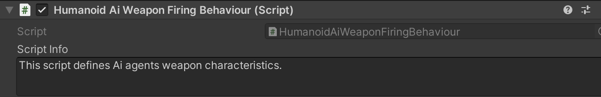
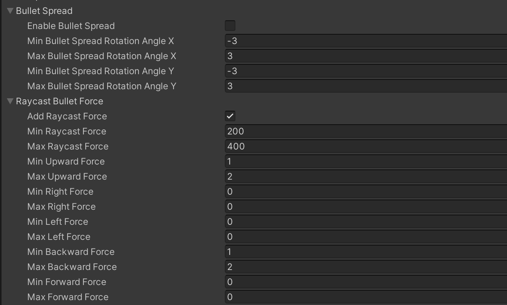

# Weapon Firing Behaviour Part-2

    <iframe width="700" height="405" src="https://www.youtube.com/embed/hVD0wtHb4UM?si=PUNwfF04UUhETk_2" title="YouTube video player" frameborder="0" allow="accelerometer; autoplay; clipboard-write; encrypted-media; gyroscope; picture-in-picture; web-share" referrerpolicy="strict-origin-when-cross-origin" allowfullscreen></iframe>

## Introduction
This is the Part-2 of Humanoid AI Weapon Firing Behaviour and in this part we have covered following topics - Shooting Options,Bullet spread,Projectiles Per Shot,
Raycast Bullet Force and some important things to note.

### Humanoid AI Weapon Firing Behaviour 

 

<table class="custom-table">
    <tr>
        <th>Fields</th>
        <th>Info</th>
    </tr>
    <tr>
        <td>Projectile Name</td>
        <td>Copy and paste name of the projectile to be used with this weapon from the 'ObjectPooler' script into this field.</td>
    </tr>
    <tr>
        <td>Projectiles Per Shot</td>
        <td>Enter the number of the projectiles of the single shot of this weapon if you want this weapon to be shotgun. The spread of those projectiles is specified in 'BulletSpread' paragraph.</td>
    </tr>
    <tr>
        <td>Shooting Option</td>
        <td>Select one of the three available options for the kind of shooting that this weapon will utilise. RaycastShootingWithTracers is an option where those tracers are not dealing damage to targets and are there only for visuals.</td>
    </tr>
    <tr>
        <td>Enable Bullet Spread</td>
        <td>Toggle to enable or disable bullet spread for this weapon. When enabled, each shot will have a varying rotational offset as defined by the parameters below.</td>
    </tr>
    <tr>
        <td>Min Bullet Spread Rotation Angle X</td>
        <td>Negative value of the offset from the initial rotation of X axis in degrees.</td>
    </tr>
    <tr>
        <td>Max Bullet Spread Rotation Angle X</td>
        <td>Positive value of the offset from the initial rotation of X axis in degrees.</td>
    </tr>
    <tr>
        <td>Min Bullet Spread Rotation Angle Y</td>
        <td>Negative value of the offset from the initial rotation of Y axis in degrees.</td>
    </tr>
    <tr>
        <td>Max Bullet Spread Rotation Angle Y</td>
        <td>Positive value of the offset from the initial rotation of Y axis in degrees.</td>
    </tr>
    <tr>
        <td>Add Raycast Force</td>
        <td>If checked will apply raycast force to target.</td>
    </tr>
    <tr>
        <td>Min Raycast Force</td>
        <td>Minimal possible RayCastForce to be applied to target.</td>
    </tr>
    <tr>
        <td>Max Raycast Force</td>
        <td>Maximal possible RayCastForce to be applied to target.</td>
    </tr>
    <tr>
        <td>Min Upward Force</td>
        <td>Minimal possible RaycastForce to be applied to target in upward direction.</td>
    </tr>
    <tr>
        <td>Max Upward Force</td>
        <td>Maximal possible RaycastForce to be applied to target in upward direction.</td>
    </tr>
    <tr>
        <td>Min Right Force</td>
        <td>Minimal possible RaycastForce to be applied to target in right direction.</td>
    </tr>
    <tr>
        <td>Max Right Force</td>
        <td>Maximal possible RaycastForce to be applied to target in right direction.</td>
    </tr>
    <tr>
        <td>Min Left Force</td>
        <td>Minimal possible RaycastForce to be applied to target in left direction.</td>
    </tr>
    <tr>
        <td>Max Left Force</td>
        <td>Maximal possible RaycastForce to be applied to target in left direction.</td>
    </tr>
    <tr>
        <td>Min Backward Force</td>
        <td>Minimal possible RaycastForce to be applied to target in backward direction.</td>
    </tr>
    <tr>
        <td>Max Backward Force</td>
        <td>Maximal possible RaycastForce to be applied to target in backward direction.</td>
    </tr>
    <tr>
        <td>Min Forward Force</td>
        <td>Minimal possible RaycastForce to be applied to target in forward direction.</td>
    </tr>
    <tr>
        <td>Max Forward Force</td>
        <td>Maximal possible RaycastForce to be applied to target in forward direction.</td>
    </tr>
</table>

