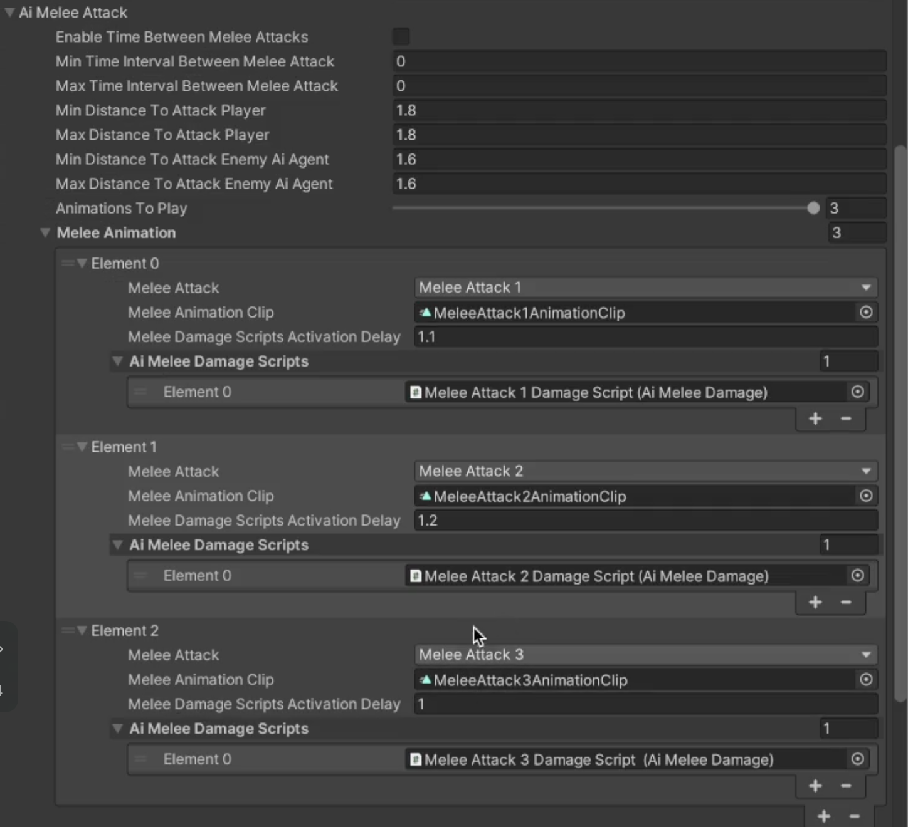

# Charging & Melee Attack Behaviour

    <iframe width="700" height="405" src="https://www.youtube.com/embed/hVD0wtHb4UM?si=PUNwfF04UUhETk_2" title="YouTube video player" frameborder="0" allow="accelerometer; autoplay; clipboard-write; encrypted-media; gyroscope; picture-in-picture; web-share" referrerpolicy="strict-origin-when-cross-origin" allowfullscreen></iframe>

## Introduction
This video will help you understand how to achieve 'Charging' and 'Melee Attack' behaviour on the humanoid AI zombie.

### Zombie Charging

By default, the zombie charges toward its enemies based on specified distance values. There are four key fields involved: Min Distance To Run, Max Distance To Run, Min Distance To Walk, and Max Distance To Walk. The zombie's movement behavior is determined by randomly selecting a value between the defined minimum and maximum distances.

For example, if the Min Distance To Run is 20 and the Max Distance To Run is 30, and the script selects 25 as the random value, the zombie will sprint if the enemy is more than 25 units away. If the enemy is within 25 units, it will switch to running behavior. Similarly, for walking, if the Min Distance To Walk is 10 and the Max Distance To Walk is 20, and the random value chosen is 15, the zombie will walk when the enemy is closer than 15 units. This system ensures dynamic movement based on proximity to the target.

<table class="custom-table">
    <tr>
        <th>Fields</th>
        <th>Info</th>
    </tr>
    <tr>
        <td>Min Distance To Running</td>
        <td>Minimal remaining distance to target to switch from walking or sprinting to running towards the target.</td>
    </tr>
    <tr>
        <td>Max Distance To Running</td>
       <td>Maximal remaining distance to target to switch from walking or sprinting to running towards the target.</td>
    </tr>
    <tr>
        <td>Min Distance To Walk</td>
        <td>Minimal remaining distance to target to switch from running or sprinting to walking towards the target.</td>
    </tr>
    <tr>
        <td>Max Distance To Walk </td>
       <td>Maximal remaining distance to target to switch from running or sprinting to walking towards the target.</td>
    </tr>
</table>

### AI Melee Attack

When the zombie charges toward its target and reaches the defined range, based on the Min/Max Distance to Attack Player or Min/Max Distance to Attack Enemy AI Agent, it will stop and begin attacking. If the target is a player, the zombie will halt when the distance to the player is less than or equal to the randomly chosen value from the Min/Max Distance to Attack Player. Similarly, if the target is an enemy AI agent, the zombie will stop once it is within the randomly selected range from the Min/Max Distance to Attack Enemy AI Agent. This ensures that the zombie's attack behavior is triggered dynamically based on proximity to the appropriate target.

<table class="custom-table">
    <tr>
        <th>Fields</th>
        <th>Info</th>
    </tr>
    <tr>
        <td>Enable Time Between Melee Attacks</td>
        <td>Activate this checkbox to enable time intervals between Melee attacks.</td>
    </tr>
    <tr>
        <td>Min Time Interval Between Melee Attack</td>
        <td>Minimum Time interval between Melee Attacks.</td>
    </tr>
    <tr>
        <td>Max Time Interval Between Melee Attack</td>
        <td>Maximum time interval between Melee Attacks.</td>
    </tr>
    <tr>
        <td>Min Distance To Attack Player</td>
        <td>Minimum required distance to attack player.</td>
    </tr>
    <tr>
        <td>Max Distance To Attack Player</td>
        <td>Maximum required distance to attack player.</td>
    </tr>
    <tr>
        <td>Min Distance To Attack Enemy Ai Agent</td>
        <td>Minimum required distance to attack enemies Ai agents.</td>
    </tr>
    <tr>
        <td>Max Distance To Attack Enemy Ai Agent</td>
        <td>Maximum required distance to attack enemies Ai agents.</td>
    </tr>
    <tr>
        <td>Animations To Play</td>
        <td>Use slider to decide how many animations to play for Melee attack.</td>
    </tr>
    <tr>
        <td>Melee Animation</td>
        <td>Set of fields to create melee animations for the Ai agent.</td>
    </tr>
    <tr>
        <td>Melee Attack</td>
        <td>Choose melee attack animation to be played during the melee attack. If melee attack 1 is selected, check which animation will be used by going to the scene and then clicking on the Tools <> MobileActionKit < HumanoidAi < EditHumanoidAiAnimations. After clicking 'EditHumanoidAiAnimations', you can drag and drop this Humanoid Ai agent into the field named 'Humanoid Ai animator controller' and click import animations. This way, you will be able to see which animation is used in melee attack 1.</td>
    </tr>
    <tr>
        <td>Melee Animation Clip</td>
        <td>Provide the same melee attack animation clip that you have used for this Humanoid AI agent. You can check which animation you have used by going to the tools < MobileActionKit < HumanoidAi < EditHumanoidAiAnimations. After clicking 'EditHumanoidAiAnimations', you can drag and drop this Humanoid Ai agent into the field named 'Humanoid Ai animator controller' and click import animations. This way, you will be able to see which animation is used for melee attack.</td>
    </tr>
    <tr>
        <td>Melee Damage Scripts Activation Delay</td>
        <td>Set the delay time for activating the melee damage scripts.</td>
    </tr>
    <tr>
        <td>Ai Melee Damage Scripts</td>
        <td>Drag and drop the Ai melee damage scripts attached with the child gameObject of this Ai agent.</td>
    </tr>
</table>

### Player Damage Effect UI Images

To set up the Damage Effect UI Images for the player, start by selecting the Canvas 2D in your scene. Then, create an Image Component within the canvas and drag and drop the source image that will be displayed when the player takes damage from a zombie. This image will serve as the visual effect for player damage. [See the image below for reference.]

Next, you can set up the damage effect UI by dragging and dropping the desired images into the Damage Effect UI Images field within the Player Health Script. These UI images will be triggered whenever the player takes damage from a zombie. The script will randomly select an image from the list and activate it. Once displayed, the image will fade out over a duration specified in the Damage Effect Image Fade Duration field. For instance, if the duration is set to 1 second, the image will gradually fade out within that time.

Additionally, the Time Between Damage Effect UI Images field allows you to control the interval between the activation of consecutive images. For example, if the player is hit by a zombie, the first image will appear immediately, but subsequent images will only be triggered after the specified interval has passed. This means that even if the player takes another hit within that time, a new image won't be displayed until the timer resets.

