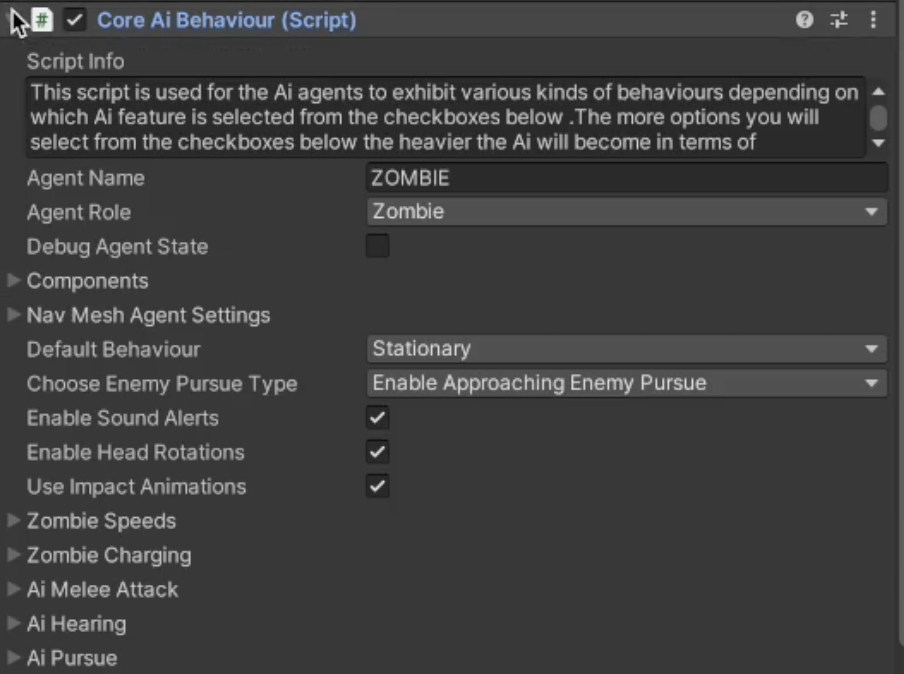
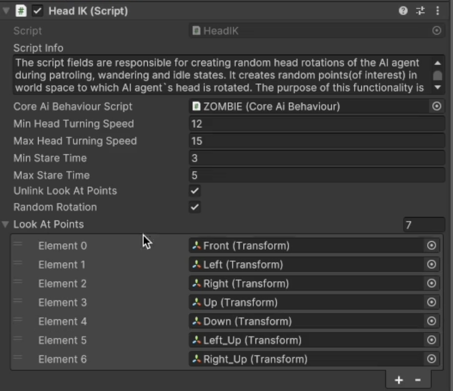

# Head Rotations

    <iframe width="700" height="405" src="https://www.youtube.com/embed/hVD0wtHb4UM?si=PUNwfF04UUhETk_2" title="YouTube video player" frameborder="0" allow="accelerometer; autoplay; clipboard-write; encrypted-media; gyroscope; picture-in-picture; web-share" referrerpolicy="strict-origin-when-cross-origin" allowfullscreen></iframe>

## Introduction
This video will help you understand how to achieve head rotations on humanoid AI agent in Non combat behaviour.Firstly, you need to make sure to have the same Team ID as the player
so we can test this behaviour on Humanoid AI agent.You can simply copy the Team ID from the target script attached with the player and paste it to the humanoid AI agent.[See the image]

### Enable Head Rotations
To enable the head rotation select the Core AI Behaviour script and than expand the Non combat behaviour and check the checkbox 'Enable Head Rotations'.Checking this checkbox will
enable the HeadIK script below where you can tweak the values to achieve the desired behaviour.

### HeadIK Script

<table class="custom-table">
    <tr>
        <th>Fields</th>
        <th>Info</th>
    </tr>
    <tr>
        <td>CoreAiBehaviour Script</td>
        <td>Drag and drop the 'CoreAiBehaviour' component attached with this Ai agent from the hierarchy into this field.</td>
    </tr>
    <tr>
        <td>Min Head Turning Speed</td>
        <td>The minimum speed with which the head bone of the Ai agent will turn towards LookAt points.</td>
    </tr>
     <tr>
        <td>Max Head Turning Speed</td>
        <td>The maximum speed with which the head bone of the Ai agent will turn towards LookAt points.</td>
    </tr>
     <tr>
        <td>Min Stare Time</td>
        <td>Minimum time to stare at LookAt point before turning towards another LookAt point.</td>
    </tr>
      <tr>
        <td>Max Stare Time</td>
        <td>Maximum time to stare at LookAt point before turning towards another LookAt point.</td>
      </tr>
      <tr>
        <td>Unlink LookAt Points</td>
        <td>If checked it will keep the head turning independent of scanning turns directions and unsync with them.</td>
      </tr>
       <tr>
        <td>Random Rotation</td>
        <td>If enabled than Ai agents head will rotate and look at the points randomly.If disabled then Ai agent will look at them in recurring fashion (0,1,2,0,1,2 etc).</td>
      </tr>
     <tr>
        <td>LookAt Points</td>
        <td>Assign child LookAtPoints from the hierarchy of this Ai agent to this list.They can be child game objects of Ai agent named and positioned according to their direction name(front, left, right, down, up, front up, left up, etc.)In which case the Ai agent head will be turning between them.Alternatively those LookAt points can be independently placed at a certain spots on the level and would not be child game objects of Ai agent.This would force Ai agent to focus on those independent LookAt points thus ensuring that Ai agent will concentrate on those directions.This would be useful for example for sniper bot observing only few particular areas of the level(certain building or a crossroad etc.).</td>
      </tr> 
</table>

