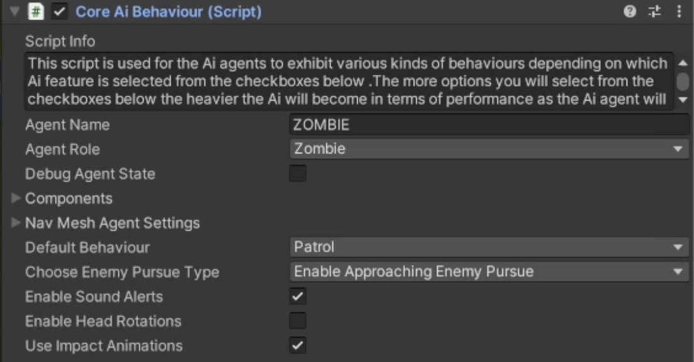
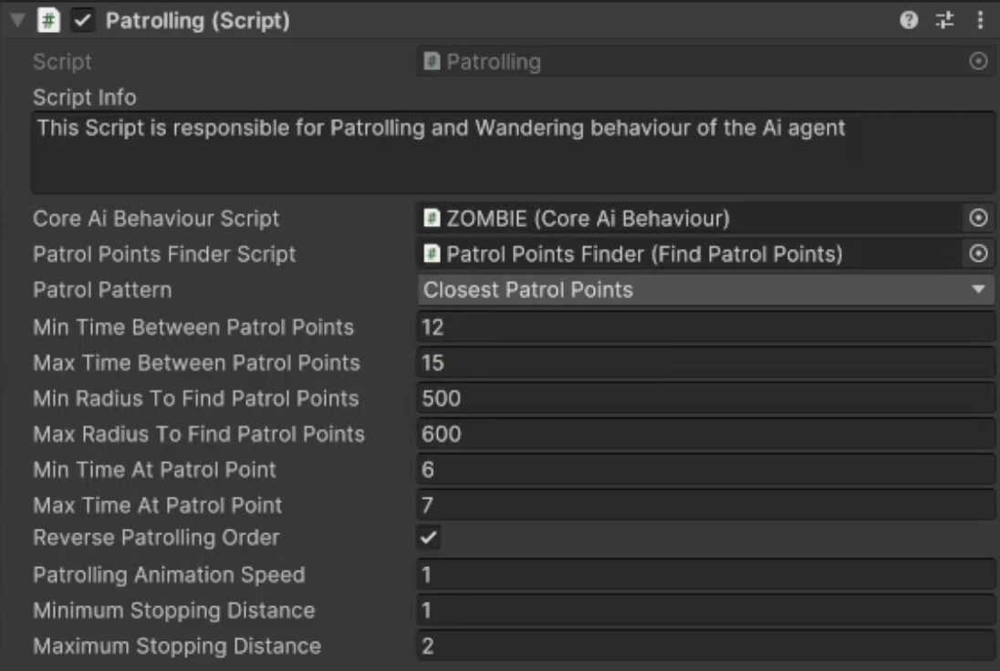

# Patrol Behaviour

    <iframe width="700" height="405" src="https://www.youtube.com/embed/hVD0wtHb4UM?si=PUNwfF04UUhETk_2" title="YouTube video player" frameborder="0" allow="accelerometer; autoplay; clipboard-write; encrypted-media; gyroscope; picture-in-picture; web-share" referrerpolicy="strict-origin-when-cross-origin" allowfullscreen></iframe>

## Introduction
This video will help you understand how to achieve patrol behaviour on humanoid AI agent in Non combat behaviour.Firstly, you need to make sure to have the same Team ID as the player
so we can test this behaviour on Humanoid AI agent.You can simply copy the Team ID from the target script attached with the player and paste it to the humanoid AI agent.[See the image]

### Choosing Patrol behaviour
To choose the patrol behaviour select the Core AI Behaviour script and than expand the Non combat behaviour and choose the 'Patrol' behaviour from the dropdown menu.This will enable the patrolling script below where you can tweak the values to achieve the desired behaviour.

### Create Patrol Point

To create patrol point first right click in the hierarchy and create a cube(this is only for visualisation purpose i.e you can later remove the 'Mesh Renderer' and 'Mesh Filter' when
you make a build) rename the cube to be 'Patrol Point' and change its tag to 'PatrolPoint'. Position it in the scene view where you want.
Note: To Find the patrol point and store it in a list. It's Important to have a collider attached to it. Any collider is acceptable(Box,Capsule,Sphere etc..)

### Patrolling Script

<table class="custom-table">
    <tr>
        <th>Fields</th>
        <th>Info</th>
    </tr>
    <tr>
        <td>CoreAiBehaviour Script</td>
        <td>Drag and drop 'CoreAiBehaviour Script' component attached with this gameobject from the hierarchy into this field.</td>
    </tr>
    <tr>
        <td>Patrol Points Finder Script</td>
        <td>Drag and drop 'Patrol Points Finder' child game object with the 'Find Patrol Points' Script attached to it from the hierarchy into this field.</td>
    </tr>
     <tr>
        <td>Patrol Pattern</td>
        <td>Choose one of the two patrol point selection options from the drop-down list.If 'Closest Patrol Points' option is selected then activated Ai agent will follow the specified route by going from one closest Patrol Point to the next nearest one and thus following a certain path depending on the place of activation of patrolling Ai agent.If 'Random Patrol Points' option is selected then Ai agent will be going between specified patrol points in no particular order.</td>
    </tr>
     <tr>
        <td>Min Time Between Patrol Points</td>
        <td>Minimum allowed time to travel from previous patrol point to the next one.</td>
    </tr>
      <tr>
        <td>Max Time Between Patrol Pointst</td>
        <td>Maximum allowed time to travel from previous patrol point to the next one.</td>
      </tr>
       <tr>
        <td>Min Radius To Find Patrol Points</td>
        <td>The minimum radius within which Ai agent will find a new patrol point.</td>
      </tr> 
       <tr>
        <td>Max Radius To Find Patrol Points</td>
        <td>The maximum radius within which Ai agent will find a new patrol point.</td>
      </tr> 
       <tr>
        <td>Min Time At Patrol Point</td>
        <td>Set the minimum time the AI agent waits at the current Patrol point before moving out to the next one.If the 'Min/MaxTimeBetweenPatrolPoints' is smaller than what is needed for Ai agent to reach next Patrol Point, e.i if the next Patrol point is further away than amount of seconds allowed for agent to travel in order to reach it, then the designated 'MinTimeAtPatrolPoint' time will not be utilised because Ai agent will not have a chance to reach that point in the first place.
        </td> 
         <tr>
        <td>Max Time At Patrol Point</td>
        <td>Set the maximum time the AI agent waits at the current Patrol point before moving out to the next one.If the 'Min/MaxTimeBetweenPatrolPoints' is smaller than what is needed for Ai agent to reach next Patrol Point, e.i if the next Patrol point is further away than amount of seconds allowed for agent to travel in order to reach it, then the designated 'MinTimeAtPatrolPoint' time will not be utilised because Ai agent will not have a chance to reach that point in the first place.
        </td>
       <tr>
        <td>Reverse Patrolling Order</td>
        <td>If enabled then it will make Ai agent to reverse his patrol rout after reaching last Patrol point.If disabled then after reacing last Patrol Point Ai agent will move out to first Patrol point thus performing his patrol behaviour in a loop fashion.For example if there are 3 Patrol points and this checkbox is checked then Ai Agent will go through them as follows 1, 2, 3, 2, 1(so called ping - pong pattern).And if disabled then the order will be 1, 2, 3, 1, 2, 3(so called loop pattern).</td>
      </tr>  
        <tr>
        <td>Patrolling Animation Speed</td>
        <td>Specify the walking animation speed during Patrolling behaviour. i.e. the speed of the playback of the animation clip.</td>
      </tr>  
       <tr>
        <td>Minimum Stopping Distance</td>
        <td>The minimum distance to stop near the Patrol point and to consider it as reached.</td>
      </tr>  
       <tr>
        <td>Maximum Stopping Distance</td>
        <td>The maximum distance to stop near the Patrol point and to consider it as reached.</td>
      </tr>  
</table>

