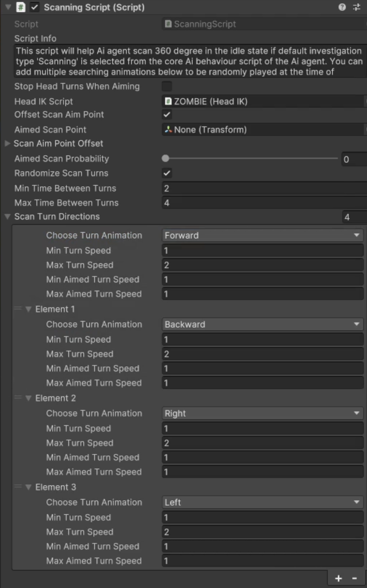

# Scan Behaviour

    <iframe width="700" height="405" src="https://www.youtube.com/embed/hVD0wtHb4UM?si=PUNwfF04UUhETk_2" title="YouTube video player" frameborder="0" allow="accelerometer; autoplay; clipboard-write; encrypted-media; gyroscope; picture-in-picture; web-share" referrerpolicy="strict-origin-when-cross-origin" allowfullscreen></iframe>

## Introduction
This video will help you understand how to achieve scanning behaviour on humanoid AI agent in Non combat behaviour.Firstly, you need to make sure to have the same Team ID as the player
so we can test this behaviour on Humanoid AI agent.You can simply copy the Team ID from the target script attached with the player and paste it to the humanoid AI agent.[See the image]

### Choosing Scan behaviour
To choose the scan behaviour select the Core AI Behaviour script and than expand the Non combat behaviour and choose the 'Scan' behaviour from the dropdown menu.This will enable the scanning
script below where you can tweak the values to achieve the desired behaviour.

### Scanning Script

<table class="custom-table">
    <tr>
        <th>Fields</th>
        <th>Info</th>
    </tr>
    <tr>
        <td>StopHeadTurnsWhenAiming</td>
        <td>If checked then it will stop head  rotations during aimed scanning.</td>
    </tr>
    <tr>
        <td>HeadIK Script</td>
        <td>Drag and Drop 'Head IK' script into this field.</td>
    </tr>
     <tr>
        <td>Offset Scan Aim Point</td>
        <td>If checked then aimed scan point will randomly will be offset during each new aimed scan.The offset values can be set using Change Aimed Scan Point Position sliders.</td>
    </tr>
     <tr>
        <td>Aimed Scan Point</td>
        <td>Drag and Drop 'Head IK' script into this field.</td>
    </tr>
      <tr>
        <td>Scan Aim Point Offset</td>
        <td>Set of values within which the offset of the ScanAimPoint will happen each time the AimedScan will take place.</td>
      </tr>
       <tr>
        <td>MinX</td>
        <td>Minimum X axis value to move the Scan Aim point too.</td>
      </tr> 
       <tr>
        <td>MaxX</td>
        <td>Maximum X axis value to move the Scan Aim point too.</td>
      </tr> 
       <tr>
        <td>MinY</td>
        <td>Minimum Y axis value to move the Scan Aim point too.</td>
      </tr> 
       <tr>
        <td>MaxY</td>
        <td>Maximum Y axis value to move the Scan Aim point too.</td>
      </tr> 
       <tr>
        <td>MinZ</td>
        <td>Minimum Z axis value to move the Scan Aim point too.</td>
      </tr> 
       <tr>
        <td>MaxZ</td>
        <td>Maximum Z axis value to move the Scan Aim point too.</td>
      </tr> 
      <tr>
        <td>Randomize Scan Turns</td>
        <td>If enabled, then AI agent will play turning animations randomly. If disabled, then AI agent will play turning animations in the order that they are placed in the drop down list.</td>
      </tr>
       <tr>
        <td>Min Time Between Turns</td>
        <td>Minimum time interval between area scanning turns.</td>
      </tr>
     <tr>
        <td>Max Time Between Turns</td>
        <td>Maximum time interval between area scanning turns.</td>
      </tr> 
       <tr>
        <td>Scan Turn Directions</td>
        <td>You can add up to 4 elements to this list with each element having 4 'ScanTurnDirections'.Names of those directions are Forward, Backward, Left and Right.Those 4 names are stored as events inside animation controller that will play respective turning animation clip whenever any of those directions are selected by Ai agent.You can randomise the speed of each turn as well as speed of each aimed turn within scanning behaviour.</td>
      </tr> 
      <tr>
        <td>Choose Turn Animation</td>
        <td>Choose any of the provided turn directions.</td>
      </tr> 
      <tr>
        <td>Min Turn Speed</td>
        <td>Minimal playback speed of the turning animation.</td>
      </tr> 
      <tr>
        <td>Max Turn Speed</td>
        <td>Maximal playback speed of the turning animation.</td>
      </tr> 
      <tr>
        <td>Min Aimed Turn Speed</td>
        <td>Minimal playback speed of the aimed turning animation..</td>
      </tr> 
      <tr>
        <td>Max Aimed Turn Speed</td>
        <td>Maximal playback speed of the aimed turning animation.</td>
      </tr> 
</table>

