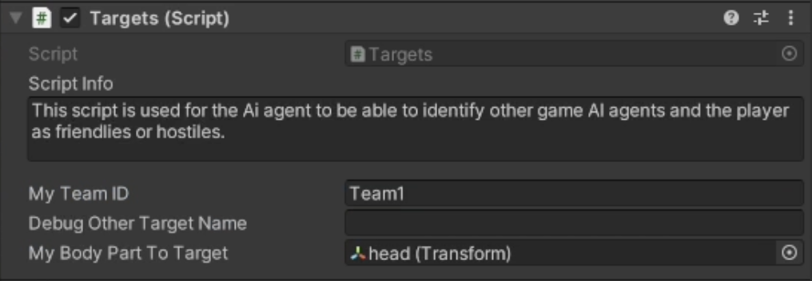
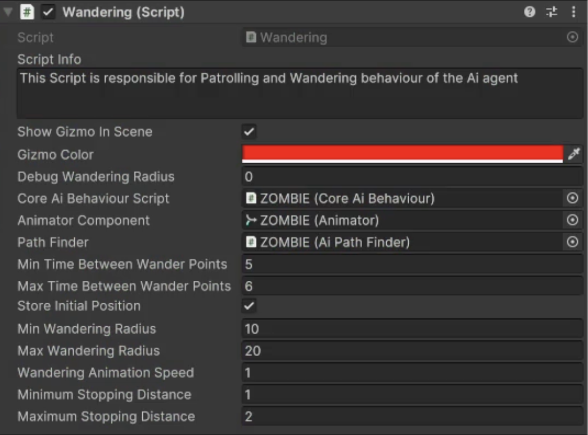

# Wander Behaviour

    <iframe width="700" height="405" src="https://www.youtube.com/embed/hVD0wtHb4UM?si=PUNwfF04UUhETk_2" title="YouTube video player" frameborder="0" allow="accelerometer; autoplay; clipboard-write; encrypted-media; gyroscope; picture-in-picture; web-share" referrerpolicy="strict-origin-when-cross-origin" allowfullscreen></iframe>

## Introduction
This video will help you understand how to achieve wander behaviour on humanoid AI agent in Non combat behaviour.Firstly, you need to make sure to have the same Team ID as the player
so we can test this behaviour on Humanoid AI agent.You can simply copy the Team ID from the target script attached with the player and paste it to the humanoid AI agent.[See the image]

### Choosing Wander behaviour
To choose the wander behaviour select the Core AI Behaviour script and than expand the Non combat behaviour and choose the 'Wander' behaviour from the dropdown menu.This will enable the wandering script below where you can tweak the values to achieve the desired behaviour.

### Wandering Script

<table class="custom-table">
    <tr>
        <th>Fields</th>
        <th>Info</th>
    </tr>
    <tr>
        <td>CoreAiBehaviour Script</td>
        <td>Drag and drop 'CoreAiBehaviour Script' component attached with this gameobject from the hierarchy into this field.</td>
    </tr>
    <tr>
        <td>Animator Component</td>
        <td>Drag and drop 'Animator' component attached with this gameobject from the hierarchy into this field.</td>
    </tr>
     <tr>
        <td>Path Finder</td>
        <td>Drag and drop 'AiPathFinder Script' attached with this gameobject from the hierarchy into this field.</td>
    </tr>
     <tr>
        <td>Min Time Between Wander Points</td>
        <td>Minimum possible radius for a new wandering point creation on the navmesh.  Note that the Wandering point cannot be created closer than the minimal radius.</td>
    </tr>
      <tr>
        <td>Max Time Between Wander Pointst</td>
        <td>Maximum possible radius for a new wandering point creation on the navmesh.Note that the Wandering point cannot be created farther than the maximal radius.</td>
      </tr>
       <tr>
        <td>Wandering Animation Speed</td>
        <td>Specify the walking animation speed during wandering behaviour. i.e. the speed of the playback of the animation clip.</td>
      </tr> 
       <tr>
        <td>Minimum Stopping Distance</td>
        <td>The minimum distance to stop near the wandering point and to consider it as reached.</td>
      </tr> 
       <tr>
        <td>Maximum Stopping Distance</td>
        <td>The maximum distance to stop near the wandering point and to consider it as reached.
        </td> 
</table>

