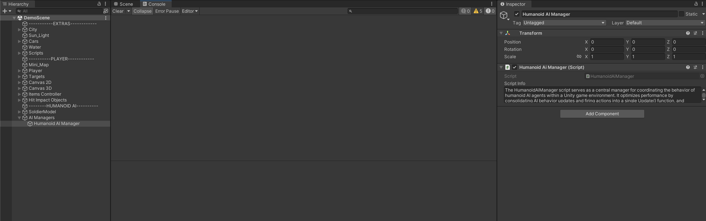
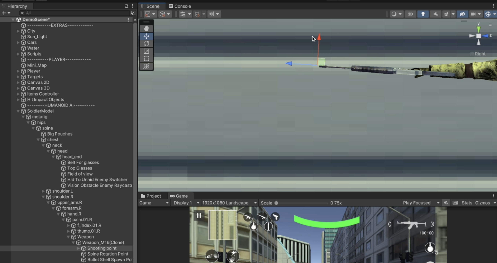
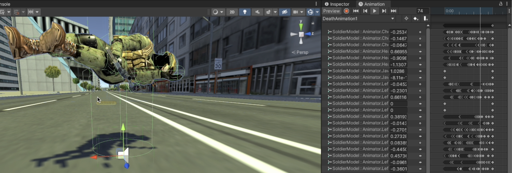
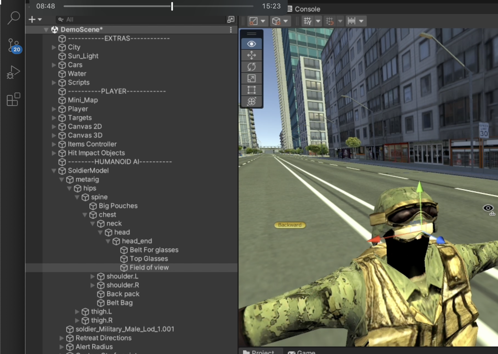
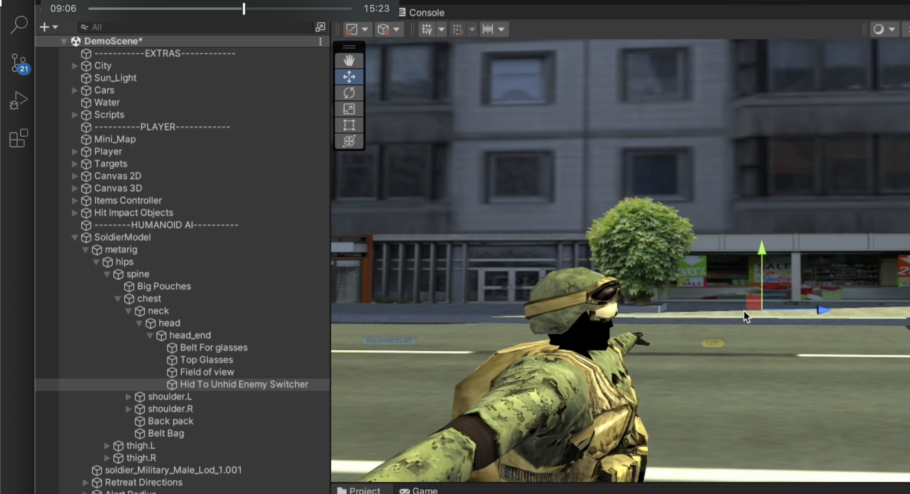
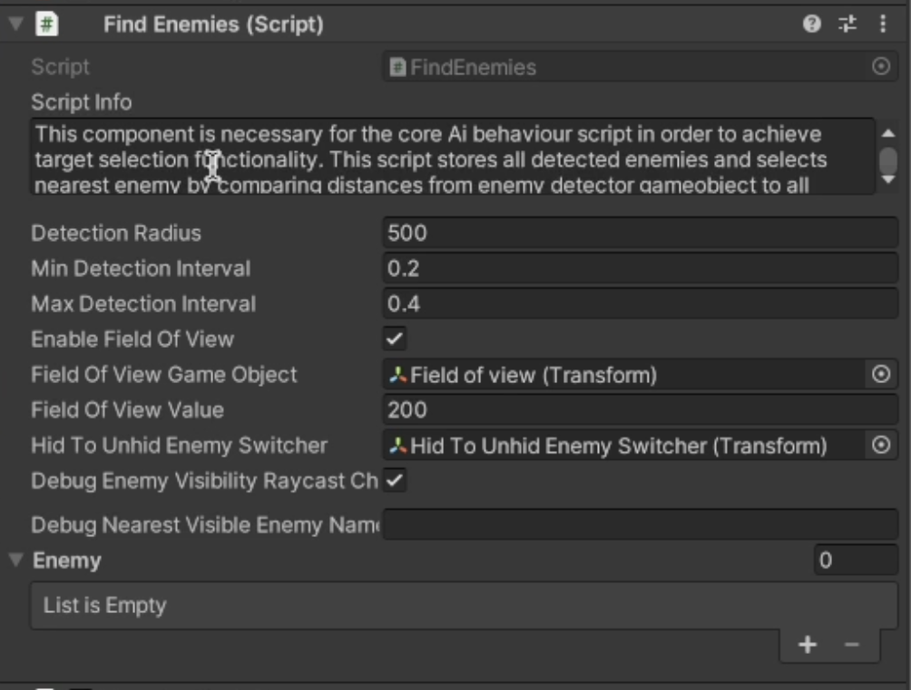
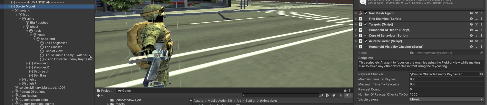

# Setting Up Humanoid Ai Agent

    <iframe width="700" height="405" src="https://www.youtube.com/embed/hVD0wtHb4UM?si=PUNwfF04UUhETk_2" title="YouTube video player" frameborder="0" allow="accelerometer; autoplay; clipboard-write; encrypted-media; gyroscope; picture-in-picture; web-share" referrerpolicy="strict-origin-when-cross-origin" allowfullscreen></iframe>

## Introduction
This video guides you through the essential steps for setting up a humanoid AI agent in Unity. We'll be customizing the 3D humanoid soldier model using Unity's editor windows, fixing death animations and will add neccessary gameObjects required to make this AI agent shoot. 

### Important Steps To Follow

#### Step 1
Select all the bones where the rigidbody is attached from the hierarchy and enable the checkbox 'Is Kinematic'.[See the image below]

#### Step 2 
Select the Weapon model and add a box collider to it and make sure to disable it like this [See the image below].This is important because when this Humanoid AI agent is dying we can add rigidbody to this weapon model and enable this box collider to achieve weapon falling effect on ground.

Also you can make the weapon to be the child of palm bone instead of hand bone.

#### Step 3
Create an empty gameObject in the hierarchy and call it as 'Humanoid AI Manager' and add a script called 'Humanoid AI Manager'.This is important to make the AI Agent functioning.
i.e The HumanoidAiManager script serves as a central manager for coordinating the behavior of humanoid AI agents within a Unity game environment. It optimizes performance by consolidating AI behavior updates and firing actions into a single Update() function, and handles spine rotation updates in the LateUpdate() function. This consolidation reduces the overhead of multiple Update() and LateUpdate() calls for individual AI agents, enhancing overall performance.

### Customising The Agent
Firstly,you can customise the soldier however you want using the textures provided(see the image below) and change it.

You can also add the pouches,googles,bagpack etc.. for soldier if you want.Just drag and drop the prefab named as 'SoldierBagPack' from the project to the Spine bone that will automatically
going to add googles,pouches,bagpack etc.. which will look like this[See the image below]

### Preparing The Soldier For Shooting

Select the shooting point and Spine rotation point and align it like this[See the image below]

NOTE : MAKE SURE TO CHANGE THE SCALE OF SPINE ROTATION POINT TO 0,0,0 ON ALL THE AXIS

After this create an empty gameObject in the weapon and call it as 'Bullet Shell Spawn Point' and place it like this[See the image below]. After that drag and drop it to the field called
'BulletShellSpawnPoint' exist in the shooting features paragraph.[See the image below]

### Fixing Death Animations

When you will play death animation in the scene view you will notice that they are floating in the air and not grounded.[See the image below]

To fix this issue you need to select the animation clip from the project and update its settings like this.[See the image below]

### Adding Missing Components And GameObjects

So before you enter the playmode you need to drag and drop the required components in three scripts.

Inside the FindEnemies Script(located in the root gameObject) you need to drag and drop the 'Field of View GameObject' and Hid To Unhid Enemy Switcher. To create these gameObject you need to select the Head bone from the hierarchy and create an empty gameObject called as 'Field of View' and position is close to the eyes.[See the image below]

After this just duplicate 'Field of View' gameObject and rename it to Hid To Unhid Enemy Switcher and position it further from the humanoid AI agent eyes.[See the image below]

Just Drag and drop it in the script 'FindEnemies Script'.[See the image below]

Now Select the Humanoid Visibility Checker(located in the root gameObject) and here you need to drag and drop 'Raycast Checker' gameObject. To create it go back and select the Head bone from the hierarchy and create an empty gameObject called as 'Vision Obstacle Enemy Raycaster' and position is close to the eyes.[See the image below]

Just Drag and drop it in the script 'Humanoid Visibility Checker'.[See the image below]

Now Lastly Select the Humanoid Firing Behaviour Script(located in the Shooting point) and here you need to drag and drop 'Animation Clips' from the project to the Humanoid Firing Behaviour Script.[See the image below] 

### Run The Game

Great 🎉
So we successfully configured the Humanoid Ai agent in the scene.

