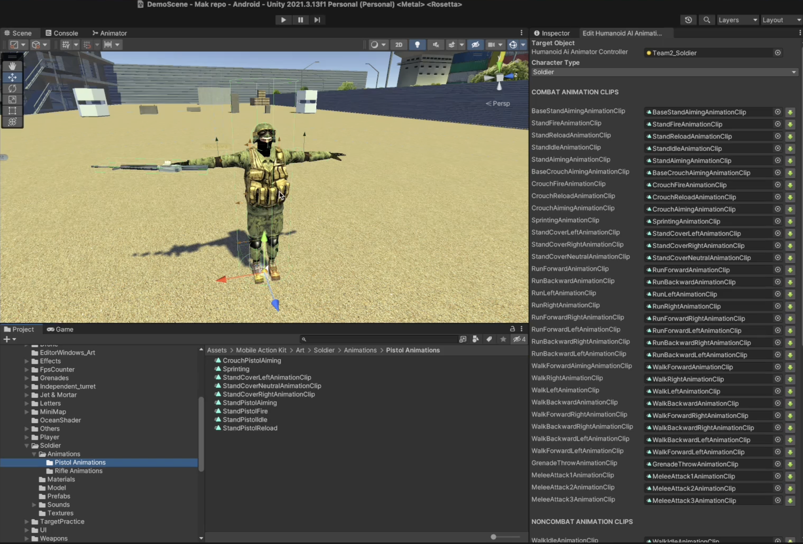

# Making Pistol Shooter AI Agent

    <iframe width="700" height="405" src="https://www.youtube.com/embed/hVD0wtHb4UM?si=PUNwfF04UUhETk_2" title="YouTube video player" frameborder="0" allow="accelerometer; autoplay; clipboard-write; encrypted-media; gyroscope; picture-in-picture; web-share" referrerpolicy="strict-origin-when-cross-origin" allowfullscreen></iframe>

## Introduction

In this tutorial you will learn how to make AI agent use Pistol for shooting. We will be use some pistol animations from mixamo and will replace AI Agent rifle animations with it. We will also going to use and align pistol weapon in the hands of AI Agent.

### Setup the Pistol Weapon 

First, We need to align the weapon in the AI agent hand so that during aiming it will look proper.[See the image below]

### Replacing Animations 

After downloading pistol animations from mixamo for the AI agent, first you need to duplicate the animator controller that we created for the rifle agent previously and rename it differently (i.e PistolAnimatorController). Than after this you need to go to Tools < MobileActionKit < Humanoid AI < Edit Humanoid AI Animations and here first, drag and drop the AI agent from the hierarchy into this field and than after click on 'Import existing animations from animator' to see current animations exist in animator controller.After this you need to drag and drop the animations that you want to replace for example 'replace stand fire animation clip' with 'Pistol stand fire animation clip' and after replacing animations you need to click 'Modify Animation Clip Import Settings'.This will modify the import settings of each of the assigned animation clips. 

Here,We also need to select each new pistol animation clip and check the checkbox 'Bake Into Pose' for both Root Transform Rotation and Root Transform Position.This is important so that animation will look proper in the game.[See the image below]

### Before Test

So,before testing this we need to assign some missing animations.When you will expand 'Humanoid Grenade Thrower' you will see grenade throw animation clip is missing. Just make sure to assign the animation clip from the project.[See the image below]

Similary, Select the shooting point and inside the 'Humanoid Firing Behaviour Component' you need to drag and drop stand fire, stand reload, crouch fire and crouch reload animation clips.[See the image below]

### Enter Play Mode

Great 🎉
So we successfully setup the Pistol Shooter Humanoid Ai agent in the scene.