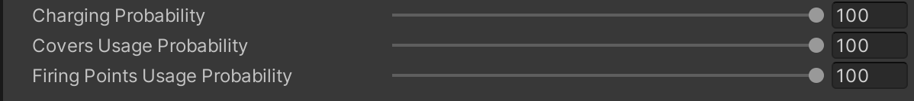

# Master AI Agent

    <iframe width="700" height="405" src="https://www.youtube.com/embed/hVD0wtHb4UM?si=PUNwfF04UUhETk_2" title="YouTube video player" frameborder="0" allow="accelerometer; autoplay; clipboard-write; encrypted-media; gyroscope; picture-in-picture; web-share" referrerpolicy="strict-origin-when-cross-origin" allowfullscreen></iframe>

## Introduction
In this tutorial you will learn how to make a 'Master AI Agent'.

### Enabling Checkboxes

First, enable all the checkboxes located in combat and non combat state behaviours.[see the image below]

### Tweaking Behaviour

When you enable 'Charging','Take Covers' and 'Use Firing Points'.You will see below 3 sliders using which you can control the probability of each behaviour.
For example: Increasing the charging probability to 100 and covers usage probability to 20 and firing points usage probability to 20 as well . This means the highest performed behaviour by the AI agent will be Charging while covers and firing points behaviour will be rare or least.

This new state switch time will going to pick any behaviour randomly based on the 'Min/Max Time to Switch State'. 

<table class="custom-table">
    <tr>
        <th>Fields</th>
        <th>Info</th>
    </tr>
     <tr>
        <td>Min State Switch Time</td>
        <td>Minimal period of time in seconds for Ai Agent to stay in any given behaviour.</td>
    </tr>
      <tr>
        <td>Max State Switch Time</td>
        <td>Maximal period of time in seconds for Ai Agent to stay in any given behaviour.</td>
    </tr>
    <tr>
        <td>Charging Probability</td>
        <td>Increasing this slider value will increase the chances of the Ai agent to perform charging behaviour and decreasing the slider value will reduce the chances of the Ai agent to perform charging behaviour.</td>
    </tr>
    <tr>
        <td>Covers Usage Probability</td>
        <td>Increasing this slider value will increase the chances of the Ai agent to use covers and decreasing the slider value will reduce the chances of the Ai agent to use covers.</td>
    </tr>
      <tr>
        <td>Firing Points Usage Probability</td>
        <td>Increasing this slider value will increase the chances of the Ai agent to use firing points and decreasing the slider value will reduce the chances of the Ai agent to use firing points.</td>
    </tr>
</table>

### Debug Agent State

When you enable debug agent state. This will going to spawn a prefab on top of AI agent head which will going to display the name,state of the agent and current behaviour. [See the image below]

<table class="custom-table">
    <tr>
        <th>Fields</th>
        <th>Info</th>
    </tr>
     <tr>
        <td>Debug Agent State</td>
        <td>Enable this to add a 'Debug info' option in the core Ai behaviour script.</td>
    </tr>
    <tr>
        <td>Debug Info Text UI</td>
        <td>Provide the information about Ai agent current state.</td>
    </tr>
     <tr>
        <td>Debug Info Text UI Offset</td>
        <td>Adjust the DebugInfo Text UI position at x,y and z axis</td>
    </tr>
</table>

Now You can just push Play in unity editor and test the behaviour 🙂