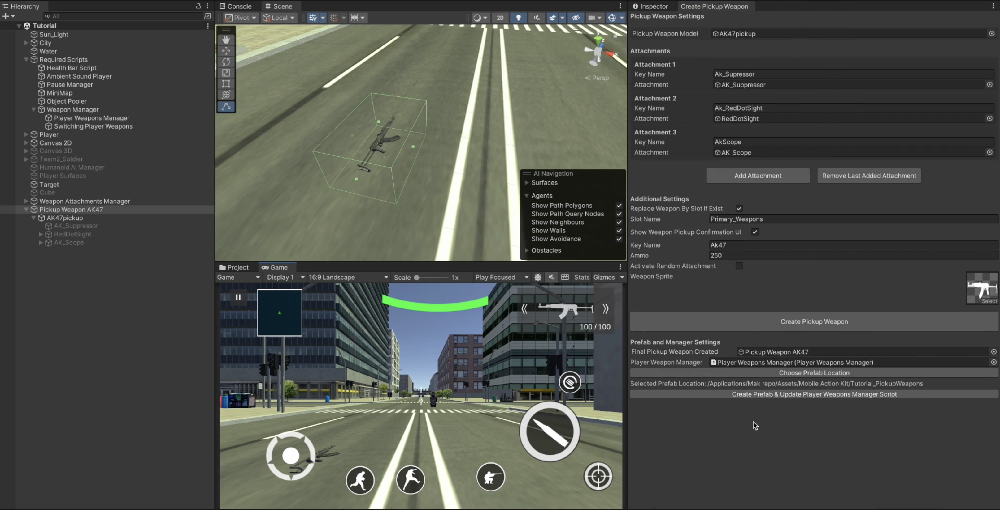
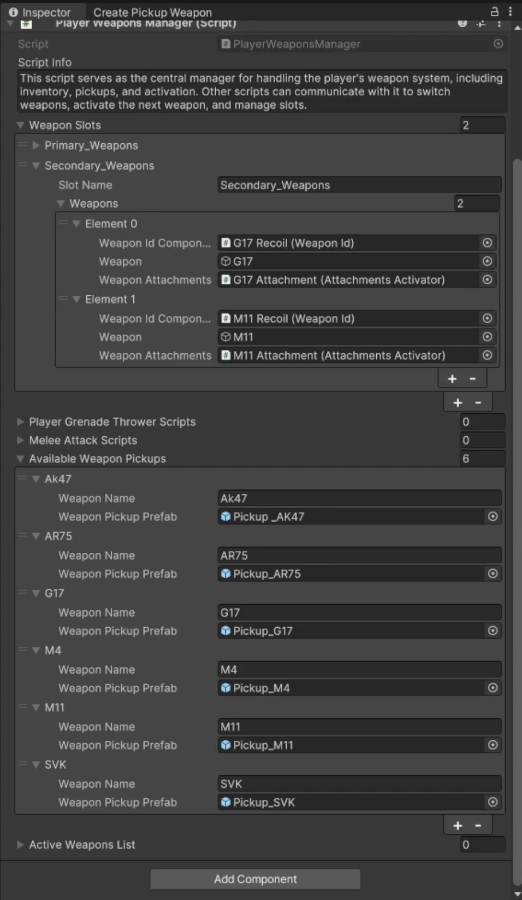

# Pickup Weapon

    <iframe width="700" height="405" src="https://www.youtube.com/embed/hVD0wtHb4UM?si=PUNwfF04UUhETk_2" title="YouTube video player" frameborder="0" allow="accelerometer; autoplay; clipboard-write; encrypted-media; gyroscope; picture-in-picture; web-share" referrerpolicy="strict-origin-when-cross-origin" allowfullscreen></iframe>

## Introduction
This video guides you on how to setup the pickup weapon with attachments for the player to pickup.

### Setup Pickup Weapon
Firstly,you have to go to the Tools < Mobile Action Kit < Player < FireArms < Pickup Weapons < Create Pickup Weapon. This will going to open up the wizard using which you need to setup the pickup weapon (See the video tutorial above for more detail).Your setup should look like this [See the image below].

### Pickup Weapon And Attachment Script
After clicking on 'Create Pickup Weapon' button in the wizard. This will going to add the Box Collider and the Pickup Weapon script to the weapon and Attachment Key script to the attachments.
 
#### Pickup Weapon
This script allows weapons placed in the scene to be picked up by the player. When the player enters the pickup area, the script checks if the weapon already exists in their inventory. If a matching weapon is found, it can either replace the existing weapon or can just pickup its ammo. The script also provides initial ammo, and optionally activates a random attachment when the game begin. Additionally, it supports displaying a UI confirmation for weapon pickups. The weapon becomes inactive after being picked up to prevent duplicate pickups.

<table class="custom-table">
<tr>
<th>Fields</th>
<th>Info</th>
</tr>
<tr>
<td>ReplaceWeaponBySlotIfExist</td>
<td>If enabled, the weapon will replace an existing weapon in the active weapons list of the 'PlayerWeaponsManager' script if a weapon with the same slot name exists. 
If no matching slot weapon exists, it will replace the currently equipped weapon. 
If an empty slot is available, the weapon will be added to the player's inventory. 
If disabled, the weapon will either be added to an available empty slot in the active weapons list of the 'PlayerWeaponsManager' script or replace the currently equipped weapon.</td>
</tr>
<tr>
<td>SlotName</td>
<td>Enter the same slot name that you have entered in the 'PlayerWeaponsManager' Script.</td>
</tr>
<tr>
<td>ShowWeaponPickupConfirmationUI</td>
<td>If enabled, a UI confirmation will be shown to the player when they attempt to pick up the weapon.</td>
</tr>
<tr>
<td>KeyName</td>
<td>The unique identifier for this weapon. It is used to check if the player already owns this weapon in their inventory.</td>
</tr>
<tr>
<td>InitialAmmo</td>
<td>The amount of ammo the pickup weapon has by default.</td>
</tr>
<tr>
<td>WeaponSprite</td>
<td>The sprite image representing this weapon, used for UI and inventory display.</td>
</tr>
<tr>
<td>ActivateRandomAttachment</td>
<td>If enabled, a random attachment from the provided list will be activated when the game starts.</td>
</tr>
<tr>
<td>AttachmentsToActivate</td>
<td>A list of weapon attachments.</td>
</tr>
</table>

#### Attachment Key
Enter the same key name for this attachment that you have entered in the attachment script of this weapon.

<table class="custom-table">
<tr>
<th>Fields</th>
<th>Info</th>
</tr>
<tr>
<td>KeyName</td>
<td>Enter the same key name for this attachment that you have entered in the attachment script of this weapon.</td>
</tr>
</table>

### Create Pickup Weapon Prefab

Now,you need to make sure to create the pickup weapon prefab using the pickup weapon wizard again.[See the image below]

Assign, All the player pickup weapons from the project to the 'Player Weapons Manager Script' with there correct key name that you have specified.[See the image below].

### Setup Pickup Weapon UI

To setup the pickup weapon UI just go to Tools < Mobile Action Kit < Player < FireArms < Pickup Weapons < Create Pickup Weapon UI and assign the necessary gameObjects and components to the provided fields.[See the image below]

This setup will going to create the UI that you see below in the image. It will also going to add the Weapon Pickup Manager Script to the player.

#### Weapon Pickup Manager 

Handles weapon collection, including adding weapons to inventory, replacing weapons, and collecting ammo.

<table class="custom-table">
<tr>
<th>Fields</th>
<th>Info</th>
</tr>
<tr>
<td>PlayerWeaponsManagerScript</td>
<td>Reference to the PlayerWeaponsManager script.</td>
</tr>
<tr>
<td>DroppedWeaponPosition</td>
<td>Position where the dropped weapon should appear.</td>
</tr>
<tr>
<td>WeaponInfo</td>
<td>UI panel displaying weapon information.</td>
</tr>
<tr>
<td>WeaponIcon</td>
<td>UI image to display pickup weapon icon.</td>
</tr>
<tr>
<td>CollectWeaponButton</td>
<td>Button for collecting a weapon.</td>
</tr>
<tr>
<td>CollectAmmoButton</td>
<td>Button for collecting ammo.</td>
</tr>
<tr>
<td>AmmoText</td>
<td>Text UI displaying available ammo.</td>
</tr>
<tr>
</table>

### Weapon Slot Manager 

You can even control the default available weapons to the player and the Max weapons player can carry using the 'Weapon Slot Manager' script.

The 'Weapon Slot Manager Script' manages weapon slot restrictions, determining the default active weapons and enforcing a maximum weapon limit during gameplay. Disable this script (along with its GameObject) when displaying the weapons available in the shop menu. Keep it enabled if you do not want to link it to the shop system Or want to activate specific weapon in this Level.

<table class="custom-table">
<tr>
<th>Fields</th>
<th>Info</th>
</tr>
<tr>
<td>PlayerWeaponsManagerScript</td>
<td>Reference to the PlayerWeaponsManager script that handles the player's weapons.</td>
</tr>
<tr>
<td>WeaponsToActivateByDefault</td>
<td>Number of weapons that will be available to the player by default at the start of the game.</td>
</tr>
<tr>
<td>MaxWeaponsPlayerCarry</td>
<td>Maximum number of weapons a player can hold at any time during gameplay.</td>
</tr>
</table>

