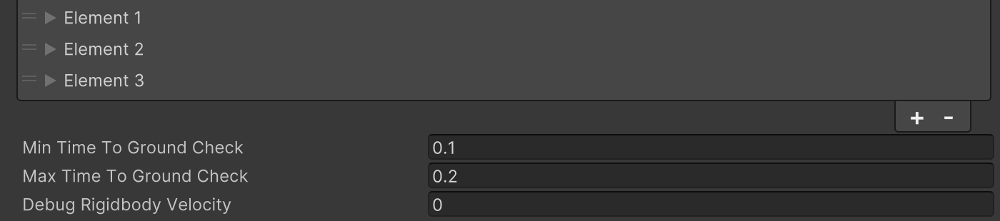

# Player Health Setup

    <iframe width="700" height="405" src="https://www.youtube.com/embed/hVD0wtHb4UM?si=PUNwfF04UUhETk_2" title="YouTube video player" frameborder="0" allow="accelerometer; autoplay; clipboard-write; encrypted-media; gyroscope; picture-in-picture; web-share" referrerpolicy="strict-origin-when-cross-origin" allowfullscreen></iframe>

## Introduction
This video will help you understand the Player Health script with examples in Play mode.

### Player Health
This Script Regulates The Player Health In game.

                                     

<table class="custom-table">
    <tr>
        <th>Fields</th>
        <th>Info</th>
    </tr>
    <tr>
        <td>RigidbodyComponent</td>
        <td>The Rigidbody component of the player, used to detect falls and calculate velocity.</td>
    </tr>
    <tr>
        <td>FirstPersonControllerScript</td>
        <td>Reference to the FirstPersonController script, used to check player movement and grounding.</td>
    </tr>
    <tr>
        <td>PlayerHealthbar</td>
        <td>The player's health bar, used to display and manage the player's health status.</td>
    </tr>
    <tr>
        <td>DamageEffectScreensFadeOutDuration</td>
        <td>The duration for the fade-out effect of damage indicators on the screen.</td>
    </tr>
    <tr>
        <td>TimeBetweenDamageEffectScreens</td>
        <td>The minimum time interval between damage indicator effects on the screen.</td>
    </tr>
    <tr>
        <td>MinHealthToCheck</td>
        <td>The minimum health value at which this effect is triggered.</td>
    </tr>
    <tr>
        <td>MaxHealthToCheck</td>
        <td>The maximum health value at which this effect is triggered.</td>
    </tr>
    <tr>
        <td>RotateImpactEffectBloodScreens</td>
        <td>Enable or disable rotation of blood screen effects.</td>
    </tr>
    <tr>
        <td>MinImpactEffectBloodScreenAngle</td>
        <td>The minimum angle for rotating blood screen effects.</td>
    </tr>
    <tr>
        <td>MaxImpactEffectBloodScreenAngle</td>
        <td>The maximum angle for rotating blood screen effects.</td>
    </tr>
    <tr>
        <td>ScaleImpactEffectBloodScreens</td>
        <td>Enable or disable scaling of blood screen effects.</td>
    </tr>
    <tr>
        <td>MinImpactEffectBloodScreenScale</td>
        <td>The minimum scale for blood screen effects.</td>
    </tr>
    <tr>
        <td>MaxImpactEffectBloodScreenScale</td>
        <td>The maximum scale for blood screen effects.</td>
    </tr>
    <tr>
        <td>DamageEffectUIImages</td>
        <td>The array of UI images used for blood screen effects.</td>
    </tr>
    <tr>
        <td>TemporaryDamageEffectBloodScreens</td>
        <td>A list of temporary damage effect properties based on the player's health.</td>
    </tr>
    <tr>
        <td>UIToDeactivateOnDie</td>
        <td>UI elements to deactivate when the player dies.</td>
    </tr>
    <tr>
        <td>AllWeaponsRoot</td>
        <td>The root object for all weapons, to deactivate upon death.</td>
    </tr>
    <tr>
        <td>DeadArmsObj</td>
        <td>The player's dead arms object, activated upon death.</td>
    </tr>
    <tr>
        <td>DeadArmsRotation</td>
        <td>The rotation of the player's arms when dead.</td>
    </tr>
    <tr>
        <td>DeadArmsPosition</td>
        <td>The position of the player's arms when dead.</td>
    </tr>
    <tr>
        <td>DeadArmsMoveDuration</td>
        <td>The duration for moving the player's arms to their dead position.</td>
    </tr>
    <tr>
        <td>DeadArmsRotationDuration</td>
        <td>The duration for rotating the player's arms to their dead rotation.</td>
    </tr>
    <tr>
        <td>PlayerBobber</td>
        <td>The player bobber object, for simulating a death bob effect.</td>
    </tr>
    <tr>
        <td>PlayerBobberPosition</td>
        <td>The position of the player bobber when the player is dead.</td>
    </tr>
    <tr>
        <td>PlayerBobberRotation</td>
        <td>The rotation of the player bobber when the player is dead.</td>
    </tr>
    <tr>
        <td>PlayerBobberMoveDuration</td>
        <td>The duration for moving the player bobber to its dead position.</td>
    </tr>
    <tr>
        <td>PlayerBobberRotationDuration</td>
        <td>The duration for rotating the player bobber to its dead rotation.</td>
    </tr>
    <tr>
        <td>PlayerCamera</td>
        <td>The player camera object, for simulating death animations.</td>
    </tr>
    <tr>
        <td>PlayerCameraPosition</td>
        <td>The position of the player camera when dead.</td>
    </tr>
    <tr>
        <td>PlayerCameraRotation</td>
        <td>The rotation of the player camera when dead.</td>
    </tr>
    <tr>
        <td>PlayerCameraMoveDuration</td>
        <td>The duration for moving the player camera to its dead position.</td>
    </tr>
    <tr>
        <td>PlayerCameraRotationDuration</td>
        <td>The duration for rotating the player camera to its dead rotation.</td>
    </tr>
    <tr>
        <td>GameObjectToActivateOnMissionFail</td>
        <td>Game objects to activate upon mission failure.</td>
    </tr>
    <tr>
        <td>GameObjectToDeactivateOnMissionFail</td>
        <td>Game objects to deactivate upon mission failure.</td>
    </tr>
    <tr>
        <td>PlayerDieProperties</td>
        <td>Properties for handling player death animations and effects.</td>
    </tr>
    <tr>
        <td>PermanentDamageEffectBloodScreens</td>
        <td>A list of permanent damage effect properties based on health ranges.</td>
    </tr>
    <tr>
        <td>MinimumRigidbodyVelocity</td>
        <td>The minimum velocity of the Rigidbody for a fall to cause damage.</td>
    </tr>
    <tr>
        <td>MaximumRigidbodyVelocity</td>
        <td>The maximum velocity of the Rigidbody for a fall to cause damage.</td>
    </tr>
    <tr>
        <td>HealthToReduceInPercent</td>
        <td>The percentage of health to reduce upon falling within the velocity range.</td>
    </tr>
    <tr>
        <td>FallingProperties</td>
        <td>A list of fall damage properties based on Rigidbody velocity.</td>
    </tr>
    <tr>
        <td>MinTimeToGroundCheck</td>
        <td>The minimum time to check if the player is grounded after falling.</td>
    </tr>
    <tr>
        <td>MaxTimeToGroundCheck</td>
        <td>The maximum time to check if the player is grounded after falling.</td>
    </tr>
    <tr>
        <td>DebugRigidbodyVelocity</td>
        <td>Debug value to monitor the Rigidbody's vertical velocity.</td>
    </tr>
</table>

