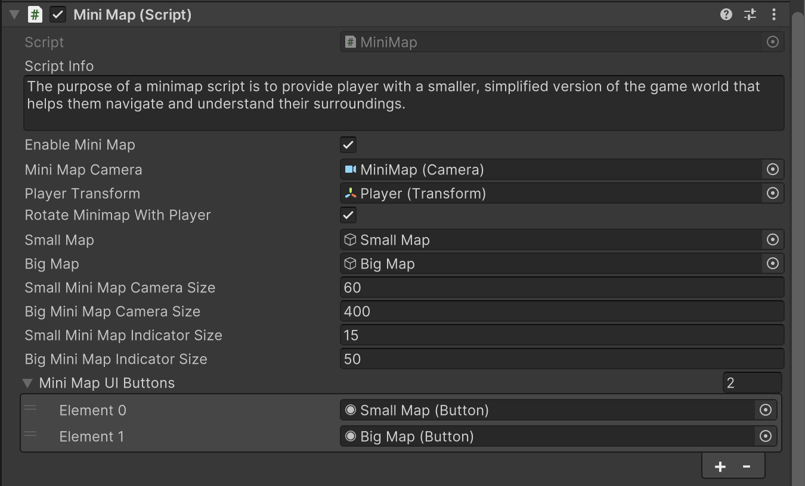

# Player MiniMap Setup

    <iframe width="700" height="405" src="https://www.youtube.com/embed/hVD0wtHb4UM?si=PUNwfF04UUhETk_2" title="YouTube video player" frameborder="0" allow="accelerometer; autoplay; clipboard-write; encrypted-media; gyroscope; picture-in-picture; web-share" referrerpolicy="strict-origin-when-cross-origin" allowfullscreen></iframe>

## Introduction
This video guides you through the steps required to implement Minimap for player. We'll be adding the minimap using Unity's editor windows, integrating necessary components and game objects.

### Setup Minimap
Firstly,you have to go to the Tools < Mobile Action Kit < Player < Player < Create Minimap. This will open up the MiniMap setup wizard where in the first field you have to drag and drop the Player from the hierarchy. In the second field you have to drag and drop the 'Required Scripts' gameObject from the hierarchy. In the third field you have to drag and drop the Canvas 2D from the hierarchy and in the last field you have to go to project and create a render texture and drag and drop it to the last field in the wizard called 'Render Texture' and than click the button 'Add Required UI'.

### MiniMap
The purpose of a minimap script is to provide player with a smaller, simplified version of the game world that helps them navigate and understand their surroundings.

<table class="custom-table">
    <tr>
        <th>Fields</th>
        <th>Info</th>
    </tr>
    <tr>
        <td>Enable MiniMap</td>
        <td>Enables or disables the MiniMap functionality. If unchecked, the MiniMap will not be displayed.</td>
    </tr>
    <tr>
        <td>MiniMap Camera</td>
        <td>Dedicated orthographic 'Mini_Map' camera from hierarchy is to be placed into this field.</td>
    </tr>
    <tr>
        <td>Player Transform</td>
        <td>Player root GameObject is to be placed into this field.</td>
    </tr>
    <tr>
        <td>Rotate Minimap With Player</td>
        <td>Toggles whether the MiniMap rotates to match the player's facing direction.</td>
    </tr>
    <tr>
        <td>Small Map</td>
        <td>GameObject for the small-sized MiniMap view.</td>
    </tr>
    <tr>
        <td>Big Map</td>
        <td>GameObject for the enlarged MiniMap view.</td>
    </tr>
    <tr>
        <td>Small MiniMap Camera Size</td>
        <td>The orthographic size of the MiniMap camera when in the small view.</td>
    </tr>
    <tr>
        <td>Big MiniMap Camera Size</td>
        <td>The orthographic size of the MiniMap camera when in the big view.</td>
    </tr>
    <tr>
        <td>Small MiniMap Indicator Size</td>
        <td>The size of the indicators on the MiniMap when in the small view.</td>
    </tr>
    <tr>
        <td>Big MiniMap Indicator Size</td>
        <td>The size of the indicators on the MiniMap when in the big view.</td>
    </tr>
    <tr>
        <td>MiniMap UI Buttons</td>
        <td>An array of UI buttons used for interacting with the MiniMap (e.g., switching between small and big map views).</td>
    </tr>
</table>

