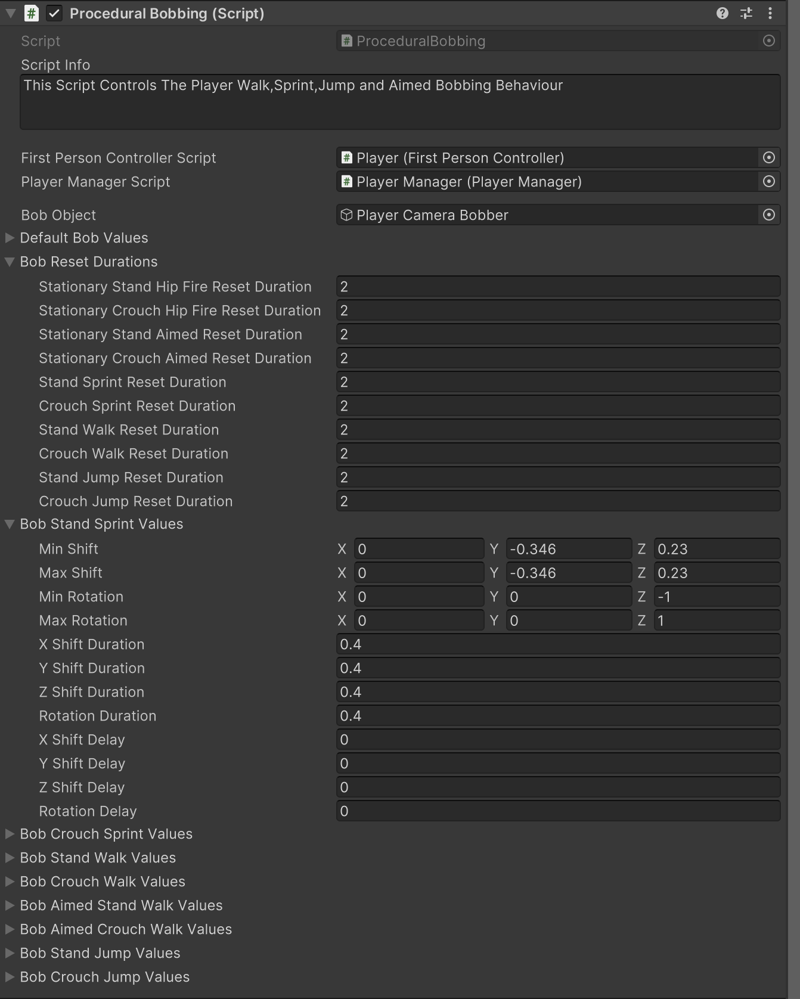

# Player Setup

    <iframe width="700" height="405" src="https://www.youtube.com/embed/hVD0wtHb4UM?si=PUNwfF04UUhETk_2" title="YouTube video player" frameborder="0" allow="accelerometer; autoplay; clipboard-write; encrypted-media; gyroscope; picture-in-picture; web-share" referrerpolicy="strict-origin-when-cross-origin" allowfullscreen></iframe>

## Introduction
This video guides you through the inital steps for getting started with the Player in Unity. We'll be adding the Player in the city using editor windows, integrating necessary components and game objects. Furthermore, we'll be talking about some important scripts like First person controller, Player Manager, Crouch, Procedural bobbing and other scripts. Will also fine-tune values in those scripts and will also make sure to test the player setup.

### Setup Player
Firstly,you have to go to the Tools < Mobile Action Kit < Player < Player < Create Player. This will automatically create the player for you and will reset it's position and rotation. You can just position it to the city and push play in unity to test it.

### Two Types of Player Running Option
You can choose either 'Run or Walk Switch' Or Hold Run. The difference between both is If you choose 'Hold Run' than you can hold the Run UI button to move the player in the forward direction with the set amount of speed specified in the First Person Controller script paragraph named as 'Speeds'. If you choose 'Run or Walk Switch' than you can switch between either Run or walk by clicking on the Run UI button this button by default have the 'Run Sprite' meaning if you click on it, The image will be changed to 'Walk Sprite' which allow the player to use the Joystick to navigate around the city with the run speed specified in the First Person Controller script paragraph named as 'Speeds'. If you click on the Run UI button again which now have the 'Walk Sprite' this will change the sprite to 'Run Sprite' and this will allow the player to use the joystick to navigate around the city with the walk speed specified in the First Person Controller script paragraph named as 'Speeds'.

The Player Manager script manages various player HUD Ui elements for interactions with game environment and Weapons.

<table class="custom-table">
    <tr>
        <th>Fields</th>
        <th>Info</th>
    </tr>
    <tr>
        <td>Switching Player Weapons Component</td>
        <td>'SwitchingPlayerWeapons' GameObject with 'SwitchingPlayerWeapons' script component attached to it is to be placed into this field.</td>
    </tr>
    <tr>
        <td>Fire Button</td>
        <td>'FireButton' GameObject with 'Button' component attached to it is to be placed into this field.</td>
    </tr>
    <tr>
        <td>Reload Button</td>
        <td>'ReloadButton' GameObject with 'Button' component attached to it is to be placed into this field.</td>
    </tr>
    <tr>
        <td>Aiming Button</td>
        <td>'AimingButton' GameObject with 'Button' component attached to it is to be placed into this field.</td>
    </tr>
    <tr>
        <td>Run Options</td>
        <td>
            Choose one of the two available running activation options:
            <ul>
                <li><strong>RunOrWalkSwitch:</strong> Alters movement joystick to always walk or always run depending on the state of the 'Run' button.</li>
                <li><strong>HoldToRun:</strong> The 'Run' button acts as a dedicated running button that needs to be kept pressed for the player to run.</li>
            </ul>
        </td>
    </tr>
    <tr>
        <td>Walking Sprite</td>
        <td>Walking sprite from the project is to be placed into this field.</td>
    </tr>
    <tr>
        <td>Running Sprite</td>
        <td>Running sprite from the project is to be placed into this field.</td>
    </tr>
    <tr>
        <td>Player Weapon Scripts</td>
        <td>All 'ShootingPoint' GameObjects of all the weapons from the player's hierarchy are to be placed into this list.</td>
    </tr>
</table>

### Crouch
Crouch script Controls The Player Crouch Behaviour.

<table class="custom-table">
    <tr>
        <th>Fields</th>
        <th>Info</th>
    </tr>
    <tr>
        <td>Player Camera</td>
        <td>Reference to the player's camera. Used for adjusting the camera's height when crouching or standing.</td>
    </tr>
    <tr>
        <td>Sit Down Speed</td>
        <td>Speed at which the player crouches down.</td>
    </tr>
    <tr>
        <td>Stand Up Speed</td>
        <td>Speed at which the player stands up.</td>
    </tr>
    <tr>
        <td>Crouch Height</td>
        <td>The height of the camera when crouching.</td>
    </tr>
    <tr>
        <td>Stand Height</td>
        <td>The height of the camera when standing.</td>
    </tr>
    <tr>
        <td>Stand Capsule Collider</td>
        <td>Collider used when the player is standing.</td>
    </tr>
    <tr>
        <td>Crouch Capsule Collider</td>
        <td>Collider used when the player is crouching.</td>
    </tr>
    <tr>
        <td>Standing Sprite</td>
        <td>Sprite to show when the crouch button is toggled to a standing position.</td>
    </tr>
    <tr>
        <td>Crouching Sprite</td>
        <td>Sprite to show when the crouch button is toggled to a crouching position.</td>
    </tr>
</table>

### First Person Controller 
This Script Controls The Player Walk,Sprint,Jump and TouchPad Behaviour.

<table class="custom-table">
    <tr>
        <th>Fields</th>
        <th>Info</th>
    </tr>
    <tr>
        <td>Player Camera</td>
        <td>Reference to the player's camera. Controls the player's view during movement, sprinting, jumping, and aiming.</td>
    </tr>
    <tr>
        <td>Joystick Script</td>
        <td>Script for managing the player's joystick input for movement control.</td>
    </tr>
    <tr>
        <td>TouchPad Look</td>
        <td>Handles touchpad input for controlling the player's aim and camera movement.</td>
    </tr>
    <tr>
        <td>Weapon Aimed TouchPad Look Values</td>
        <td>Settings for touchpad sensitivity when aiming weapons.</td>
    </tr>
    <tr>
        <td>Speeds</td>
        <td>Contains the player's movement speeds for different states such as walking, running, crouching, and aiming.</td>
    </tr>
    <tr>
        <td>Run Speed On Standing</td>
        <td>Speed of the player while running in a standing position.</td>
    </tr>
    <tr>
        <td>Run Speed On Crouching</td>
        <td>Speed of the player while running in a crouched position.</td>
    </tr>
    <tr>
        <td>Player Fall Speed</td>
        <td>How fast the player falls when in air.</td>
    </tr>
    <tr>
        <td>Walk and Run Sounds</td>
        <td>Manages footstep sounds for walking, running, crouching, and aiming.</td>
    </tr>
    <tr>
        <td>Stand Run Steps Sound Trigger</td>
        <td>Sound trigger for footstep sounds when the player is running while standing.</td>
    </tr>
    <tr>
        <td>Crouch Run Steps Sound Trigger</td>
        <td>Sound trigger for footstep sounds when the player is running while crouching.</td>
    </tr>
    <tr>
        <td>Time Between Stand Sprint Steps</td>
        <td>The time interval between footstep sounds while sprinting in a standing position.</td>
    </tr>
    <tr>
        <td>Time Between Crouch Sprint Steps</td>
        <td>The time interval between footstep sounds while sprinting in a crouched position.</td>
    </tr>
    <tr>
        <td>Jump</td>
        <td>Handles jump settings, including jump height, duration, and associated sounds.</td>
    </tr>
    <tr>
        <td>Jump Button</td>
        <td>Reference to the button used to trigger the player's jump action.</td>
    </tr>
    <tr>
        <td>Stand Jumping Meters</td>
        <td>Maximum height the player can reach when jumping from a standing position.</td>
    </tr>
    <tr>
        <td>Stand Jumping Duration</td>
        <td>The time it takes for the player to reach the maximum height when jumping from a standing position.</td>
    </tr>
    <tr>
        <td>Crouch Jumping Meters</td>
        <td>Maximum height the player can reach when jumping from a crouched position.</td>
    </tr>
    <tr>
        <td>Crouch Jumping Duration</td>
        <td>The time it takes for the player to reach the maximum height when jumping from a crouched position.</td>
    </tr>
    <tr>
        <td>Weapon Touch</td>
        <td>Settings for adjusting touchpad sensitivity and smoothing during weapon aiming.</td>
    </tr>
    <tr>
        <td>X Sensitivity</td>
        <td>Horizontal sensitivity of the touchpad for aiming.</td>
    </tr>
    <tr>
        <td>Y Sensitivity</td>
        <td>Vertical sensitivity of the touchpad for aiming.</td>
    </tr>
    <tr>
        <td>Smooth</td>
        <td>Enables or disables how smooth should be the touchpad input.</td>
    </tr>
    <tr>
        <td>Smooth Time</td>
        <td>Defines the duration over which touchpad input is smooth.</td>
    </tr>
</table>

### Procedural Bobbing
This Script Controls The Player Walk,Sprint,Jump and Aimed Bobbing Behaviour.

 <table class="custom-table">
    <tr>
        <th>Fields</th>
        <th>Info</th>
    </tr>
    <tr>
        <td>First Person Controller Script</td>
        <td>Player root gameobject containing 'FirstPersonController' script is to be placed into this field.</td>
    </tr>
    <tr>
        <td>Player Manager Script</td>
        <td>PlayerManager gameobject containing 'PlayerManager' script is to be placed into this field.</td>
    </tr>
    <tr>
        <td>Bob Object</td>
        <td>Gameobject to be bobbed is to be placed into this field.</td>
    </tr>
    <tr>
        <td>Enable Procedural Hip Fire Idle</td>
        <td>Toggle procedural Hip Fire Idle animation.</td>
    </tr>
    <tr>
        <td>Enable Procedural Aimed Idle</td>
        <td>Toggle procedural Aimed Idle animation.</td>
    </tr>
    <tr>
        <td>Hip Fire Pos Value</td>
        <td>Position offset values for the Hip Fire Idle pose.</td>
    </tr>
    <tr>
        <td>Hip Fire Rot Value</td>
        <td>Rotation offset values for the Hip Fire Idle pose.</td>
    </tr>
    <tr>
        <td>Aimed Pos Value</td>
        <td>Position offset values for the Aimed Idle pose.</td>
    </tr>
    <tr>
        <td>Aimed Rot Value</td>
        <td>Rotation offset values for the Aimed Idle pose.</td>
    </tr>
    <tr>
        <td>Stand Hip Fire Idle Values</td>
        <td>Bob values for Standing Hip Fire Idle.</td>
    </tr>
    <tr>
        <td>Crouch Hip Fire Idle Values</td>
        <td>Bob values for Crouching Hip Fire Idle.</td>
    </tr>
    <tr>
        <td>Stand Aimed Idle Values</td>
        <td>Bob values for Standing Aimed Idle.</td>
    </tr>
    <tr>
        <td>Crouch Aimed Idle Values</td>
        <td>Bob values for Crouching Aimed Idle.</td>
    </tr>
    <tr>
        <td>Stationary Stand Hip Fire Reset Duration</td>
        <td>Reset duration for Stationary Stand Hip Fire pose.</td>
    </tr>
    <tr>
        <td>Stationary Crouch Hip Fire Reset Duration</td>
        <td>Reset duration for Stationary Crouch Hip Fire pose.</td>
    </tr>
    <tr>
        <td>Stationary Stand Aimed Reset Duration</td>
        <td>Reset duration for Stationary Stand Aimed pose.</td>
    </tr>
    <tr>
        <td>Stationary Crouch Aimed Reset Duration</td>
        <td>Reset duration for Stationary Crouch Aimed pose.</td>
    </tr>
    <tr>
        <td>Stand Sprint Reset Duration</td>
        <td>Reset duration for Stand Sprint.</td>
    </tr>
    <tr>
        <td>Crouch Sprint Reset Duration</td>
        <td>Reset duration for Crouch Sprint.</td>
    </tr>
    <tr>
        <td>Stand Walk Reset Duration</td>
        <td>Reset duration for Stand Walk.</td>
    </tr>
    <tr>
        <td>Crouch Walk Reset Duration</td>
        <td>Reset duration for Crouch Walk.</td>
    </tr>
    <tr>
        <td>Stand Jump Reset Duration</td>
        <td>Reset duration for Stand Jump.</td>
    </tr>
    <tr>
        <td>Crouch Jump Reset Duration</td>
        <td>Reset duration for Crouch Jump.</td>
    </tr>
    <tr>
        <td>Bob Stand Sprint Values</td>
        <td>Bobbing values for Stand Sprint.</td>
    </tr>
    <tr>
        <td>Bob Crouch Sprint Values</td>
        <td>Bobbing values for Crouch Sprint.</td>
    </tr>
    <tr>
        <td>Bob Stand Walk Values</td>
        <td>Bobbing values for Stand Walk.</td>
    </tr>
    <tr>
        <td>Bob Crouch Walk Values</td>
        <td>Bobbing values for Crouch Walk.</td>
    </tr>
    <tr>
        <td>Bob Aimed Stand Walk Values</td>
        <td>Bobbing values for Aimed Stand Walk.</td>
    </tr>
    <tr>
        <td>Bob Aimed Crouch Walk Values</td>
        <td>Bobbing values for Aimed Crouch Walk.</td>
    </tr>
    <tr>
        <td>Bob Stand Jump Values</td>
        <td>Bobbing values for Stand Jump.</td>
    </tr>
    <tr>
        <td>Bob Crouch Jump Values</td>
        <td>Bobbing values for Crouch Jump.</td>
    </tr>
</table>

### Multiple Ambient Sounds Player
This script, handles the playback of ambient sounds in the game. It supports playing sounds either randomly or sequentially, based on the 'PlaySoundsRandomly' field. Each sound can have unique properties such as volume, priority, loop behavior, and a time range for playback duration. The script uses a coroutine to manage the timing and playback of sounds, ensuring seamless transitions between them. It requires an 'AudioSource' component on the same GameObject to function properly and can be configured using the 'AmbientSoundProperties' list.

<table class="custom-table">
    <tr>
        <th>Fields</th>
        <th>Info</th>
    </tr>
    <tr>
        <td>Play Sounds Randomly</td>
        <td>Determines whether the ambient sounds should be played in random order. If unchecked, sounds will play sequentially.</td>
    </tr>
    <tr>
        <td>Sound Name</td>
        <td>Name of the sound for identification purposes.</td>
    </tr>
    <tr>
        <td>Audio Clip To Play</td>
        <td>The audio clip to play for this ambient sound.</td>
    </tr>
    <tr>
        <td>Audio Volume</td>
        <td>Volume level for this audio clip (0 = muted, 1 = full volume).</td>
    </tr>
    <tr>
        <td>Loop</td>
        <td>Whether this audio clip should loop continuously when played.</td>
    </tr>
    <tr>
        <td>Audio Priority</td>
        <td>The priority of this audio clip (0 = highest priority, 256 = lowest priority). Useful when multiple audio sources are competing.</td>
    </tr>
    <tr>
        <td>Minimum Time To Play This Sound</td>
        <td>The minimum amount of time (in seconds) before this sound can start playing.</td>
    </tr>
    <tr>
        <td>Maximum Time To Play This Sound</td>
        <td>The maximum amount of time (in seconds) before this sound can start playing.</td>
    </tr>
    <tr>
        <td>Ambient Sound Properties</td>
        <td>List of ambient sound properties. Each entry defines the characteristics of a single sound.</td>
    </tr>
</table>

