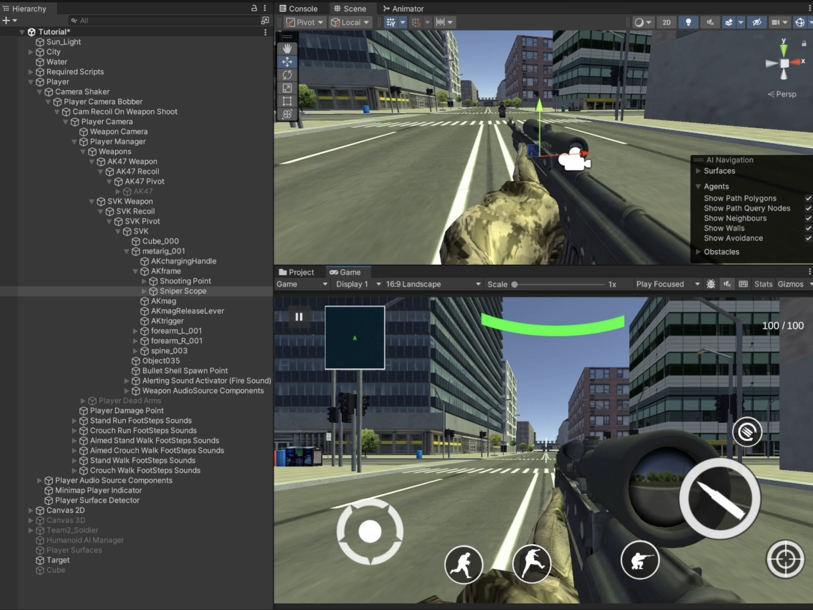
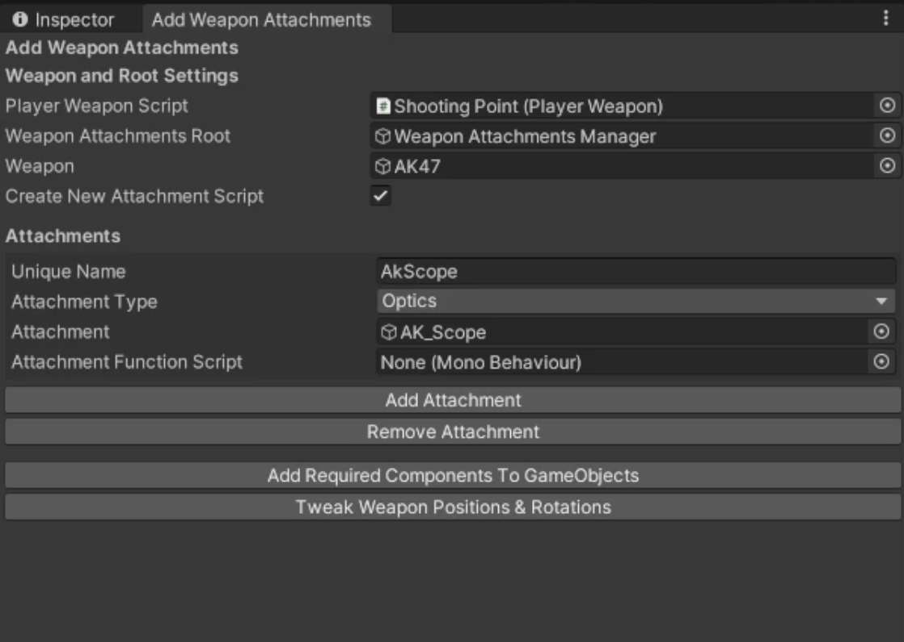
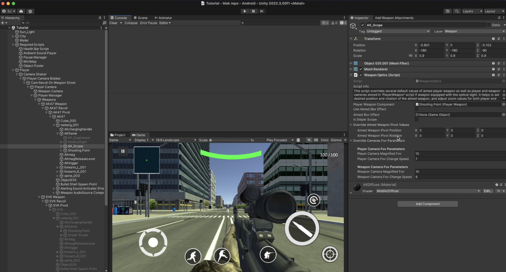
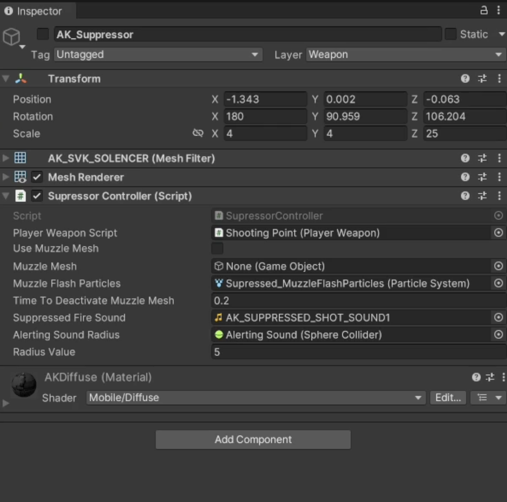
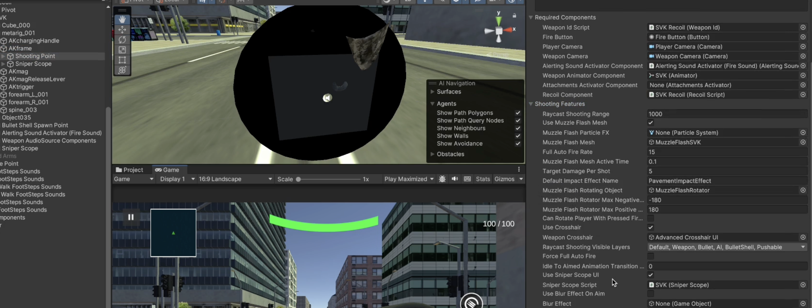
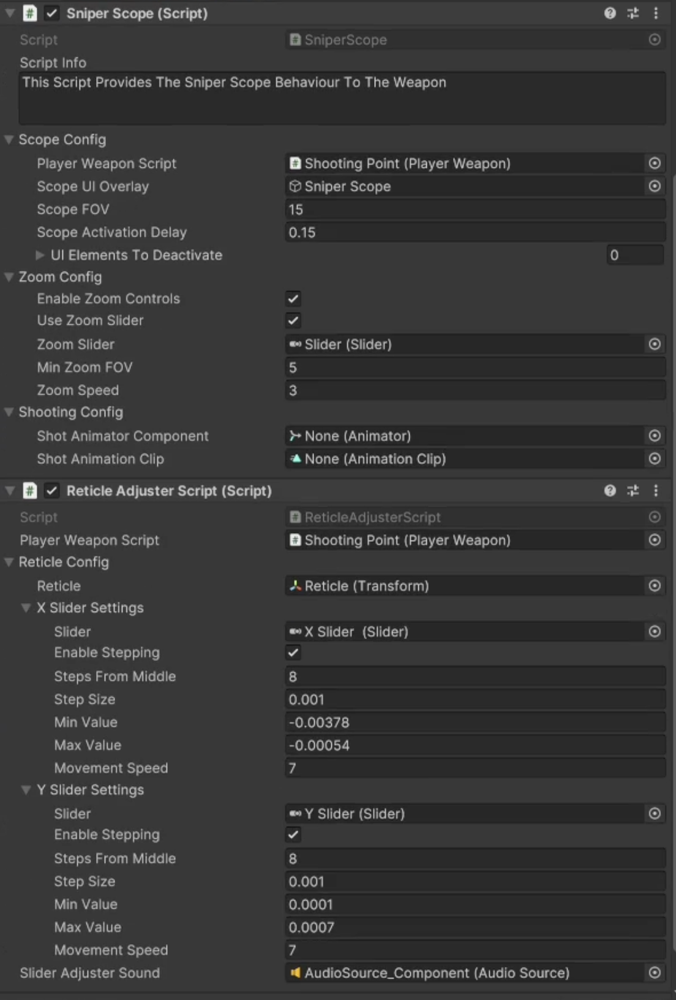
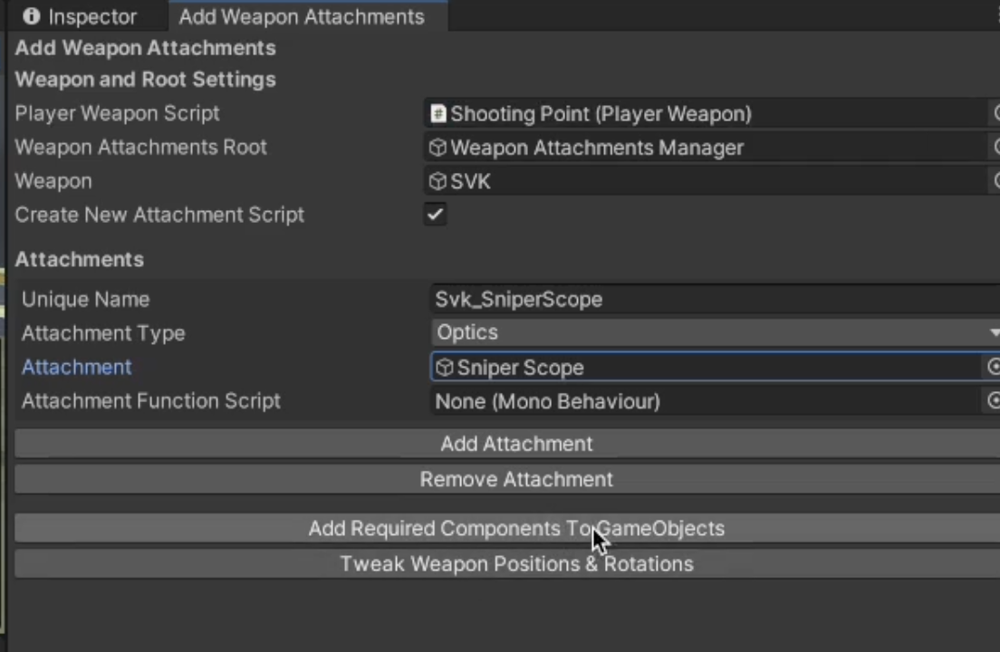
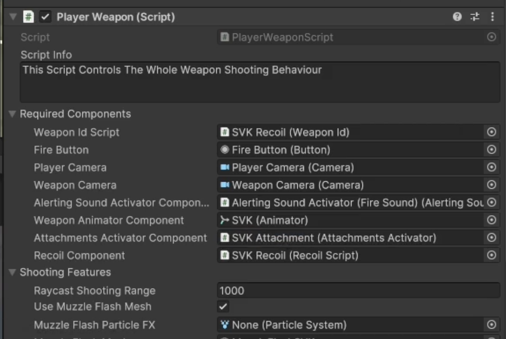

# Player Weapon Attachments

    <iframe width="700" height="405" src="https://www.youtube.com/embed/hVD0wtHb4UM?si=PUNwfF04UUhETk_2" title="YouTube video player" frameborder="0" allow="accelerometer; autoplay; clipboard-write; encrypted-media; gyroscope; picture-in-picture; web-share" referrerpolicy="strict-origin-when-cross-origin" allowfullscreen></iframe>

## Introduction
This video will guide you on how to setup player weapon attachments like Sniper Scope, Red Dot Sight,Supressor etc.

### Add Attachments To The Weapon

First, You need to setup the Ak scope and other attachments and align it properly with the weapon.As an example [See the screenshots below]

### Setup Attachments

Go to Tools < Mobile Action Kit < Player < FireArms < Add Weapon Attachments. Set it up like shown in video above and your setup should look like this [See the screenshot below]

When you click 'Add Required Components To GameObject' it basically add the Weapon Optics Script to the Optics Attachment and add the attachments activator script to a newly created gameObject.[See the Screenshot below]

Follow the same steps to add the Red Dot Sight Attachment to the AK47 weapon but make sure to uncheck the checkbox 'Create New Attachment' so it do not create a new attachments activator script for the AK47 weapon.

In the screenshot below you can see I have added both the Red Dot Sight and the Supressor attachment to the AK47 Weapon.

This time when you click 'Add Required Components To GameObject' you will find it will going to add the Supressor Controller Script to the supressor mesh and here you can add a separate Muzzle Flash Or Muzzle Mesh and drag and drop necessary components from the hierarchy to the provided fields. [See the screenshot below]

After these steps, Make sure to Align all the weapon using the Weapon View Wizard. You can open up the Weapon View Wizard by going to Tools < Mobile Action Kit < Player < FireArms < Weapon View. You can watch the video tutorial above to learn more about how to Align the weapon with scope. 

#### Weapon Optics
This script overrides several default values of aimed player weapon as well as player and weapon cameras stored in 'PlayerWeapon' script if weapon equipped with the optical sight. It helps to set desired position and rotation of the aimed weapon, and adjust zoom values for both player and weapon cameras to any particular type of the optical scope. This script is to  be disabled if weapon is not equipped with any kind of optics and uses iron sights.

<table class="custom-table">
<tr>
    <th>Fields</th>
    <th>Info</th>
</tr>
<tr>
    <td>PlayerWeaponComponent</td>
    <td>Respective 'Shooting point' GameObject from the player's hierarchy is to be placed into this field.</td>
</tr>
<tr>
    <td>UseAimedBlurEffect</td>
    <td>Enable this option to use a blur effect when aiming.</td>
</tr>
<tr>
    <td>AimedBlurEffect</td>
    <td>GameObject representing the aimed blur effect. This effect is shown when 'UseAimedBlurEffect' is enabled.</td>
</tr>
<tr>
    <td>IsSniperScope</td>
    <td>Enable this option if the weapon is equipped with a sniper scope.</td>
</tr>
<tr>
    <td>OverrideAimedWeaponPivotValues</td>
    <td>Overrides the position and rotation values of the aimed weapon pivot for better alignment with the optical sight.</td>
</tr>
<tr>
    <td>CamerasFovParameters</td>
    <td>Overrides the zoom and field-of-view parameters for both player and weapon cameras.</td>
</tr>
<tr>
    <td>CamerasFovParametersClass.PlayerCameraMagnifiedFov</td>
    <td>The field of view (FOV) of the player camera when zoomed in with the optics.</td>
</tr>
<tr>
    <td>CamerasFovParametersClass.PlayerCameraFovChangeSpeed</td>
    <td>The speed at which the player camera transitions to the magnified FOV.</td>
</tr>
<tr>
    <td>CamerasFovParametersClass.WeaponCameraMagnifiedFov</td>
    <td>The field of view (FOV) of the weapon camera when zoomed in with the optics.</td>
</tr>
<tr>
    <td>CamerasFovParametersClass.WeaponCameraFovChangeSpeed</td>
    <td>The speed at which the weapon camera transitions to the magnified FOV.</td>
</tr>
<tr>
    <td>OverrideAimedWeaponPivotValuesClass.AimedWeaponPivotPosition</td>
    <td>The local position of the weapon pivot when aiming with the optics.</td>
</tr>
<tr>
    <td>OverrideAimedWeaponPivotValuesClass.AimedWeaponPivotRotation</td>
    <td>The local rotation of the weapon pivot when aiming with the optics.</td>
</tr>
</table>

#### Supressor Script
This script modify 'Player Weapon Script Properties' when the supressor is enabled on this weapon.

<table class="custom-table">
<tr>
<th>Fields</th>
<th>Info</th>
</tr>
<tr>
<td>PlayerWeaponScript</td>
<td>Reference to the PlayerWeapon script to modify its shooting features.</td>
</tr>
<tr>
<td>UseMuzzleMesh</td>
<td>Toggle to use a muzzle mesh instead of muzzle flash particles.</td>
</tr>
<tr>
<td>MuzzleMesh</td>
<td>The GameObject representing the muzzle flash mesh to be displayed during firing.</td>
</tr>
<tr>
<td>MuzzleFlashParticles</td>
<td>The particle system used for the muzzle flash effect when not using a muzzle mesh.</td>
</tr>
<tr>
<td>TimeToDeactivateMuzzleMesh</td>
<td>Time (in seconds) after which the muzzle mesh will be deactivated automatically.</td>
</tr>
<tr>
<td>SuppressedFireSound</td>
<td>Audio clip to play when firing with suppressed sound.</td>
</tr>
<tr>
<td>AlertingSoundRadius</td>
<td>SphereCollider representing the area where sound alerts enemies. Adjusts dynamically based on RadiusValue.</td>
</tr>
<tr>
<td>RadiusValue</td>
<td>Radius of the sound alert effect caused by firing. Larger values alert enemies farther away.</td>
</tr>
</table>

#### Weapon Activator Script

<table class="custom-table">
<tr>
    <th>Fields</th>
    <th>Info</th>
</tr>
<tr>
    <td>keyName</td>
    <td>Unique key name used to track the activation state of this inventory item in PlayerPrefs.</td>
</tr>
<tr>
    <td>ObjectsToActivate</td>
    <td>GameObjects that should be activated when this inventory item is equipped.</td>
</tr>
<tr>
    <td>AttachmentFunctionScript</td>
    <td>Script that contains the function to be called when this item is activated.</td>
</tr>
<tr>
    <td>AttachmentFunction</td>
    <td>Name of the function to be called from the specified script when this item is activated.</td>
</tr>
</table>

### Additional Settings For Sniper Scope

 Go to Tools < Mobile Action Kit < Player < FireArms < Add Sniper Scope. Set it up like shown in video above and your setup should look like this [See the screenshot below]

Activate Sniper Scope UI by selecting the Player weapon script attached to the 'Shooting Point GameObject'.[See the screenshot below]

This setup above will also going to add two Scripts - Sniper Scope and Reticle Adjuster Script.

#### Sniper Scope Script
This Script Provides The Sniper Scope Behaviour To The Weapon.

<table class="custom-table">
    <tr>
        <th>Fields</th>
        <th>Info</th>
    </tr>
    <tr>
        <td>ScopeSettings.PlayerWeaponScript</td>
        <td>The PlayerWeapon script attached to the weapon. This controls weapon-specific behavior.</td>
    </tr>
    <tr>
        <td>ScopeSettings.ScopeUIOverlay</td>
        <td>The UI overlay that appears when the sniper scope is active.</td>
    </tr>
    <tr>
        <td>ScopeSettings.ScopeFOV</td>
        <td>Field of view when the sniper scope is active.</td>
    </tr>
    <tr>
        <td>ScopeSettings.ScopeActivationDelay</td>
        <td>Delay (in seconds) before the scope UI activates after scoping.</td>
    </tr>
    <tr>
        <td>ScopeSettings.UIElementsToDeactivate</td>
        <td>Array of UI elements to deactivate when scoping.</td>
    </tr>
    <tr>
        <td>ZoomSettings.EnableZoomControls</td>
        <td>Enable or disable zoom controls for the sniper scope.</td>
    </tr>
    <tr>
        <td>ZoomSettings.UseZoomSlider</td>
        <td>Use a slider UI element to control the zoom level.</td>
    </tr>
    <tr>
        <td>ZoomSettings.ZoomSlider</td>
        <td>The slider UI element for adjusting the zoom level.</td>
    </tr>
    <tr>
        <td>ZoomSettings.MinZoomFOV</td>
        <td>Minimum Field of View (FOV) value for the zoom.</td>
    </tr>
    <tr>
        <td>ZoomSettings.ZoomSpeed</td>
        <td>Speed of zooming in or out.</td>
    </tr>
    <tr>
        <td>ShootingSettings.ShotAnimatorComponent</td>
        <td>Animator component to handle shooting animations.</td>
    </tr>
    <tr>
        <td>ShootingSettings.ShotAnimationClip</td>
        <td>Animation clip to play when a shot is fired.</td>
    </tr>
    <tr>
        <td>ScopeConfig</td>
        <td>Settings related to the sniper scope functionality.</td>
    </tr>
    <tr>
        <td>ZoomConfig</td>
        <td>Settings related to zoom functionality for the sniper scope.</td>
    </tr>
    <tr>
        <td>ShootingConfig</td>
        <td>Settings related to shooting animations while scoped.</td>
    </tr>
</table>

#### Reticle Adjuster Script
This script helps in changing the sniper scope reticle position in X and Y axis when the weapon is aiming.

<table class="custom-table">
<tr>
    <th>Fields</th>
    <th>Info</th>
</tr>
<tr>
    <td>PlayerWeaponScript</td>
    <td>Reference to the player's weapon script to retrieve shooting and aiming settings.</td>
</tr>
<tr>
    <td>ReticleConfig</td>
    <td>Settings for configuring the reticle, including X and Y slider adjustments.</td>
</tr>
<tr>
    <td>SliderAdjusterSound</td>
    <td>Audio source that plays when a slider adjustment is made.</td>
</tr>
<tr>
    <td>ReticleSettings.Reticle</td>
    <td>The reticle's transform, which will be adjusted based on the slider settings.</td>
</tr>
<tr>
    <td>ReticleSettings.XSliderSettings</td>
    <td>Settings for the horizontal slider that adjusts the X position of the reticle.</td>
</tr>
<tr>
    <td>ReticleSettings.YSliderSettings</td>
    <td>Settings for the vertical slider that adjusts the Y position of the reticle.</td>
</tr>
<tr>
    <td>SliderSettings.Slider</td>
    <td>The slider UI element used to adjust the position of the reticle.</td>
</tr>
<tr>
    <td>SliderSettings.EnableStepping</td>
    <td>Determines whether the slider uses discrete steps for adjustments.</td>
</tr>
<tr>
    <td>SliderSettings.StepsFromMiddle</td>
    <td>The number of steps on either side of the middle position for stepping adjustments.</td>
</tr>
<tr>
    <td>SliderSettings.StepSize</td>
    <td>The size of each step for stepping adjustments.</td>
</tr>
<tr>
    <td>SliderSettings.MovementSpeed</td>
    <td>Speed at which the reticle moves when the slider value changes.</td>
</tr>
</table>

 

Make sure to add Sniper scope attachment by going to Tools < Mobile Action Kit < Player < FireArms < Add Weapon Attachments. Set it up like shown in video above and your setup should look like this [See the screenshot below]

After this, Last step is to assign the 'Attachment Activator Script' to the Player Weapon Script for both the Ak47 Weapon and SVK Weapon.[See the screenshot below]

Now you can Play Test! 🎉