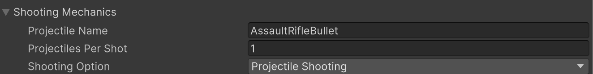
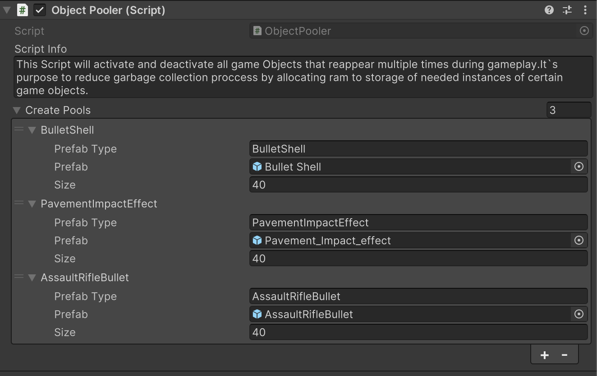
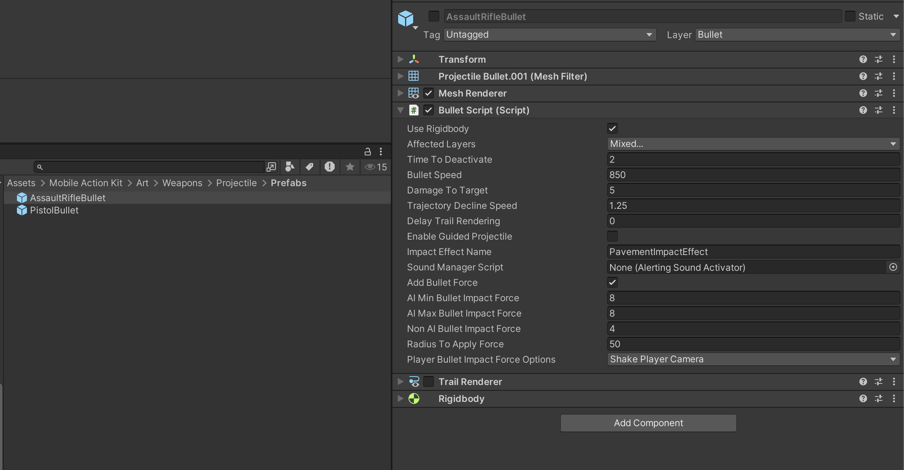

# Player Weapon Projectile Shooting Part4

    <iframe width="700" height="405" src="https://www.youtube.com/embed/hVD0wtHb4UM?si=PUNwfF04UUhETk_2" title="YouTube video player" frameborder="0" allow="accelerometer; autoplay; clipboard-write; encrypted-media; gyroscope; picture-in-picture; web-share" referrerpolicy="strict-origin-when-cross-origin" allowfullscreen></iframe>

## Introduction
This video will help you understand about player weapon projectile shooting. 

### First Step

Go to Player Weapon Script, and inside the shooting mechanics choose the option 'Projectile Shooting'.[See the screenshot below]

and than copy/paste the name from object pooler to the field 'Projectile Name' located inside the shooting mechanics paragraph of the Player Weapon script.[See the screenshot below]

### Bullet Script
This script is used in cases when shooting is performed with projectile instead of raycast.One of the Two types of projectiles provided with this kit can be choosed in this script.One Is Simple bulet optimized for more performant gameplay.Other is Realistic bullet  with  physics calculations for more fidelity and realism.

<table class="custom-table">
    <tr>
        <th>Fields</th>
        <th>Info</th>
    </tr>
    <tr>
        <td>AffectedLayers</td>
        <td>Layers that will get affected by the bullets.</td>
    </tr>
    <tr>
        <td>TimeToDeactivate</td>
        <td>If the bullet doesn’t hit anything and continues to fly, this will deactivate it after the set time to reactivate it inside the object pooler.</td>
    </tr>
    <tr>
        <td>BulletSpeed</td>
        <td>Choose the speed that would be appropriate for the real-world projectile bullet you are implementing in your project.</td>
    </tr>
    <tr>
        <td>DamageToTarget</td>
        <td>Amount of damage points this bullet will apply to targets.</td>
    </tr>
    <tr>
        <td>DelayTrailRendering</td>
        <td>This value should be tweaked for the trail renderer to adequately display the tracer bullet effect.</td>
    </tr>
    <tr>
        <td>EnableGuidedProjectile</td>
        <td>Enables guided projectile functionality.</td>
    </tr>
    <tr>
        <td>ImpactEffectName</td>
        <td>If the bullet hits other colliders (e.g., road, houses), specifies which prefab to spawn from the Object Pooler at the hit point (e.g., BulletHole).</td>
    </tr>
     <tr>
        <td>AddBulletForce</td>
        <td>If checked than the force will be applied to humanoid Ai agent at the time of death using the fields provided below..</td>
    </tr>
</table>

        
