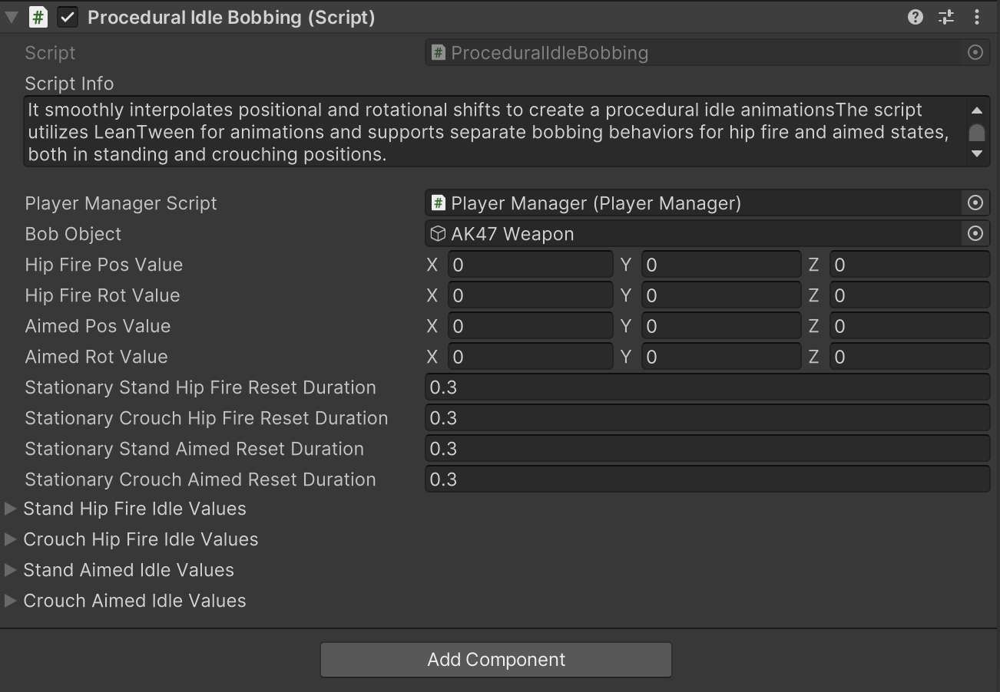
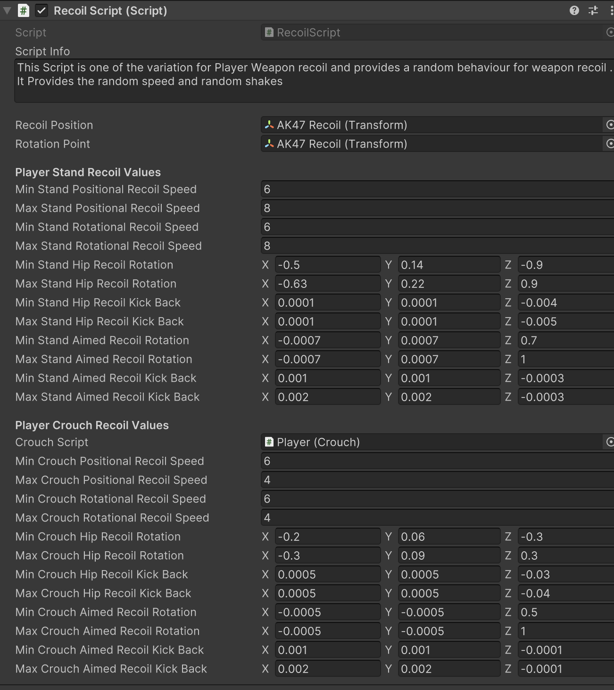

# Player Weapon Bobbing, Recoil & Crosshair Part-2

    <iframe width="700" height="405" src="https://www.youtube.com/embed/hVD0wtHb4UM?si=PUNwfF04UUhETk_2" title="YouTube video player" frameborder="0" allow="accelerometer; autoplay; clipboard-write; encrypted-media; gyroscope; picture-in-picture; web-share" referrerpolicy="strict-origin-when-cross-origin" allowfullscreen></iframe>

## Introduction
This video will help you understand about player weapon bobbing, Recoil and crosshair scripts.

### Player Weapon Bobbing 

#### Procedural Bobbing 
Procedural Bobbing script is providing looping animation to any of the player`s child gameObjects it is being attached to (cameras, weapons etc.) be it Walking,Sprinting, Jumping, Crouching movements, for Hip/Idle and Aimed poses. It provides the ability to add extra layers of control and fine-tuning to the overall dynamics of the player's view.

<table class="custom-table">
    <tr>
        <th>Fields</th>
        <th>Info</th>
    </tr>
    <tr>
        <td>FirstPersonControllerScript</td>
        <td>Player root gameobject containing 'FirstPersonController' script is to be placed into this field.</td>
    </tr>
    <tr>
        <td>PlayerManagerScript</td>
        <td>PlayerManager gameobject containing 'PlayerManager' script is to be placed into this field.</td>
    </tr>
    <tr>
        <td>BobObject</td>
        <td>Gameobject to be bobbed is to be placed into this field.</td>
    </tr>
    <tr>
        <td>EnableProceduralHipFireIdle</td>
        <td>Toggle procedural Hip Fire Idle animation.</td>
    </tr>
    <tr>
        <td>EnableProceduralAimedIdle</td>
        <td>Toggle procedural Aimed Idle animation.</td>
    </tr>
    <tr>
        <td>HipFirePosValue</td>
        <td>Position offset values for the Hip Fire Idle pose.</td>
    </tr>
    <tr>
        <td>HipFireRotValue</td>
        <td>Rotation offset values for the Hip Fire Idle pose.</td>
    </tr>
    <tr>
        <td>AimedPosValue</td>
        <td>Position offset values for the Aimed Idle pose.</td>
    </tr>
    <tr>
        <td>AimedRotValue</td>
        <td>Rotation offset values for the Aimed Idle pose.</td>
    </tr>
    <tr>
        <td>StationaryStandHipFireResetDuration</td>
        <td>Reset duration for Stationary Stand Hip Fire pose.</td>
    </tr>
    <tr>
        <td>StationaryCrouchHipFireResetDuration</td>
        <td>Reset duration for Stationary Crouch Hip Fire pose.</td>
    </tr>
    <tr>
        <td>StationaryStandAimedResetDuration</td>
        <td>Reset duration for Stationary Stand Aimed pose.</td>
    </tr>
    <tr>
        <td>StationaryCrouchAimedResetDuration</td>
        <td>Reset duration for Stationary Crouch Aimed pose.</td>
    </tr>
    <tr>
        <td>StandSprintResetDuration</td>
        <td>Reset duration for Stand Sprint.</td>
    </tr>
    <tr>
        <td>CrouchSprintResetDuration</td>
        <td>Reset duration for Crouch Sprint.</td>
    </tr>
    <tr>
        <td>StandWalkResetDuration</td>
        <td>Reset duration for Stand Walk.</td>
    </tr>
    <tr>
        <td>CrouchWalkResetDuration</td>
        <td>Reset duration for Crouch Walk.</td>
    </tr>
    <tr>
        <td>StandJumpResetDuration</td>
        <td>Reset duration for Stand Jump.</td>
    </tr>
    <tr>
        <td>CrouchJumpResetDuration</td>
        <td>Reset duration for Crouch Jump.</td>
    </tr>
    <tr>
        <td>BobStandSprintValues</td>
        <td>Bobbing values for Stand Sprint.</td>
    </tr>
    <tr>
        <td>BobCrouchSprintValues</td>
        <td>Bobbing values for Crouch Sprint.</td>
    </tr>
    <tr>
        <td>BobStandWalkValues</td>
        <td>Bobbing values for Stand Walk.</td>
    </tr>
    <tr>
        <td>BobCrouchWalkValues</td>
        <td>Bobbing values for Crouch Walk.</td>
    </tr>
    <tr>
        <td>BobAimedStandWalkValues</td>
        <td>Bobbing values for Aimed Stand Walk.</td>
    </tr>
    <tr>
        <td>BobAimedCrouchWalkValues</td>
        <td>Bobbing values for Aimed Crouch Walk.</td>
    </tr>
    <tr>
        <td>BobStandJumpValues</td>
        <td>Bobbing values for Stand Jump.</td>
    </tr>
    <tr>
        <td>BobCrouchJumpValues</td>
        <td>Bobbing values for Crouch Jump.</td>
    </tr>
</table>

#### Procedural Idle Bobbing 
This script dynamically adjusts the weapon's idle bobbing movement based on the player's idle behaviour. It smoothly interpolates positional and rotational shifts to create a procedural idle animationsThe script utilizes LeanTween for animations and supports separate bobbing behaviors for hip fire and aimed states, both in standing and crouching positions.

<table class="custom-table">
    <tr>
        <th>Fields</th>
        <th>Info</th>
    </tr>
    <tr>
        <td>PlayerManagerScript</td>
        <td>Reference to the PlayerManager script, which handles player state and weapon interactions.</td>
    </tr>
    <tr>
        <td>BobObject</td>
        <td>The object that will be animated for procedural bobbing (typically the weapon or camera).</td>
    </tr>
    <tr>
        <td>HipFirePosValue</td>
        <td>Default position offset for hip fire stance.</td>
    </tr>
    <tr>
        <td>HipFireRotValue</td>
        <td>Default rotation offset for hip fire stance.</td>
    </tr>
    <tr>
        <td>AimedPosValue</td>
        <td>Default position offset when aiming down sights.</td>
    </tr>
    <tr>
        <td>AimedRotValue</td>
        <td>Default rotation offset when aiming down sights.</td>
    </tr>
    <tr>
        <td>StationaryStandHipFireResetDuration</td>
        <td>Time taken to reset the bobbing effect when the player is standing in hip fire mode.</td>
    </tr>
    <tr>
        <td>StationaryCrouchHipFireResetDuration</td>
        <td>Time taken to reset the bobbing effect when the player is crouching in hip fire mode.</td>
    </tr>
    <tr>
        <td>StationaryStandAimedResetDuration</td>
        <td>Time taken to reset the bobbing effect when the player is standing in aimed mode.</td>
    </tr>
    <tr>
        <td>StationaryCrouchAimedResetDuration</td>
        <td>Time taken to reset the bobbing effect when the player is crouching in aimed mode.</td>
    </tr>
    <tr>
        <td>StandHipFireIdleValues</td>
        <td>Bobbing properties when the player is standing in hip fire mode.</td>
    </tr>
    <tr>
        <td>CrouchHipFireIdleValues</td>
        <td>Bobbing properties when the player is crouching in hip fire mode.</td>
    </tr>
    <tr>
        <td>StandAimedIdleValues</td>
        <td>Bobbing properties when the player is standing while aiming.</td>
    </tr>
    <tr>
        <td>CrouchAimedIdleValues</td>
        <td>Bobbing properties when the player is crouching while aiming.</td>
    </tr>
    <tr>
        <td>MinShift</td>
        <td>Minimum position shift values for procedural bobbing.</td>
    </tr>
    <tr>
        <td>MaxShift</td>
        <td>Maximum position shift values for procedural bobbing.</td>
    </tr>
    <tr>
        <td>MinRotation</td>
        <td>Minimum rotation shift values for procedural bobbing.</td>
    </tr>
    <tr>
        <td>MaxRotation</td>
        <td>Maximum rotation shift values for procedural bobbing.</td>
    </tr>
    <tr>
        <td>XShiftDuration</td>
        <td>Time taken to complete one bobbing cycle along the X-axis.</td>
    </tr>
    <tr>
        <td>YShiftDuration</td>
        <td>Time taken to complete one bobbing cycle along the Y-axis.</td>
    </tr>
    <tr>
        <td>ZShiftDuration</td>
        <td>Time taken to complete one bobbing cycle along the Z-axis.</td>
    </tr>
    <tr>
        <td>RotationDuration</td>
        <td>Time taken to complete one bobbing cycle for rotations.</td>
    </tr>
    <tr>
        <td>XShiftDelay</td>
        <td>Delay before starting the bobbing motion on the X-axis.</td>
    </tr>
    <tr>
        <td>YShiftDelay</td>
        <td>Delay before starting the bobbing motion on the Y-axis.</td>
    </tr>
    <tr>
        <td>ZShiftDelay</td>
        <td>Delay before starting the bobbing motion on the Z-axis.</td>
    </tr>
    <tr>
        <td>RotationDelay</td>
        <td>Delay before starting the bobbing motion for rotations.</td>
    </tr>
</table>

### Recoil Script
This Script provides random behavior for player weapon recoil, including speed and shake variations.

<table class="custom-table">
    <tr>
        <th>Fields</th>
        <th>Info</th>
    </tr>
    <tr>
        <td>RecoilPosition</td>
        <td>Transform that determines the recoil position.</td>
    </tr>
    <tr>
        <td>RotationPoint</td>
        <td>Transform that determines the recoil rotation point.</td>
    </tr>
    <tr>
        <th colspan="2">Player Stand Recoil Values</th>
    </tr>
    <tr>
        <td>MinStandPositionalRecoilSpeed</td>
        <td>Minimum speed for positional recoil when standing.</td>
    </tr>
    <tr>
        <td>MaxStandPositionalRecoilSpeed</td>
        <td>Maximum speed for positional recoil when standing.</td>
    </tr>
    <tr>
        <td>MinStandRotationalRecoilSpeed</td>
        <td>Minimum speed for rotational recoil when standing.</td>
    </tr>
    <tr>
        <td>MaxStandRotationalRecoilSpeed</td>
        <td>Maximum speed for rotational recoil when standing.</td>
    </tr>
    <tr>
        <td>MinStandHipRecoilRotation</td>
        <td>Minimum rotation values for hip fire recoil when standing.</td>
    </tr>
    <tr>
        <td>MaxStandHipRecoilRotation</td>
        <td>Maximum rotation values for hip fire recoil when standing.</td>
    </tr>
    <tr>
        <td>MinStandHipRecoilKickBack</td>
        <td>Minimum positional kickback for hip fire recoil when standing.</td>
    </tr>
    <tr>
        <td>MaxStandHipRecoilKickBack</td>
        <td>Maximum positional kickback for hip fire recoil when standing.</td>
    </tr>
    <tr>
        <td>MinStandAimedRecoilRotation</td>
        <td>Minimum rotation values for aimed recoil when standing.</td>
    </tr>
    <tr>
        <td>MaxStandAimedRecoilRotation</td>
        <td>Maximum rotation values for aimed recoil when standing.</td>
    </tr>
    <tr>
        <td>MinStandAimedRecoilKickBack</td>
        <td>Minimum positional kickback for aimed recoil when standing.</td>
    </tr>
    <tr>
        <td>MaxStandAimedRecoilKickBack</td>
        <td>Maximum positional kickback for aimed recoil when standing.</td>
    </tr>
    <tr>
        <th colspan="2">Player Crouch Recoil Values</th>
    </tr>
    <tr>
        <td>CrouchScript</td>
        <td>Reference to the player's crouch script.</td>
    </tr>
    <tr>
        <td>MinCrouchPositionalRecoilSpeed</td>
        <td>Minimum speed for positional recoil when crouching.</td>
    </tr>
    <tr>
        <td>MaxCrouchPositionalRecoilSpeed</td>
        <td>Maximum speed for positional recoil when crouching.</td>
    </tr>
    <tr>
        <td>MinCrouchRotationalRecoilSpeed</td>
        <td>Minimum speed for rotational recoil when crouching.</td>
    </tr>
    <tr>
        <td>MaxCrouchRotationalRecoilSpeed</td>
        <td>Maximum speed for rotational recoil when crouching.</td>
    </tr>
    <tr>
        <td>MinCrouchHipRecoilRotation</td>
        <td>Minimum rotation values for hip fire recoil when crouching.</td>
    </tr>
    <tr>
        <td>MaxCrouchHipRecoilRotation</td>
        <td>Maximum rotation values for hip fire recoil when crouching.</td>
    </tr>
    <tr>
        <td>MinCrouchHipRecoilKickBack</td>
        <td>Minimum positional kickback for hip fire recoil when crouching.</td>
    </tr>
    <tr>
        <td>MaxCrouchHipRecoilKickBack</td>
        <td>Maximum positional kickback for hip fire recoil when crouching.</td>
    </tr>
    <tr>
        <td>MinCrouchAimedRecoilRotation</td>
        <td>Minimum rotation values for aimed recoil when crouching.</td>
    </tr>
    <tr>
        <td>MaxCrouchAimedRecoilRotation</td>
        <td>Maximum rotation values for aimed recoil when crouching.</td>
    </tr>
    <tr>
        <td>MinCrouchAimedRecoilKickBack</td>
        <td>Minimum positional kickback for aimed recoil when crouching.</td>
    </tr>
    <tr>
        <td>MaxCrouchAimedRecoilKickBack</td>
        <td>Maximum positional kickback for aimed recoil when crouching.</td>
    </tr>
</table>

### Crosshair Script
This Script Controls The Reticle Lines of Cross Hair

<table class="custom-table">
    <tr>
        <th>Fields</th>
        <th>Info</th>
    </tr>
    <tr>
        <td>CrouchScript</td>
        <td>Reference to the player's crouch script.</td>
    </tr>
    <tr>
        <td>ReticleLinesParent</td>
        <td>The parent RectTransform that holds the reticle lines.</td>
    </tr>
    <tr>
        <td>StandDefaultSizeX</td>
        <td>Default width of the crosshair when standing.</td>
    </tr>
    <tr>
        <td>StandDefaultSizeY</td>
        <td>Default height of the crosshair when standing.</td>
    </tr>
    <tr>
        <td>StandMaxSizeX</td>
        <td>Maximum width of the crosshair when standing.</td>
    </tr>
    <tr>
        <td>StandMaxSizeY</td>
        <td>Maximum height of the crosshair when standing.</td>
    </tr>
    <tr>
        <td>StandExpandSpeed</td>
        <td>Speed at which the crosshair expands when standing.</td>
    </tr>
    <tr>
        <td>StandResetSpeed</td>
        <td>Speed at which the crosshair resets when standing.</td>
    </tr>
    <tr>
        <td>CrouchDefaultSizeX</td>
        <td>Default width of the crosshair when crouching.</td>
    </tr>
    <tr>
        <td>CrouchDefaultSizeY</td>
        <td>Default height of the crosshair when crouching.</td>
    </tr>
    <tr>
        <td>CrouchMaxSizeX</td>
        <td>Maximum width of the crosshair when crouching.</td>
    </tr>
    <tr>
        <td>CrouchMaxSizeY</td>
        <td>Maximum height of the crosshair when crouching.</td>
    </tr>
    <tr>
        <td>CrouchExpandSpeed</td>
        <td>Speed at which the crosshair expands when crouching.</td>
    </tr>
    <tr>
        <td>CrouchResetSpeed</td>
        <td>Speed at which the crosshair resets when crouching.</td>
    </tr>
</table>
