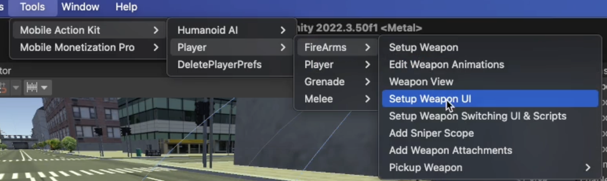
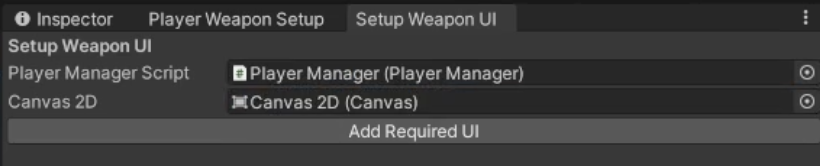
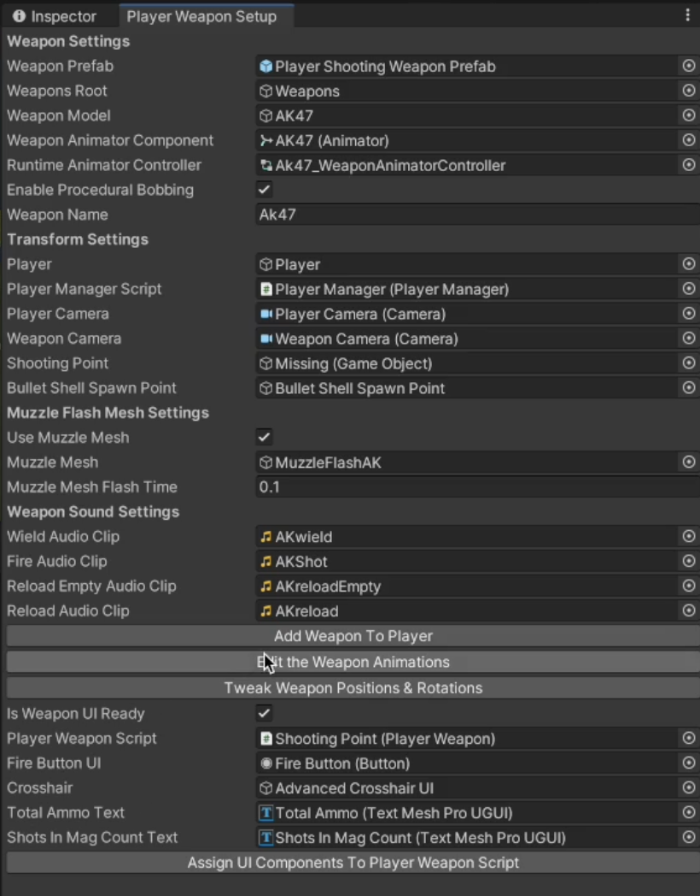
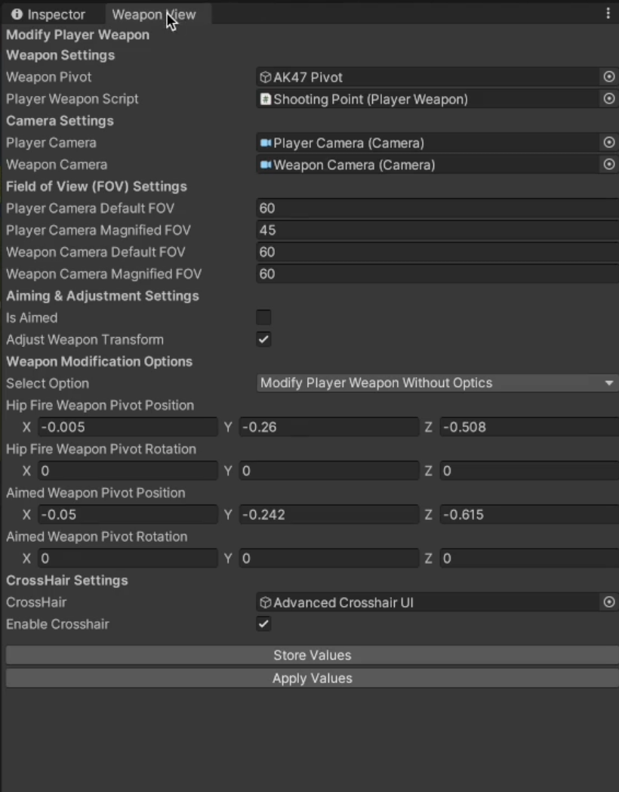

# Player Weapon Setup Part-1

    <iframe width="700" height="405" src="https://www.youtube.com/embed/hVD0wtHb4UM?si=PUNwfF04UUhETk_2" title="YouTube video player" frameborder="0" allow="accelerometer; autoplay; clipboard-write; encrypted-media; gyroscope; picture-in-picture; web-share" referrerpolicy="strict-origin-when-cross-origin" allowfullscreen></iframe>

## Introduction
This video guides you through the steps required to setup the weapon using the wizard.

### Setup Player Weapon
Firstly, You need to drag and drop the player weapon from the project to the Player hierarchy and make it to be the child of 'Weapons' gameObject and change the material for both the weapon and player hands.[See the screenshot below]

#### Creating Shooting Point and Muzzle Mesh
Expand the player weapon hierarchy and select 'AkFrame' gameObject and create another empty gameObject called 'Shooting Point' and position it to the point where you want the weapon to shoot from and Add a 'Muzzle Mesh Model' and make it to be the child of shooting point. [See the screenshot below]

#### Creating Bullet Shell Spawn Point
Expand the player weapon hierarchy and select the weapon and create another empty gameObject called 'Bullet Shell Spawn Point' and position it to the point where you want the bullet shells to be ejected. [See the screenshot below]

### Setup Player Weapon Using Wizard

Go to Tools < Mobile Action Kit < Player < FireArms < Setup Weapon. [See the screenshot below]

And this will open the Player Weapon Setup where you need to drag and drop required gameObjects and components to the fields provided. Your setup after following the video tutorial above should look like this.

### Setup Player Weapon UI

Go to Tools < Mobile Action Kit < Player < FireArms < Setup Weapon UI. [See the screenshot below]

And this will open the Player Weapon UI Setup where you need to drag and drop required gameObjects and components to the respective fields provided. Your setup after following the video tutorial above should look like this.

### Assign Player Weapon UI to the Player Weapon Script

After setting the UI in Canvas you need to go back to previous Player Weapon Setup Wizard and you will find a field in the bottom 'Is Weapon UI Setup' and you need to check this checkbox and assign the UI from the canvas to there respective fields in this wizard. Your setup after following the video tutorial above should look like this.

### Setting up Animations for Weapon

After the above steps, You need to click on the button called 'Edit The Weapon Animations' located in the Player Weapon Setup Wizard and this will open a new window called Edit The Weapon Animations where from the project you need to drag and drop the animations for the weapon. Your setup after following the video tutorial above should look like this.

'NOTE:MAKE SURE TO CLICK APPLY ANIMATIONS OTHERWISE THE ANIMATIONS WON'T BE SAVED'

### Tweaking Weapon View

After the above steps, You need to click on the button called 'Tweak Weapon Positions And Rotations' located in the Player Weapon Setup Wizard and this will open a new window called Weapon View where you need to setup the weapon pivot values for both the Aimed and Hip Fire. Your setup after following the video tutorial above should look like this.

'NOTE:MAKE SURE TO CLICK STORE VALUES AND THAN APPLY VALUES.'

### Setup The Object Pooler

Importance of Object Pooler Script - This Script will activate and deactivate all game Objects that reappear multiple times during gameplay.It`s purpose to reduce garbage collection proccess by allocating ram to storage of needed instances of certain game objects.

To Spawn Bullet Shells each time the player weapon shoot and the pavement impact effect to the hit point. We need to create an empty gameObject and make it to be the child of 'Required Scripts' and add the component called Object Pooler. Your setup after following the video tutorial above should look like this.

### Setup The Target Object

To Test the Player Weapon, You can add a Target GameObject Prefab from the Project to the scene like shown in the video above.

