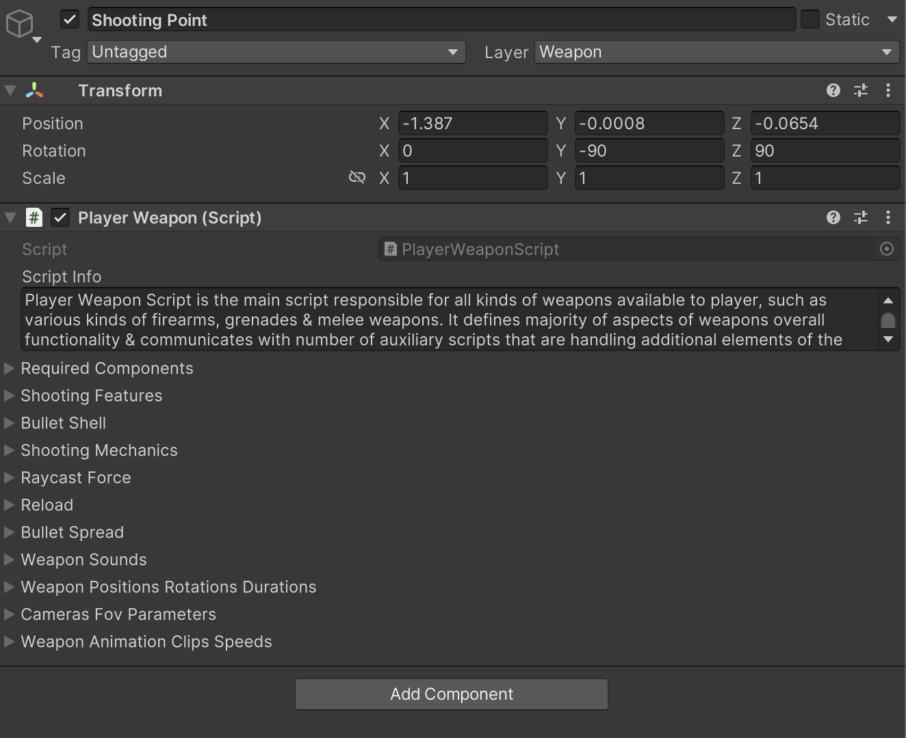

# Player Weapon Shooting Features Part-3

    <iframe width="700" height="405" src="https://www.youtube.com/embed/hVD0wtHb4UM?si=PUNwfF04UUhETk_2" title="YouTube video player" frameborder="0" allow="accelerometer; autoplay; clipboard-write; encrypted-media; gyroscope; picture-in-picture; web-share" referrerpolicy="strict-origin-when-cross-origin" allowfullscreen></iframe>

## Introduction
This video will help you understand about player weapon script attached to the shooting point of the weapon.

### Player Weapon Script  
Player Weapon Script is the main script responsible for all kinds of weapons available to player, such as various kinds of firearms, grenades & melee weapons. It defines majority of aspects of weapons overall functionality & communicates with number of auxiliary scripts that are handling additional elements of the player weapons functionality. 

You will find below some of the fields and their tooltips for the Player Weapon Script.

<table class="custom-table">
    <tr>
        <th>Fields</th>
        <th>Info</th>
    </tr>
    <tr>
        <td>RaycastShootingRange</td>
        <td>Shooting range of the weapon if it uses raycast.</td>
    </tr>
    <tr>
        <td>FullAutoFireRate</td>
        <td>Affects the Weapon Fire Rate in both Raycast and projectile shooting functionality.</td>
    </tr>
    <tr>
        <td>TargetDamagePerShot</td>
        <td>Damage to target on shoot.</td>
    </tr>
    <tr>
        <td>DefaultImpactEffectName</td>
        <td>If the bullet hits on other colliders (e.g., road, houses), specifies which prefab to spawn from Object Pooler on that hit point (e.g., BulletHole).</td>
    </tr>
    <tr>
        <td>MuzzleFlashRotatingObject</td>
        <td>'MuzzleFlashRotator' game object needs to be dragged & dropped into this field.</td>
    </tr>
    <tr>
        <td>MuzzleFlashRotatorMaxNegativeAngle</td>
        <td>Value of maximal possible rotational angle offset of the MuzzleFlashRotator gameobject in negative Z axis per weapon shot.</td>
    </tr>
    <tr>
        <td>MuzzleFlashRotatorMaxPositiveAngle</td>
        <td>Value of maximal possible rotational angle offset of the MuzzleFlashRotator gameobject in positive Z axis per weapon shot.</td>
    </tr>
    <tr>
        <td>WeaponCrosshair</td>
        <td>This field is populated with an advanced crosshair UI element. If you want to use a simple crosshair, you can drag & drop it into this field instead.</td>
    </tr>
    <tr>
        <td>RaycastShootingVisibleLayers</td>
        <td>Specify what layers raycast shooting will be affected by. Unchecked layers will be ignored.</td>
    </tr>
    <tr>
        <td>ForceFullAutoFire</td>
        <td>If checked, weapon will shoot in full automatic mode.</td>
    </tr>
    <tr>
        <td>IdleToAimedAnimationTransitionDelay</td>
        <td>Value in seconds during which weapon idle animation clip inside the 'Idle' animator state will continue to be played before switching to the 'InitialPose' animator state.</td>
    </tr>
    <tr>
        <td>BulletShellName</td>
        <td>Bullet shell name inside the Object Pooler script.</td>
    </tr>
    <tr>
        <td>ProjectileName</td>
        <td>Name in this field should match the name of the respective field inside the Object Pooler script for shooting to function properly.</td>
    </tr>
    <tr>
        <td>ProjectilesPerShot</td>
        <td>Number of projectiles per shot if this weapon is using 'ProjectileShooting' (e.g., shotguns). Spread is defined in the 'BulletSpread' field.</td>
    </tr>
    <tr>
        <td>ShootingOption</td>
        <td>Select the shooting option: RaycastShootingWithTracers (tracers without damage, for visuals).</td>
    </tr>
    <tr>
        <td>AddRaycastForce</td>
        <td>If checked, will apply raycast force to targets with a Rigidbody (AI agents or non-AI game objects with Rigidbody attached), with random force between Min & Max values.</td>
    </tr>
    <tr>
        <td>MinRaycastForceToAi</td>
        <td>Minimal base force value multiplied by the values of all the fields below (except the last one related to non-AI targets).</td>
    </tr>
    <tr>
        <td>MaxRaycastForceToAi</td>
        <td>Maximal base force value multiplied by the values of all the fields below (except the last one related to non-AI targets).</td>
    </tr>
    <tr>
        <td>RaycastForce</td>
        <td>Details for applying raycast force for AI agents (force direction and magnitude). Non-AI game objects are handled by the 'NonAIGameObjectImpactForce' field.</td>
    </tr>
    <tr>
        <td>WeaponPositionLerpSpeed</td>
        <td>Linear interpolation speed between weapon idle and weapon reloading positions.</td>
    </tr>
    <tr>
        <td>WeaponRotationLerpSpeed</td>
        <td>Linear interpolation speed between weapon idle and weapon reloading rotations.</td>
    </tr>
    <tr>
        <td>BulletSpread</td>
        <td>If you want to introduce bullet spread effect for each consecutive shot, set this field to change shooting point's rotation between specified min/max angles.</td>
    </tr>
</table>
