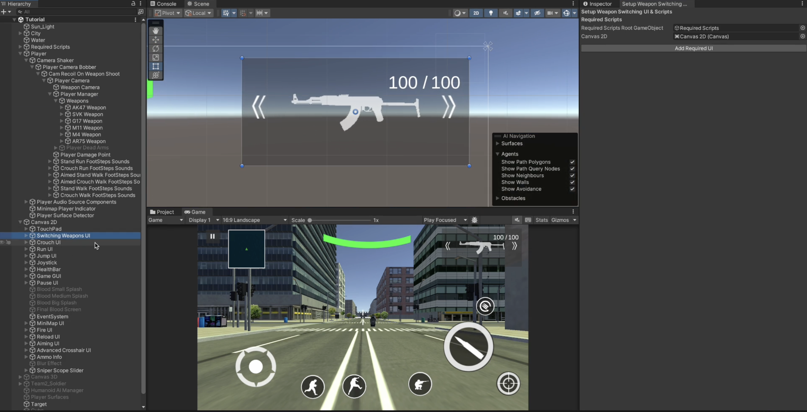
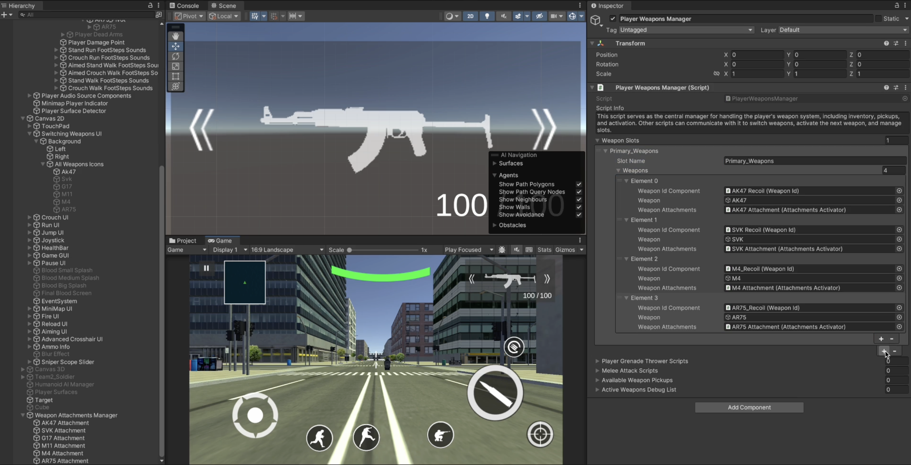
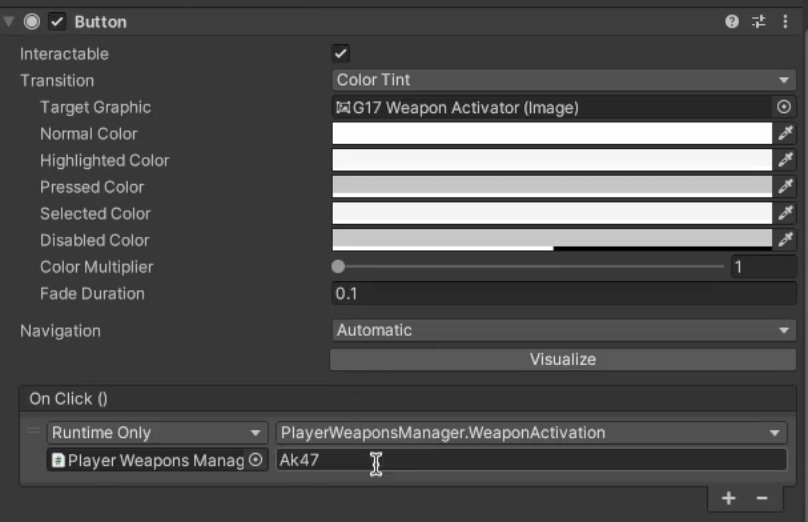

# Switching Player Weapons

    <iframe width="700" height="405" src="https://www.youtube.com/embed/hVD0wtHb4UM?si=PUNwfF04UUhETk_2" title="YouTube video player" frameborder="0" allow="accelerometer; autoplay; clipboard-write; encrypted-media; gyroscope; picture-in-picture; web-share" referrerpolicy="strict-origin-when-cross-origin" allowfullscreen></iframe>

## Introduction
This video guide you on how to switch between multiple player weapons.

### Setup Weapon Switching
Firstly,you have to go to the Tools < Mobile Action Kit < Player < FireArms < Setup Weapon Switching UI & Scripts. This will going to open up the wizard using which you need to assign the required component to complete the setup.Your setup should look like this [See the image below]

### Switching Player Weapons
This script handles player HUD UI swiping and arrow buttons for switching weapons.

<table class="custom-table">
<tr>
<th>Fields</th>
<th>Info</th>
</tr>
<tr>
<td>AvailableWeapons</td>
<td>Defines how weapons are unlocked and activated: 'ShopDependent' (based on purchased weapons) or 'LevelDependent' (based on level).</td>
</tr>
<tr>
<td>AutoAimIfSwitchedFromAimedWeapon</td>
<td>Automatically aligns the aim when switching from a weapon that was in aim mode.</td>
</tr>
<tr>
<td>PlayerWeaponsManagerScript</td>
<td>Reference to the PlayerWeaponsManager script responsible for managing weapons.</td>
</tr>
<tr>
<td>ButtonsToDisableDuringWeaponSwitching</td>
<td>List of UI buttons that will be disabled during weapon switching to prevent interaction.</td>
</tr>
<tr>
<td>SwipeArea</td>
<td>The swipeable area in the UI Canvas used to detect swipe gestures for weapon switching.</td>
</tr>
<tr>
<td>SwipeRightButton</td>
<td>The button in the UI Canvas used to switch to the next weapon.</td>
</tr>
<tr>
<td>SwipeLeftButton</td>
<td>The button in the UI Canvas used to switch to the previous weapon.</td>
</tr>
</table>

### Player Weapons Manager
This script serves as the central manager for handling the player's weapon system, including inventory, pickups, and activation. Other scripts can communicate with it to switch weapons, activate the next weapon, and manage slots.

<table class="custom-table">
<tr>
<th>Fields</th>
<th>Info</th>
</tr>
<tr>
<td>WeaponSlots</td>
<td>List of all weapon slots available to the player.</td>
</tr>
<tr>
<td>SlotName</td>
<td>The name of the weapon slot, e.g., Primary, Secondary.</td>
</tr>
<tr>
<td>Weapons</td>
<td>List of weapons assigned to this slot.</td>
</tr>
<tr>
<td>WeaponIdComponent</td>
<td>Reference to the Weapon ID component.</td>
</tr>
<tr>
<td>Weapon</td>
<td>The actual weapon GameObject.</td>
</tr>
<tr>
<td>WeaponAttachments</td>
<td>Weapon attachments activator script to be placed in this field.</td>
</tr>
<tr>
<td>WeaponPickupData</td>
<td>List of available weapon pickups in the game.</td>
</tr>
<tr>
<td>WeaponName</td>
<td>The name of the weapon pickup.</td>
</tr>
<tr>
<td>WeaponPickupPrefab</td>
<td>Prefab of the weapon pickup object.</td>
</tr>
<tr>
<td>PlayerGrenadeThrowerScripts</td>
<td>References to all grenade-throwing scripts attached to the player.</td>
</tr>
<tr>
<td>MeleeAttackScripts</td>
<td>References to all melee attack scripts attached to the player.</td>
</tr>
<tr>
<td>AvailableWeaponPickups</td>
<td>List of available weapon pickups in the game.</td>
</tr>
<tr>
<td>ActiveWeaponsList</td>
<td>Debugging list for tracking active weapons.</td>
</tr>
</table>

### GameObject Activation Manager
This Script Only Activates and Deactivates Objects Added Below On Enable

<table class="custom-table">
<tr>
<th>Fields</th>
<th>Info</th>
</tr>
<tr>
<td>GameObjectsToDeactivate</td>
<td>Array of GameObjects that will be deactivated when this script is enabled.</td>
</tr>
<tr>
<td>GameObjectsToActivate</td>
<td>Array of GameObjects that will be activated when this script is enabled.</td>
</tr>
</table>

### Click And Switch Weapons
Another option for switching weapons is to by create UI buttons in canvas and based on the button click we switch the player weapon.[See the image below]

Make sure to add the function in the UI button and make sure to write the correct key name to make sure to activate the correct weapon when the button is clicked.[See the image below]

