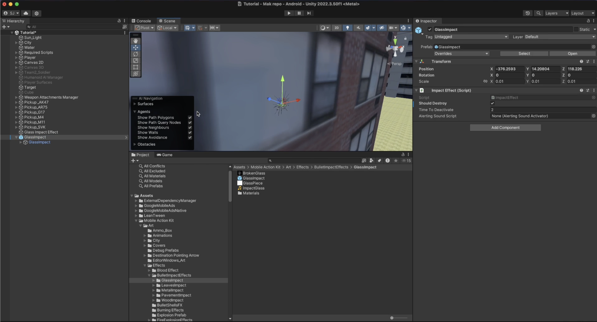
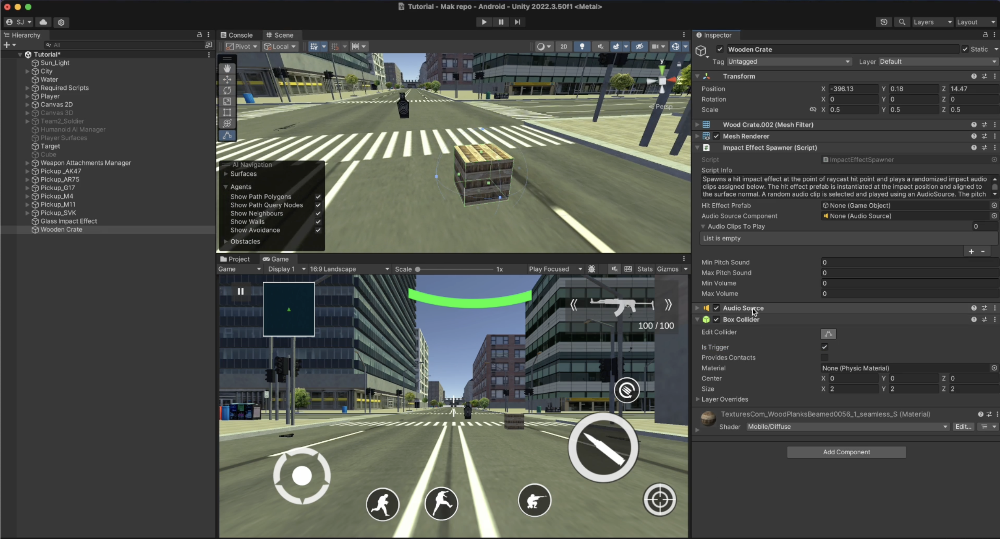
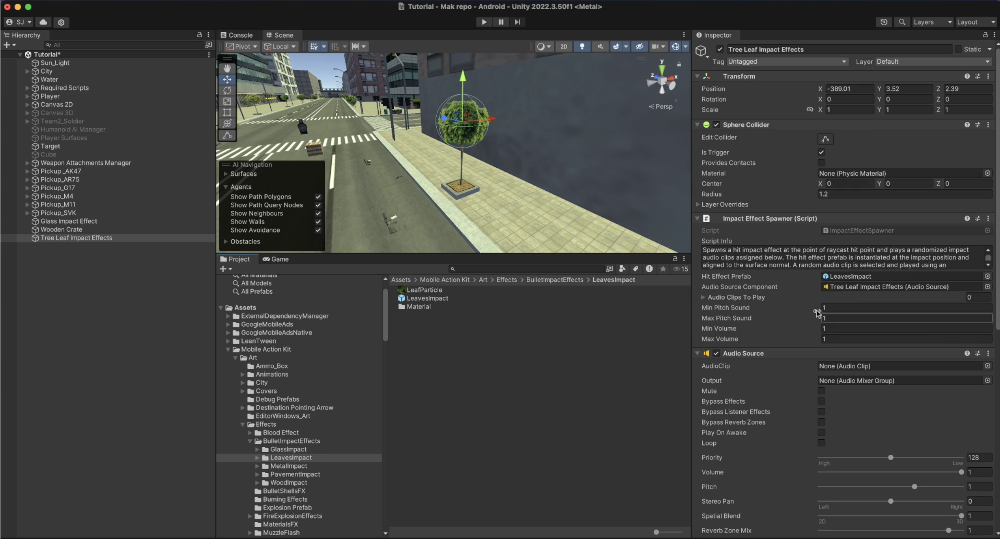

# Unique Hit Impact Effects

    <iframe width="700" height="405" src="https://www.youtube.com/embed/hVD0wtHb4UM?si=PUNwfF04UUhETk_2" title="YouTube video player" frameborder="0" allow="accelerometer; autoplay; clipboard-write; encrypted-media; gyroscope; picture-in-picture; web-share" referrerpolicy="strict-origin-when-cross-origin" allowfullscreen></iframe>

## Introduction
This video guides you on how to setup different hit impact effect on different surfaces like - glass window,tree leaves,wooden crate when the bullet or player weapon raycast hit these surfaces.

### Setup Impact Effect Spawner
You need to follow the steps below to setup the different hit impact effect on different surfaces. We will here first going to take an example of a glass window.

Step 1: Create an empty gameObject

Step 2: Add any primitive collider i.e Box Colldier

Step 3: Add the component called 'ImpactEffectSpawner'

Step 4: Add the component called 'AudioSource'

Step 5: Select the particles prefab you want to spawn when hitting the primitive collider (that you setup in Step 2) and add the script called 'Impact Effect' and setup it like shown in the image below.

Step 6: Setup the impact effect spawner script like shown in the image below by making your to assign the components that you just created following the above steps.

####  Impact Effect Spawner Script
Impact Effect Spawner Script allow player weapons script to spawn a hit impact effect at the point of raycast hit point and plays a randomized impact audio clips assigned below. The hit effect prefab is instantiated at the impact position and aligned to the surface normal. A random audio clip is selected and played using an AudioSource. The pitch and volume of the sound are randomized within defined ranges.

<table class="custom-table">
<tr>
<th>Fields</th>
<th>Info</th>
</tr>
<tr>
<td>HitEffectPrefab</td>
<td>Prefab of the visual hit effect to spawn at the point of impact.</td>
</tr>
<tr>
<td>AudioSourceComponent</td>
<td>Audio source that will play the impact sound.</td>
</tr>
<tr>
<td>AudioClipsToPlay</td>
<td>Array of audio clips to choose from when playing the impact sound.</td>
</tr>
<tr>
<td>MinPitchSound</td>
<td>Minimum pitch variation for the impact sound.</td>
</tr>
<tr>
<td>MaxPitchSound</td>
<td>Maximum pitch variation for the impact sound.</td>
</tr>
<tr>
<td>MinVolume</td>
<td>Minimum volume variation for the impact sound.</td>
</tr>
<tr>
<td>MaxVolume</td>
<td>Maximum volume variation for the impact sound.</td>
</tr>
</table>

####  Impact Effect

<table class="custom-table">
<tr>
<th>Fields</th>
<th>Info</th>
</tr>
<tr>
<td>ShouldDestroy</td>
<td>Specify whether the impact effect GameObject should be destroyed.</td>
</tr>
<tr>
<td>TimeToDeactivate</td>
<td>Time in seconds after which the impact effect will be deactivated or destroyed.</td>
</tr>
<tr>
<td>AlertingSoundScript</td>
<td>Reference to the AlertingSoundActivator script to handle sound alerts.</td>
</tr>
</table>

### Conclusion
Your can even follow the same setup to spawn impact effect on Tree leaves Or Wooden crate as well.[See the image below]

