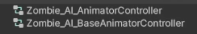

<!-- ---
hide:
  - toc
--- -->
# Getting Started With Humanoid AI Zombie

    <iframe width="700" height="405" src="https://www.youtube.com/embed/hVD0wtHb4UM?si=PUNwfF04UUhETk_2" title="YouTube video player" frameborder="0" allow="accelerometer; autoplay; clipboard-write; encrypted-media; gyroscope; picture-in-picture; web-share" referrerpolicy="strict-origin-when-cross-origin" allowfullscreen></iframe>

## Introduction
This video guides you through the essential steps for getting started with the humanoid AI zombie in Unity. We'll be adding the 3D humanoid zombie model using Unity's editor windows, integrating necessary components and game objects. Furthermore, we'll create a ragdoll for the zombie and incorporate vital animations tailored to the zombie movements, while fine-tuning animation import settings through the editor interface and will also make sure to optimise the animations.

### Setup Zombie
Firstly,you have to go to the Mobile Action Kit < Humanoid Ai < Setup Humaoid Ai agent. This will open up a window where you need to setup the humanoid Ai agent.

<table class="custom-table">
    <tr>
        <th>Fields</th>
        <th>Info</th>
    </tr>
    <tr>
        <td>Select Humanoid Ai Type </td>
        <td>Choose either Soldier or Zombie.</td>
    </tr>
    <tr>
        <td>Reference Ai Prefab</td>
        <td>Drag and drop the Humanoid Ai Prefab from the project into this field.</td>
    </tr>
     <tr>
        <td>Humanoid Model</td>
        <td>Drag and drop the Humanoid Model from the hierarchy into this field. Make sure dragged humanoid model
         is unpacked completely.</td>
    </tr>
     <tr>
        <td>Humanoid Model Avatar</td>
        <td>Drag and drop the Humanoid Model Avatar from the project into this field.</td>
    </tr>
      <tr>
        <td>Spine Bone To Rotate</td>
        <td>Drag and drop the Spine bone to rotate when this Ai agent will aim and shoot its target i.e spine bone.</td>
      </tr>
      <tr>
        <td>My Body Part To Target</td>
        <td>Drag and drop my body part to target so that other Ai entites in the game will shoot at this Ai agent i.e
         HeadBone.</td>
      </tr>
       <tr>
        <td>Weapon Model</td>
        <td>Drag and drop weapon model from the project into this field.</td>
      </tr>
     <tr>
        <td>Weapon Socket</td>
        <td>Drag and drop the gameObject from this Ai agent hierarchy into this field where the weapon Model will be
         instantiated when 'Configure Humanoid Ai agent' button will be clicked.</td>
      </tr>
    
</table>

### Create Ragdoll
After configuring the humanoid Ai agent you need to click on create ragdoll where you need to drag and drop the bones at there 
appropriate fields and create the ragdoll for the Ai agent.

### Download And Customise Humanoid Animations
Now to add animations to the humanoid Ai agent first click on the 'Customise Humanoid Animations' this will open up a window where you have to drag and drop the target object on which the new Animations will be applied. To create the new animations first duplicate the animator controller by selecting the Humanoid Ai agent in the hierarchy and click on the animator controller and locate it in the project and duplicate it.[SEE THE IMAGE BELOW]

 

Drag and drop the new duplicated Animator controller from the project into this field.And than drag and drop the Humanoid Ai agent from the hierarchy to the field named as 'Humanoid Ai Animator Controller'.

Select the character type to 'Zombie'

After this download all the animations from Mixamo using the download button provided after each field and follow the instructions mentioned in the tutorial above.

 

Great 🎉
So we successfully setup the Humanoid Ai agent in the scene.

