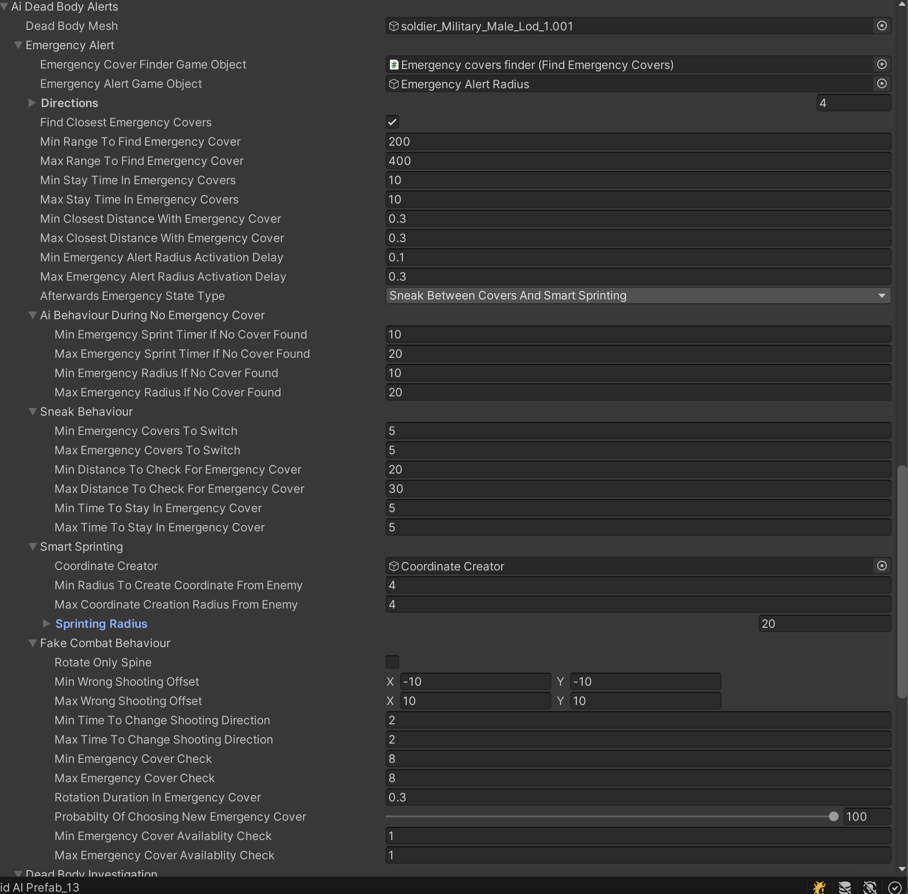
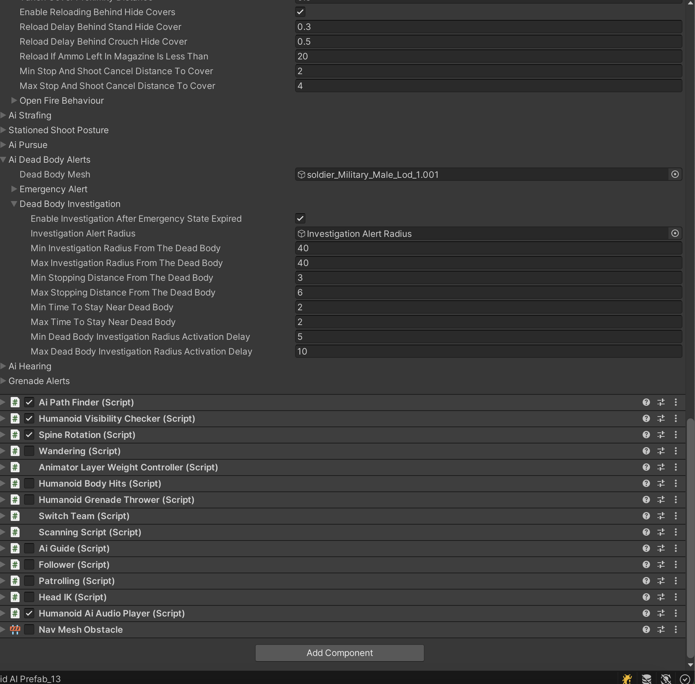

# 🤖 Humanoid Ai

## 🤖 Setting Up Ragdoll
The AI provided in the kit is really cool, and you should learn how to create your own AI system.

### Getting Started
This section is essential.
[Tutorials For AI](https://www.youtube.com/watch?v=jpeh1WorrWM)

#### Emergency Cover
This section is about emergency behavior.

#### Combat Covers
This section is about combat behavior.
[Great](https://www.youtube.com/watch?v=jpeh1WorrWM)

#### Emergency Covers

<video src="Videos/AiConversation.mp4" controls title="Conversation Sound"></video>
